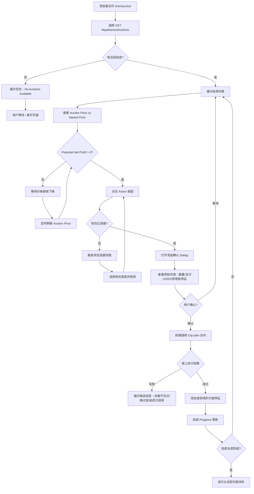
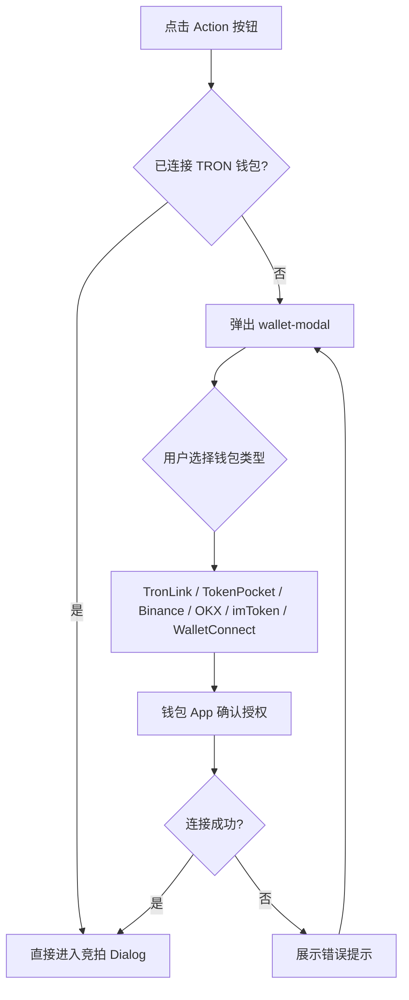

# 逆向还原 PRD | TRON Collateral Auctions 页面

> 模块名称：TRON Collateral Auctions Page
> 页面入口：`https://app.usdd.io/tron/auction`
> 文档类型：逆向还原 PRD
> 还原日期：2026-04-02
> 还原依据：现网页面截图、DOM / 无障碍树、CSS 类名分析、网络请求抓包、API 响应数据（active + historical）、Tooltip 文案提取（JS mouseenter 触发）、React 组件树、MakerDAO DSS Clipper 合约逻辑对照

---

## 先结论

`/tron/auction` 是 USDD 2.0 清算体系的第二个前台界面，负责承接 Vault Liquidations（`/tron/liquidation`）触发的 **荷兰式递减价格拍卖**。该页面的核心用户是套利者和竞拍者——他们在此查看当前活跃拍卖的折价空间，并通过"Action"按钮完成 `Clip.take` 链上调用，以低于市场价格买入被清算的抵押品，完成债务回收。

从业务视角：该页是 USDD 2.0 风控体系的"最后一公里"——在 Keeper 触发清算后，拍卖页面的竞拍效率直接决定系统是否能快速完整地回收坏账、维持 USDD 超额抵押率。

当前状态（2026-04-02）：活跃拍卖为 0，历史拍卖记录 17 条（auctionId 1~8）。

---

## 逆向事实层

### 已证实事实

**页面基础**

- 页面标题：`USDD | Auction`，路径 `/tron/auction`
- Hero 说明文案："Collateral auctions maintain USDD stability by liquidating under-collateralized positions."
- Hero "Learn more" 链接：`https://docs.usdd.io/`
- 数据最后更新时间展示格式："Updated at:2026-04-02 HH:MM:SS"（注意无空格，与 Liquidation 页格式略有差异）
- 手动刷新按钮（🔄 图标）：点击重新拉取数据
- 空态文案："No Auctions Available."，附独立空态图标（绿色文档图标）

**表格结构（8 列）**

| 列名 | 类型 | Info 图标 | 说明 |
|------|------|---------|------|
| Auction ID | 数字编号 | ❌ | 拍卖唯一 ID（整数，从 1 递增） |
| Auction Debt | USDD 金额 | ✅ | 被拍卖的 USDD 债务总量 |
| Available Collateral | 抵押品数量 | ✅ | 可竞拍的抵押品代币数量 |
| Auction Price | 折算价格 | ✅ | 当前拍卖价格（动态递减） |
| Market Price | 参考价格 | ✅ | 当前抵押品市场价格 |
| Potential Net Profit | 利润估算 | ✅ | 折价套利空间 |
| Progress | 进度指示 | ❌ | 拍卖完成进度（⚠️ 具体展示形式待有活跃拍卖时验证） |
| Action | 操作按钮 | ❌ | 竞拍入口按钮（⚠️ 文案待有活跃拍卖时验证） |

**Tooltip 文案（全部已通过 JS 验证）**

| 列 | Tooltip 文案 |
|----|------------|
| Auction Debt | "The total amount of USDD debt being auctioned due to a vault liquidation." |
| Available Collateral | "The amount of collateral tokens available in the auction for bidders." |
| Auction Price | "The current price of the collateral in the auction." |
| Market Price | "The current market price of the collateral token outside of the auction." |
| Potential Net Profit | "The potential profit bidders can make if they win the auction at the current auction price, calculated as the difference between the market value of the collateral and the amount paid." |

**API 端点（已验证）**

| 端点 | 用途 | 返回 |
|------|------|------|
| `GET /liquid/activeAuctions?pageNo=1&pageSize=100` | 活跃拍卖列表 | code=2 / data=null（当前无活跃拍卖） |
| `GET /liquid/auctions?pageNo=1&pageSize=100` | 历史拍卖记录 | totalCount=17，含 auctionId 1~8 |

**历史拍卖数据字段（已验证）**

```json
{
  "auctionId": 8,
  "blockNumber": 79891010,
  "hasAirDrop": false,
  "timestamp": 1770337590000,
  "transactionHash": "c5d0f254fa3af10507b28ba52382bc75fddce0e221d75b13997e336d17d68921"
}
```

**CSS 类名（已验证）**

| 类名 | 用途 |
|------|------|
| `auction-root root-bg` | 页面根容器 |
| `auction-table-container` | 整体表格区域容器 |
| `auction-table` | 拍卖表格 |
| `liquid-body` | 清算模块公共布局类 |
| `no-data` | 空态容器 |
| `no-data-img` | 空态图标 |
| `no-data-label` | 空态文字 |
| `explain-icon` | Info 图标包装类 |
| `bg-position` | 背景定位类（装饰性） |

**导航结构（已验证）**

```
🔥 Vault ▼
  ├─ Borrow USDD       → /tron/vault-mint（推断）
  ├─ Vault Liquidations → /tron/liquidation
  └─ Collateral Auctions → /tron/auction  ← 当前页
```

**网络范围（已验证）**

| 链 | Auction 可用 |
|----|------------|
| Tron | ✅ 支持 |
| Ethereum | ❌ 不支持 |
| BNB Chain | ❌ 不支持 |

**钱包（已验证）**

- 支持：TronLink、TokenPocket、Binance Wallet、OKX Wallet、imToken、WalletConnect
- 竞拍操作需要钱包连接

### 推断结论

- **荷兰拍卖价格递减机制**：Auction Price 从 Market Price × 1.05（buf）开始，按 `clip.tail`（13200s）内线性递减到 0，或直至有竞拍者成交
- **Potential Net Profit 公式**：`(Market Price - Auction Price) × Available Collateral Amount`，当 Auction Price < Market Price 时出现正套利空间
- **Action 按钮文案推断**：基于 MakerDAO 惯例和 Tooltip 文案，按钮文案可能为"Bid"，点击后弹出确认 Dialog（⚠️ 待验证）
- **Progress 列推断**：展示已完成债务偿还比例（已拍卖 USDD / 总 Auction Debt × 100%），可能以进度条形式展示
- **activeAuctions 的完整字段**：活跃拍卖时返回的字段应包含 auctionId、ilk、debt（USDD）、collateral（抵押品数量）、auctionPrice、marketPrice、netProfit、progress 等（⚠️ 待有活跃拍卖时验证）
- **历史拍卖展示**：`/liquid/auctions` 端点返回的 17 条历史数据仅有基础字段（auctionId、blockNumber、timestamp、transactionHash、hasAirDrop），推断前台使用该数据渲染历史拍卖记录区（⚠️ 未确认是否有历史记录 Tab 或区域）
- **拍卖重置（Redo）**：当拍卖超时（超过 tail 3.67h）或价格跌幅超 cusp（10%），链上需调用 `Clip.redo`；前台可能展示"需重置"标识（⚠️ 待确认）
- **hasAirDrop 字段**：可能标记该拍卖是否关联 USDD 空投激励活动，当前均为 false

### 待确认项

- Action 按钮的完整标签与点击后的 Dialog 设计（⚠️ 核心未验证项，需有活跃拍卖时操作）
- Progress 列的具体展示形式（进度条 / 百分比 / 剩余时间）
- 竞拍 Dialog 的字段：输入金额？最大数量？USDD 余额显示？确认流程细节？
- 历史拍卖记录在页面上是否有独立展示区（与活跃拍卖同一表格 or 独立 Tab or 无显示）
- 拍卖重置（Redo）是否有前台入口
- Auction Account 余额入口（Liquidation 页 Tooltip 提及但本页未发现）
- Auction Price 刷新频率：是否需要比列表更高频次的实时更新
- `activeAuctions` API 在有活跃拍卖时的完整响应字段结构

---

## 1. 背景与目标

### 1.1 背景

USDD 2.0 清算系统分为两个阶段：
1. **触发阶段**（/tron/liquidation）：Keeper 发现欠抵押仓位，调用 `Dog.bark` 将抵押品拍入 Clip 合约，创建荷兰式拍卖
2. **拍卖阶段**（/tron/auction）：竞拍者调用 `Clip.take`，以当前递减价格购买抵押品，归还 USDD 债务

Collateral Auctions 页是第二阶段的前台界面。从系统健康角度，拍卖页的关键指标是：**拍卖能否在价格大幅下跌前完成清仓**。若市场参与者足够，能在 buf × market_price（5% 溢价）阶段就成交，则系统可覆盖抵押品贬值损失，维持足额抵押率。

参考数据：截至 2026-04-02，历史上共完成 8 次拍卖（17 条记录，含部分 auctionId 重复记录，表明单次拍卖可能涉及多笔交易）。

### 1.2 业务目标

- 为套利者和专业竞拍者提供透明的拍卖信息展示（折价幅度、剩余数量、潜在利润）
- 降低参与竞拍的操作门槛（一键竞拍、可视化折价）
- 通过 Potential Net Profit 的实时计算，引导竞拍者在合适时间点参与，提高拍卖效率
- 确保 USDD 系统通过市场化拍卖及时回收坏账，维持 USDD 锚定和储备充足性

### 1.3 非目标

- 不承担拍卖触发（`Dog.bark`）功能，该功能在 `/tron/liquidation` 页完成
- 不提供自动竞拍 Bot 服务
- 不承担盈余拍卖（Flap）或坏账拍卖（Flop）功能
- 不提供跨链拍卖，当前仅限 TRON 网络
- 不承担 Vault 建仓或 USDD 借贷功能

---

## 2. 目标用户与场景

### 2.1 目标用户

| 用户类型 | 核心关注 | 在本页的价值 |
|---------|---------|------------|
| **套利者 / MEV 竞拍者** | 折价幅度、潜在利润、快速成交 | 实时观察 Auction Price vs Market Price，选择最优竞拍时机 |
| **DeFi 协议 / 做市商** | 稳定获取折价抵押品用于流动性或投资组合 | 系统化参与竞拍，批量管理利润 |
| **普通 DeFi 用户** | 了解系统运作，偶发参与 | 理解清算机制，在有利润时尝试竞拍 |
| **风控监控人员** | 拍卖进度、债务回收速度 | 实时监控是否有拍卖出现问题（超时/价格过低） |

### 2.2 核心场景

**场景一：套利者参与活跃拍卖**
- 套利者定期访问页面监控活跃拍卖，或通过链上事件通知到达页面
- 查看 Auction Price 与 Market Price 的差价，计算 Potential Net Profit
- 在利润空间足够时点击 Action 按钮完成竞拍
- 获得折价抵押品，在 DEX 卖出完成套利

**场景二：页面空态浏览**
- 用户访问页面时无活跃拍卖
- 查看 "No Auctions Available." 空态
- 可能通过 Learn more 了解拍卖机制

**场景三：等待价格下降**
- Auction Price 仍高于 Market Price（Potential Net Profit 为负）
- 竞拍者留在页面等待价格递减到套利区间
- 前台需要足够高的刷新频率支持价格实时跟踪

---

## 3. 功能清单（P0/P1/P2）

### P0（核心功能，上线必须）

- **活跃拍卖列表展示**：调用 `GET /liquid/activeAuctions` 实时展示所有活跃荷兰拍卖
- **8 列表格**：Auction ID / Auction Debt / Available Collateral / Auction Price / Market Price / Potential Net Profit / Progress / Action
- **5 列 Tooltip**：Auction Debt / Available Collateral / Auction Price / Market Price / Potential Net Profit 均提供解释
- **空态展示**：无活跃拍卖时正确渲染 "No Auctions Available." 与空态图标
- **数据刷新**：时间戳展示 + 手动刷新按钮
- **竞拍操作入口**：Action 按钮，连接钱包后触发竞拍流程（`Clip.take`）

### P1（重要功能，优先跟进）

- **Potential Net Profit 视觉区分**：正值绿色高亮（有套利机会）、负值灰色/红色（无套利机会）
- **Auction Price 实时递减显示**：考虑局部高频刷新（每 3~10 秒），确保价格数据时效性
- **竞拍确认 Dialog**：输入竞拍数量 / 展示预期 USDD 支出 / 预期获得抵押品数量 / 确认按钮
- **Progress 进度条**：直观展示当前拍卖完成比例
- **钱包连接流程**：Action 按钮触发后，若未连接则强制弹出钱包选择

### P2（增量优化）

- **历史拍卖记录**：展示已结束拍卖（17 条历史记录），含区块链交易哈希跳转链接
- **拍卖重置（Redo）标识**：拍卖超时或价格跌幅过大时，标识需重置状态并提供 Redo 操作入口
- **闪电贷模式提示**：向高级用户说明可通过合约直接调用完成零资金套利

---

## 4. 用户流程

### 4.1 套利者竞拍完整流程



### 4.2 拍卖价格下降全生命周期

```mermaid
flowchart LR
    A["拍卖创建 (Dog.bark 触发)
    起始价格 = Market Price × buf (×1.05)"] --> B["荷兰式价格递减
    Auction Price 随时间线性下降"]
    B --> C{价格触发套利区间?}
    C -- 否 --> D["继续下降
    tail = 13200s 超时前"]
    D --> E{到达 tail 或价格降超 cusp (10%)?}
    E -- 是 --> F["拍卖需重置
    Clip.redo 重置起始价格"]
    F --> B
    E -- 否 --> C
    C -- 是 --> G["竞拍者调用 Clip.take
    以当前价格买入部分/全部抵押品"]
    G --> H{全部债务已回收?}
    H -- 是 --> I[拍卖完成，从活跃列表移除]
    H -- 否 --> B
```

### 4.3 钱包连接流程（通用）



---

## 5. 业务规则

### 5.1 荷兰拍卖机制规则

| 规则 | 说明 |
|------|------|
| 起始价格 | Market Price × `clip.buf`（当前 = 1.05，即溢价 5%） |
| 价格变化 | 随时间线性递减（基于 clip.calc 曲线合约，线性函数 `LinearDecrease`） |
| 超时重置条件 | 当前时间 - 开始时间 > `clip.tail`（当前 = 13200s ≈ 3.67h） |
| 价格过低重置条件 | 当前拍卖价格 < 起始价格 × `clip.cusp`（当前 = 0.9，即下跌超 10%） |
| 重置操作 | 任何人可调用 `Clip.redo(auctionId, kpr)`，重置起始价格为当前 Market Price × buf |
| 部分成交 | 竞拍者可购买部分抵押品（`amt` 参数），拍卖继续直至完全清偿 |
| 全部成交 | 全部债务清偿后，拍卖结束，抵押品剩余（如有）退还原 Vault 所有者 |

### 5.2 Potential Net Profit 计算规则

- **公式**：`(Market Price - Auction Price) × Available Collateral Amount`
- **单位**：USDD（以 Market Price 对应的计价货币）
- **正值**：拍卖价格低于市价，存在套利空间 → 绿色高亮
- **零/负值**：拍卖价格高于市价（早期阶段），无套利空间 → 灰色/红色
- **更新时机**：随 Auction Price 变化实时更新

### 5.3 数据展示规则

- 拍卖列表按 Auction ID 降序排列（推断，最新拍卖在前）
- `pageSize=100` 支持最多显示 100 条活跃拍卖
- Auction Price 是动态递减的，需要比列表高频刷新（推断 3~10 秒一次局部更新）
- 数据更新时间戳标准格式："Updated at:YYYY-MM-DD HH:MM:SS"（⚠️ 注意无空格，与 Liquidation 页略有差异）
- 手动刷新按钮触发完整数据重拉

### 5.4 竞拍操作规则

- 竞拍需要 TRON 钱包连接
- 竞拍者支付 USDD，获得对应数量的抵押品代币
- 竞拍金额上限 = 完全清偿所需 USDD（即 Auction Debt）
- 不可竞拍超出 Available Collateral 的数量
- 支持**闪电贷竞拍**：`Clip.take` 的 `who` 参数设为外部合约，可在同一交易内零资金套利（前台不直接暴露此能力）

### 5.5 网络与钱包规则

- 本页仅 TRON 网络可用（Ethereum / BNB Chain 无 Auction 功能）
- 切换到其他网络后该菜单项应不可用或引导回 TRON

---

## 6. UI / 交互说明

### 6.1 页面整体结构

```
[导航 Header]
[Hero 区域]
  - 标题：Collateral Auctions（绿色渐变文字，与 Vault Liquidations 黄绿渐变不同）
  - 副标题 + Learn more 链接
[主内容卡片（auction-table-container）]
  - 卡片 Header：
      左：拍卖图标 + "Collateral Auctions" 标题
      右："Updated at:YYYY-MM-DD HH:MM:SS" + 🔄 刷新按钮
  - 表格：8 列（Ant Design Table）
  - 空态：No Auctions Available. + 空态图标
[Footer：support@usdd.io / 版权 / 社交链接]
```

### 6.2 表格行数据展示（活跃拍卖有数据时推断）

| 字段 | 格式示例 | 说明 |
|------|---------|------|
| Auction ID | `#9` | 井号 + 整数 |
| Auction Debt | `1000.00 USDD` | 数量 + USDD 单位 |
| Available Collateral | `5000.00 TRX-A` | 数量 + ilk 名称 |
| Auction Price | `0.0180 USDD/TRX` | 价格 + 计价单位 |
| Market Price | `0.0200 USDD/TRX` | 价格 + 计价单位 |
| Potential Net Profit | `+100.00 USDD` | 正值绿色 / 负值灰色 |
| Progress | 进度条 + `65%`（推断） | 已拍出债务比例 |
| Action | `Bid` 按钮（推断）| 触发竞拍 Dialog |

### 6.3 Action 列按钮状态（推断）

| 状态 | 样式 | 文案 | 条件 |
|------|------|------|------|
| 可竞拍 | 绿色填充 | Bid | Potential Net Profit > 0 |
| 可竞拍（价格高于市价） | 灰色/禁用 | Bid | Potential Net Profit ≤ 0（⚠️ 待确认是否禁用） |
| 需要重置 | 橙色 | Redo（推断） | 拍卖超时或价格跌幅 > cusp |

### 6.4 空态设计

```
[空态图标：绿色文档图标]
[文案：No Auctions Available.]
```

### 6.5 时间戳格式差异

- `/tron/auction` 格式："Updated at:2026-04-02 12:10:43"（冒号后无空格）
- `/tron/liquidation` 格式："Updated at: 2026-04-02 11:25:23"（冒号后有空格）
- ⚠️ 建议统一格式（可能是前端细节不一致，待确认是否需要修复）

---

## 7. 异常场景与边界

| 场景 | 处理方式 |
|------|---------|
| 无活跃拍卖 | 空态："No Auctions Available." |
| 竞拍时拍卖已结束 | 链上 revert；前台应刷新列表并提示"该拍卖已结束" |
| 竞拍时 USDD 余额不足 | 提交前校验余额；不足则提示"Insufficient USDD balance" |
| Auction Price 高于 Market Price | Potential Net Profit 为负；按钮状态待确认（⚠️）|
| 拍卖超时未完成（需 Redo） | 前台标识需重置状态；提供 Redo 操作入口（⚠️ 待确认）|
| 网络请求失败 | 展示加载失败状态 + 重试按钮；保留旧数据并展示旧时间戳 |
| 切换到 Ethereum / BNB Chain | Auction 页面不可用，需引导切换回 Tron |
| Gas 不足 | 链上提交失败；前台提示 gas 错误 |
| 多人同时竞拍同一拍卖 | 链上先到先得；失败者收到 revert 错误，前台提示 |

---

## 8. 数据埋点需求

| 事件名 | 触发时机 | 关键参数 |
|-------|---------|---------|
| `auction_page_view` | 进入 /tron/auction | wallet_connected / active_auction_count |
| `auction_list_loaded` | 活跃拍卖 API 返回 | active_auction_count |
| `auction_list_empty` | API 返回 0 活跃拍卖 | — |
| `auction_list_refresh_click` | 点击刷新按钮 | active_auction_count_before |
| `auction_tooltip_hover` | 悬停 Info 图标 | column_name（debt/collateral/price/market_price/profit） |
| `auction_bid_click` | 点击 Action 按钮 | auction_id / auction_price / market_price / net_profit / available_collateral |
| `auction_bid_dialog_open` | Dialog 打开 | auction_id / current_net_profit |
| `auction_bid_dialog_cancel` | Dialog 取消 | auction_id |
| `auction_bid_amount_input` | 用户修改竞拍数量（防抖） | auction_id / input_amount |
| `auction_bid_confirm_click` | 点击确认竞拍 | auction_id / bid_amount / usdd_to_pay / expected_collateral |
| `auction_bid_tx_submitted` | 竞拍交易提交 | auction_id / tx_hash |
| `auction_bid_success` | Clip.take 链上成功 | auction_id / collateral_received / usdd_paid / tx_hash / block_number |
| `auction_bid_failed` | Clip.take 失败 | auction_id / error_type（auction_ended/price_low/insufficient_balance/other） |
| `auction_redo_click` | 点击重置拍卖 | auction_id |
| `auction_redo_success` | Clip.redo 成功 | auction_id / new_start_price / tx_hash |
| `learn_more_click` | 点击 Learn more | destination_url |
| `wallet_connect_triggered` | 竞拍时触发钱包连接 | source=auction_bid |

---

## 9. 国际化与文案

### 9.1 当前语言

- 当前页面纯英文，无多语言切换入口

### 9.2 关键文案表

| Key | 文案（EN） | 中文参考 |
|-----|-----------|---------|
| `auction.hero_title` | Collateral Auctions | 抵押品拍卖 |
| `auction.hero_subtitle` | Collateral auctions maintain USDD stability by liquidating under-collateralized positions. | 抵押品拍卖通过清算抵押不足的仓位来维护 USDD 的稳定性。 |
| `auction.learn_more` | Learn more | 了解更多 |
| `auction.card_title` | Collateral Auctions | 抵押品拍卖 |
| `auction.updated_at` | Updated at: | 更新时间： |
| `auction.col.auction_id` | Auction ID | 拍卖编号 |
| `auction.col.debt` | Auction Debt | 拍卖债务 |
| `auction.col.debt_tip` | The total amount of USDD debt being auctioned due to a vault liquidation. | 由于金库清算而被拍卖的 USDD 债务总量。 |
| `auction.col.collateral` | Available Collateral | 可用抵押品 |
| `auction.col.collateral_tip` | The amount of collateral tokens available in the auction for bidders. | 拍卖中可供竞拍者购买的抵押品代币数量。 |
| `auction.col.auction_price` | Auction Price | 拍卖价格 |
| `auction.col.auction_price_tip` | The current price of the collateral in the auction. | 当前拍卖中抵押品的价格。 |
| `auction.col.market_price` | Market Price | 市场价格 |
| `auction.col.market_price_tip` | The current market price of the collateral token outside of the auction. | 拍卖之外的抵押品代币当前市场价格。 |
| `auction.col.profit` | Potential Net Profit | 潜在净利润 |
| `auction.col.profit_tip` | The potential profit bidders can make if they win the auction at the current auction price, calculated as the difference between the market value of the collateral and the amount paid. | 如果竞拍者以当前拍卖价格赢得拍卖，可获得的潜在利润，计算方式为抵押品市场价值与支付金额之差。 |
| `auction.col.progress` | Progress | 进度 |
| `auction.col.action` | Action | 操作 |
| `auction.btn.bid` | Bid | 竞拍 |
| `auction.btn.redo` | Redo | 重置 |
| `auction.empty` | No Auctions Available. | 暂无可用拍卖。 |
| `auction.dialog.title` | Confirm Bid | 确认竞拍 |
| `auction.dialog.amount` | Bid Amount | 竞拍数量 |
| `auction.dialog.pay` | USDD to Pay | 支付 USDD |
| `auction.dialog.receive` | Collateral to Receive | 获得抵押品 |
| `auction.dialog.confirm` | Confirm | 确认 |
| `auction.dialog.cancel` | Cancel | 取消 |
| `auction.error.ended` | This auction has already ended. | 该拍卖已结束。 |
| `auction.error.insufficient` | Insufficient USDD balance. | USDD 余额不足。 |
| `auction.error.price_low` | Auction price is too low. Please reset the auction. | 拍卖价格过低，请重置拍卖。 |
| `auction.success` | Bid successful! | 竞拍成功！ |

---

## 10. 兼容性与平台差异

- **链：仅 TRON**。Ethereum 和 BNB Chain 不支持清算拍卖功能
- **钱包**：仅支持 TRON 兼容钱包（TronLink 等），EVM 钱包（MetaMask 等）不可用
- **桌面端为主**：8 列表格在窄屏可能产生横向滚动，移动端适配待验证
- **TronWeb 依赖**：前端使用 TronWeb 6.0.3 进行链上调用

---

## 11. 安全与隐私

| 安全点 | 说明 |
|-------|------|
| 合约调用安全 | `Clip.take` 是公开函数，无权限限制；前台传入参数需做基础校验 |
| 价格操纵防护 | Median + OSM 三级预言机提供 1 小时延迟，防止瞬时价格操纵影响清算起始价格 |
| 重入攻击防护 | Clip 合约内置重入防护，`Clip.take` 不可重入（EVM 模式同理适配 TRON） |
| 余额校验 | 前台应在 Dialog 确认前检查用户 USDD 余额是否充足 |
| 滑点/最大价格保护 | `Clip.take` 的 `max` 参数指定最大接受价格，超过则 revert，前台应允许用户设置容忍度（⚠️ 待确认前台是否暴露此参数） |
| 闪电贷风险 | 闪电贷模式由合约层保证原子性，前台无需特殊处理 |

---

## 12. 成功指标与验收

### 12.1 核心指标

| 指标 | 目标 |
|------|------|
| **拍卖平均成交时间** | 从拍卖创建到完全清偿 < 30 分钟 |
| **拍卖清仓率** | > 90%（不需要 Redo 的拍卖比例） |
| **Potential Net Profit 展示准确率** | 价格误差 < 1%（相对链上实时价） |
| **竞拍 Dialog 转化率** | Action 点击 → 竞拍成功 > 50% |

### 12.2 验收标准

- [ ] 访问 `/tron/auction`，页面标题显示 "Collateral Auctions"
- [ ] 无活跃拍卖时展示 "No Auctions Available." 空态及图标
- [ ] 5 个 Tooltip（Auction Debt / Available Collateral / Auction Price / Market Price / Potential Net Profit）均正确展示对应文案
- [ ] "Updated at:" 时间戳正确展示，刷新按钮可重新拉取数据
- [ ] Learn more 链接跳转至 docs.usdd.io（新窗口）
- [ ] 切换至 Ethereum / BNB Chain 网络，Auction 功能不可用
- [ ] **有活跃拍卖时**：
  - [ ] 表格正确展示 8 列数据
  - [ ] Auction Price 随时间递减并更新
  - [ ] Potential Net Profit 正值绿色显示
  - [ ] 点击 Action 按钮触发竞拍 Dialog（未连接钱包时触发钱包连接）
  - [ ] 竞拍确认后链上 Clip.take 成功执行
  - [ ] 拍卖完成后从列表移除

---

## 附录：核心合约参数与 API

### Clip 合约参数（当前值）

| 参数 | 值 | 含义 |
|------|------|------|
| `buf` | 1.05 (ray) | 拍卖起始价 = 市价 × 1.05 |
| `tail` | 13200s | 拍卖最大持续时间（3.67h） |
| `cusp` | 0.9 (ray) | 触发重置的价格比例（起始价的 90%） |
| `chip` | 0.001 (wad) | Keeper 奖励：债务的 0.1% |
| `tip` | 300000000000000000000000000000000000000000000000 (rad) | Keeper 固定奖励：0.3 USDD |

### API 端点

| 端点 | 用途 | 响应关键字段 |
|------|------|------------|
| `GET /liquid/activeAuctions?pageNo=1&pageSize=100` | 活跃拍卖列表 | 待有活跃拍卖时验证完整字段 |
| `GET /liquid/auctions?pageNo=1&pageSize=100` | 历史拍卖记录 | auctionId, blockNumber, timestamp, transactionHash, hasAirDrop |

### 相关页面

| 页面 | 路径 | 关系 |
|------|------|------|
| Vault Liquidations | `/tron/liquidation` | 上游：清算触发后产生拍卖 |
| Collateral Auctions | `/tron/auction` | 本页：竞拍拍卖 |
| Borrow USDD | `/tron/vault-mint`（推断） | 并联：借贷模块 |
