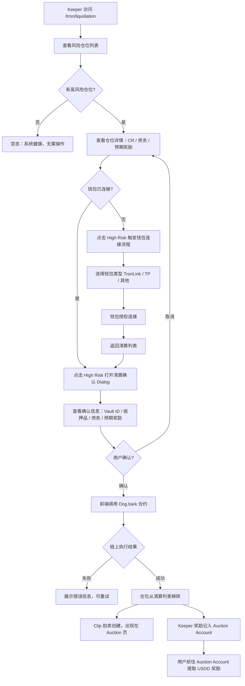
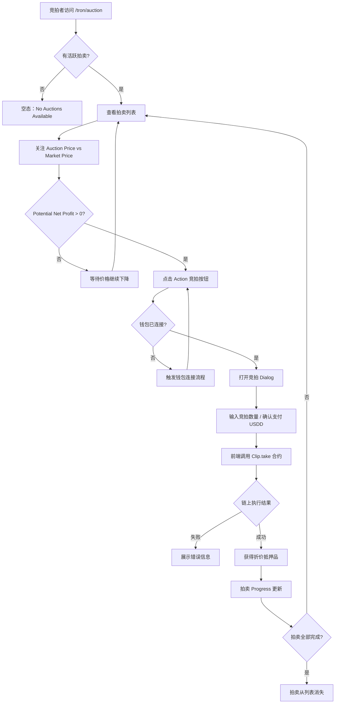
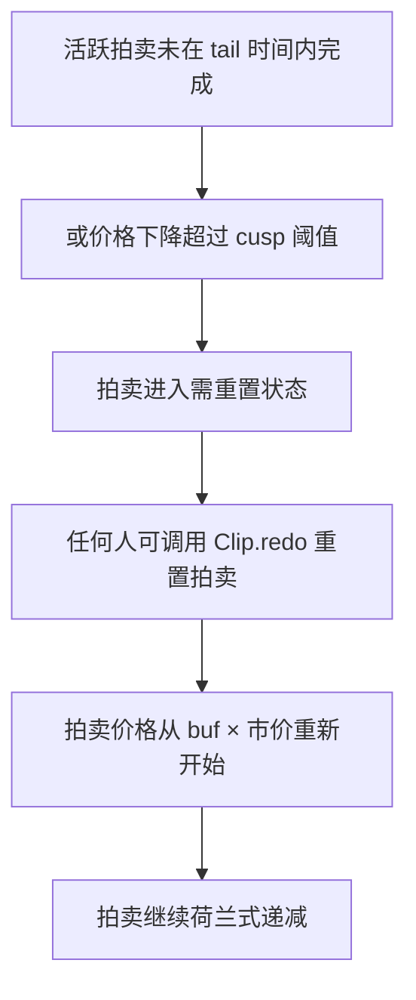

# 逆向还原 PRD | TRON 清算页（Vault Liquidations + Collateral Auctions）

> 模块名称：TRON Liquidation & Auction Page
> 页面入口：`https://app.usdd.io/tron/liquidation` / `https://app.usdd.io/tron/auction`
> 文档类型：逆向还原 PRD
> 还原日期：2026-04-02
> 还原依据：现网页面截图、DOM 结构、React Fiber 树、网络请求抓包、API 响应数据、Tooltip 文案提取、MakerDAO DSS 合约逻辑对照

---

## 先结论

TRON 清算模块由两个紧密关联的页面构成：

- **Vault Liquidations**（`/tron/liquidation`）：展示当前抵押率低于清算阈值的高风险仓位，供 Keeper 触发链上 `Dog.bark` 发起荷兰拍卖
- **Collateral Auctions**（`/tron/auction`）：展示当前活跃的荷兰式清算拍卖，供竞拍者调用 `Clip.take` 获取折价抵押品

两者共同构成 USDD 2.0 风控体系的链上执行闭环：预言机驱动风险识别 → Keeper 发起清算 → 荷兰拍卖完成债务回收。

该模块的核心用户价值：
1. **Keeper 激励**：系统为触发清算的用户提供 USDD 奖励（tip + chip × 债务），奖励在 Auction Account 中提取
2. **竞拍套利**：拍卖价格从市价溢价开始持续下降，竞拍者可以在市价以下买入折价抵押品

---

## 逆向事实层

### 已证实事实

**Vault Liquidations 页**

- 页面标题：`USDD | Liquidation`，路径 `/tron/liquidation`
- 页面说明文案："Liquidation is an essential process to ensure the stability of the USDD system."
- 数据源 API：`GET ``https://app-api.usdd.io/liquid/vaults?pageNo=1&pageSize=100`
- 表格 7 列：Vault Type、Vault ID、Collateral、Debt、Collateral Ratio ⓘ、Liquidation Reward ⓘ、Liquidate
- Collateral Ratio tooltip：*"Collateral ratio is below the Min. Collateral Ratio and should be liquidated."*
- Liquidation Reward tooltip：*"To encourage users to actively participate in the liquidation process, we offer a liquidation reward. After successfully completing a liquidation, you can withdraw your USDD reward in the Auction Account."*
- 数据刷新机制：页面右上角显示 "Updated at: YYYY-MM-DD HH:MM:SS"，带手动刷新按钮
- Liquidate 列状态按钮：已确认存在 `liquidate-action-hs`（高风险，橙色 "High Risk"）样式
- API 响应字段：`address`、`artAmount`（标准化债务）、`cdpIndex`（Vault ID）、`collateralRatio`、`cr`、`hasAirDrop`、`ilk`（抵押品类型）、`incentives`、`inkAmount`（抵押品数量）、`riskLevel`（风险等级，2 = 高风险）
- 现网数据示例：TRX-C #153，抵押品 2225.2368 TRX-C，债务 520.3708 USDD，CR = 135%，风险等级 2，Liquidation Reward = `null`
- 钱包未连接状态：按钮显示 "Connecting"，点击 "High Risk" 可进入钱包连接流程（❗未连接时无法触发清算）

**Collateral Auctions 页**

- 页面标题：`USDD | Auction`，路径 `/tron/auction`
- 页面说明文案："Collateral auctions maintain USDD stability by liquidating under-collateralized positions."
- 数据源 API（活跃拍卖）：`GET ``https://app-api.usdd.io/liquid/activeAuctions?pageNo=1&pageSize=100`
- 数据源 API（历史拍卖）：`GET ``https://app-api.usdd.io/liquid/auctions?pageNo=1&pageSize=100`
- 表格 8 列：Auction ID、Auction Debt ⓘ、Available Collateral ⓘ、Auction Price ⓘ、Market Price ⓘ、Potential Net Profit ⓘ、Progress、Action
- Tooltip 内容（均已验证）：

| 列名 | Tooltip 文案 |
| --- | --- |
| Auction Debt | The total amount of USDD debt being auctioned due to a vault liquidation. |
| Available Collateral | The amount of collateral tokens available in the auction for bidders. |
| Auction Price | The current price of the collateral in the auction. |
| Market Price | The current market price of the collateral token outside of the auction. |
| Potential Net Profit | The potential profit bidders can make if they win the auction at the current auction price, calculated as the difference between the market value of the collateral and the amount paid. |

- 空状态文案："No Auctions Available."，附空态图标
- 历史拍卖记录：共 17 条（auctionId 1~8），字段包含 `auctionId`、`blockNumber`、`timestamp`、`transactionHash`、`hasAirDrop`
- 现网活跃拍卖：0 条（`code: 2`，活跃列表为空）

**通用结构**

- 导航：Vault 下拉菜单包含三个子项
  - 🔥 **Borrow USDD** – "Borrow USDD using your collateral"（→ `/tron/vault`）
  - **Vault Liquidations** – "View positions close to liquidation"（→ `/tron/liquidation`）
  - **Collateral Auctions** – "Bid on collateral from liquidations"（→ `/tron/auction`）
- 网络限制：Liquidation 和 Auction 功能仅 TRON 网络可用（Ethereum/BNB Chain 不支持）
- 钱包支持：TronLink、TokenPocket、Binance Wallet、OKX Wallet、imToken、WalletConnect
- 前端技术栈：React 18、Ant Design 5.21.6、TronWeb 6.0.3、ethers 6.14.4

### 推断结论

- `riskLevel: 2` 对应"High Risk"橙色按钮，表明该仓位 CR 已低于 Min CR，可立即清算；`riskLevel: 1` 推断为中等预警（CR 接近但未达到清算阈值）
- `incentives: null` 时 Liquidation Reward 列显示 "--"，说明激励金额由链上 Clip 合约实时计算，API 仅在拍卖触发后才返回具体值
- `hasAirDrop` 字段与 USDD 空投激励活动相关，当前均为 false，属可选运营字段
- 点击"High Risk"按钮后（连接钱包），推断为弹出确认 Dialog → 用户确认 → 前端调用 `Dog.bark(ilk, urn)` 合约方法 → 成功后仓位从清算列表消失，进入拍卖页
- 竞拍的"Action"列按钮推断为"Bid"，对应 `Clip.take(id, amt, max, who, data)` 合约调用
- Auction Account 为链上地址余额，存储 Keeper 奖励（USDD），需用户手动提取

### 待确认项

- `riskLevel: 1` 的仓位在清算列表中是否展示，以及对应按钮样式与文案（⚠️ 待确认）
- 清算确认 Dialog 的完整字段内容（需钱包连接后验证）
- 竞拍 Action 按钮的完整交互流：是否有输入金额步骤、最大金额限制、滑点设置等（⚠️ 待确认）
- Auction Account 余额入口位置与提取操作流（⚠️ 待确认，Tooltip 提及但入口未发现）
- Progress 列的展示形式（进度条？百分比？）及含义（已拍卖比例 / 时间进度）（⚠️ 待确认）
- 荷兰拍卖价格下降速度（`clip.tail`、`clip.cusp` 参数与前台显示的关系）
- 拍卖重置（`Clip.redo`）的前台展示逻辑

---

## 1. 背景与目标

### 1.1 背景

USDD 2.0 采用超额抵押机制，当抵押品价格下跌导致仓位抵押率（CR）低于最低抵押率（Min CR）时，系统必须强制清算以保证 USDD 的足额储备支撑。USDD 2.0 的清算机制直接复用 MakerDAO DSS 的 Dog + Clip 荷兰拍卖架构，具备以下特性：

- **无需预置资金的闪电贷模式**：清算者可在单笔交易内完成"领取折价抵押品 → 外部套利 → 归还 USDD 债务"，降低清算门槛
- **Keeper 激励**：固定奖励（tip）+ 按债务比例奖励（chip × debt）激励 Keeper 保持系统健康
- **价格发现**：荷兰式递减价格拍卖，自然找到市场出清价格

Vault Liquidations 页和 Collateral Auctions 页是 USDD 2.0 清算机制的前台入口，服务于以下场景：

- 专业 Keeper 监控高风险仓位，第一时间触发清算获取奖励
- 套利者参与荷兰拍卖，以折价买入抵押品获利

### 1.2 业务目标

- 提供实时的风险仓位列表，确保 Keeper 能快速识别并触发清算
- 降低参与清算和竞拍的操作门槛（一键触发、可视化折价信息）
- 通过激励透明化（Liquidation Reward）吸引更多 Keeper 参与，提高清算执行速度
- 通过拍卖页面展示潜在利润（Potential Net Profit），吸引竞拍者参与，确保抵押品快速清仓
- 维持系统全局抵押率，保障 USDD 稳定锚定

### 1.3 非目标

- 不承担预言机价格监控或风险告警订阅功能
- 不承担 Vault 建仓/还款/抵押品调整操作
- 不承担 USDD 跨链桥或 PSM 兑换
- 不承担坏账拍卖（Flop）或盈余拍卖（Flap）功能
- 不提供自动 Bot/Keeper 脚本服务，仅提供前台界面操作入口

---

## 2. 目标用户与场景

### 2.1 目标用户

| 用户类型 | 核心关注 | 在本模块的价值 |
| --- | --- | --- |
| **专业 Keeper / 机器人运维者** | 清算触发效率、激励透明度、实时数据 | 快速识别可清算仓位，一键触发 `Dog.bark` 获取激励 |
| **套利者 / 竞拍者** | 折价幅度、潜在利润、拍卖进度 | 实时查看荷兰拍卖状态，在合适价位买入折价抵押品 |
| **TRON 生态 DeFi 用户** | 了解系统健康、参与生态 | 了解清算机制，偶发参与竞拍 |
| **风控监控人员** | 风险仓位数量、规模、CR 分布 | 通过清算列表评估系统整体风险敞口 |

### 2.2 核心场景

**Vault Liquidations 页**：
- Keeper 定期访问页面，扫描当前高风险仓位列表
- Keeper 点击"High Risk"按钮，连接钱包，确认后触发链上清算
- Keeper 清算成功后，进入 Auction Account 提取 USDD 奖励

**Collateral Auctions 页**：
- 套利者在有活跃拍卖时进入页面，查看 Auction Price vs Market Price 的折价幅度
- 套利者在 Potential Net Profit 为正时点击 Action（Bid）进行竞拍
- 无活跃拍卖时查看历史拍卖记录

---

## 3. 功能清单（P0/P1/P2）

### Vault Liquidations 页

#### P0（核心功能，上线必须）

- **风险仓位列表展示**：实时展示 CR < Min CR 的仓位，包含 Vault Type、Vault ID、Collateral、Debt、CR、Liquidation Reward、风险标记按钮
- **风险等级标识**：Liquidate 列展示风险等级按钮（High Risk 橙色 / 其他状态），可视化反映仓位紧急程度
- **Tooltip 说明**：Collateral Ratio 和 Liquidation Reward 列标题均提供 Tooltip 解释
- **数据刷新**：展示数据最后更新时间，提供手动刷新按钮
- **清算操作入口**：点击 "High Risk" 按钮，连接钱包后可触发清算（调用 `Dog.bark`）
- **钱包连接流程**：支持 TronLink、TokenPocket、Binance Wallet、OKX Wallet、imToken、WalletConnect

#### P1（重要功能，优先跟进）

- **清算确认 Dialog**：触发清算前弹出确认弹窗，展示待清算仓位详情（Vault ID、抵押品、债务、预期奖励）
- **空状态**：当前无风险仓位时展示空态提示（系统健康状态）
- **错误态**：链上交易失败时的错误提示与重试引导
- **Learn more 链接**：标题说明文案中提供跳转 docs.usdd.io 的外链

#### P2（增量优化）

- **Liquidation Reward 金额展示**：当 `incentives` 字段有值时，展示具体的预期奖励金额（当前显示 "--"）
- **竞拍成功提示**：清算触发成功后的成功状态提示与 Auction Account 引导
- **Vault ID 跳转链接**：点击 Vault ID 可跳转到 TRON 区块浏览器查看仓位详情

### Collateral Auctions 页

#### P0（核心功能）

- **活跃拍卖列表**：实时展示当前活跃的荷兰式拍卖，包含所有 8 列数据
- **数据刷新**：展示最后更新时间，提供手动刷新按钮
- **空状态**：无活跃拍卖时展示 "No Auctions Available."
- **竞拍操作（Action 列）**：提供竞拍按钮，连接钱包后可调用 `Clip.take`
- **Tooltip 说明**：5 列 Info 图标均提供完整 Tooltip 文案

#### P1

- **Potential Net Profit 可视化**：正值时绿色高亮，体现套利机会
- **Progress 列**：展示拍卖进度（已拍出比例或剩余时间）
- **价格实时更新**：Auction Price 应随时间自动递减，页面需定时刷新
- **竞拍确认 Dialog**：输入竞拍金额/数量，展示预期获得抵押品数量和需支付 USDD

#### P2

- **历史拍卖记录**：展示已结束的拍卖（17 条历史数据），包含区块链交易哈希链接
- **拍卖重置（Redo）提示**：当拍卖超时（tail 时间到）或价格跌幅过大（cusp）时，需要调用 `Clip.redo` 重置，前台需要标识并提供操作入口

---

## 4. 用户流程

### 4.1 Keeper 触发清算完整流程



### 4.2 竞拍者参与拍卖完整流程



### 4.3 拍卖重置流程（异常态）



---

## 5. 业务规则

### 5.1 风险阈值规则

| ilk 类型 | Min CR | 进入清算列表条件 |
| --- | --- | --- |
| TRX-A | 145% | CR < 145% |
| TRX-B | 130% | CR < 130% |
| TRX-C | 170% | CR < 170% |
| sTRX-A | 待确认 | CR < Min CR |
| USDT-A | 105% | CR < 105% |

- 仅显示 CR 低于 Min CR 的仓位（`riskLevel ≥ 1`）
- `riskLevel: 2`（高风险）：CR 显著低于 Min CR，优先展示
- `riskLevel: 1`（中等风险）：CR 接近 Min CR（距离阈值 < 10%），待确认是否在本页展示

### 5.2 清算激励规则（Liquidation Reward）

- 激励公式：`INCENT = clip.tip + ART × ilk.rate × Dog.ilk.chop × clip.chip`
  - `clip.tip`：固定奖励（当前 = 0.3 USDD，单位 rad）
  - `clip.chip`：按债务比例奖励（当前 = 0.1%）
  - `Dog.ilk.chop`：清算罚金（当前 = 13%）
- `incentives: null` 时前台显示 "--"
- 奖励以 USDD 计价，存入 Keeper 的 Auction Account，需手动提取

### 5.3 荷兰拍卖规则（Collateral Auctions）

- 拍卖起始价格 = 抵押品市场价格 × `buf`（当前 buf = 1.05，即溢价 5% 开始）
- 价格按时间线性递减，直至完全清偿债务
- 重置条件（任意一个满足则需 redo）：
  - 拍卖时长超过 `tail`（当前 = 13200 秒 = 3.67 小时）
  - 当前拍卖价格低于起始价格 × `cusp`（当前 cusp = 90%，即下跌超过 10%）
- 支持闪电贷模式：`Clip.take` 调用时 `who` 指向套利合约，`data` 为套利指令
- Potential Net Profit = (Market Price - Auction Price) × Available Collateral Amount

### 5.4 数据刷新规则

- 页面自动定期刷新（轮询 `/liquid/vaults` 和 `/liquid/activeAuctions`）
- 刷新间隔推断为约 60 秒（基于页面时间戳观测）
- 手动刷新按钮：点击立即请求最新数据并更新时间戳
- 拍卖价格应实时变动，前台可能需要更高频率的局部刷新

### 5.5 钱包与链规则

- 清算和竞拍操作要求 TRON 钱包（TronLink 等），仅在 TRON 链可用
- Ethereum / BNB Chain 网络不支持 Liquidation 和 Auction 功能
- 未连接钱包时：按钮可见但操作时强制触发连接流程
- 支持钱包类型：TronLink、TokenPocket、Binance Wallet、OKX Wallet、imToken、WalletConnect

### 5.6 分页规则

- 当前 API 请求 `pageSize=100`，推断清算列表支持分页
- 正常情况下清算仓位数量较少，多数情况无需分页
- 历史拍卖数据 (`/liquid/auctions`) 含 17 条记录，当前无分页 UI

---

## 6. UI / 交互说明

### 6.1 Vault Liquidations 页

#### 页面结构

```
[Header：USDD Logo + 导航菜单（Vault ▼ / Swap(PSM) / Migrate / Earn）+ 钱包按钮]
[Hero 区域：
  - 大标题：Vault liquidations（黄绿渐变文字）
  - 副标题 + "Learn more" 链接 → docs.usdd.io
]
[主内容卡片：
  - 卡片标题：Vault liquidations + 更新时间 + 刷新按钮
  - 表格：7 列（Vault Type / Vault ID / Collateral / Debt / CR ⓘ / Reward ⓘ / Liquidate）
  - 每行：抵押品图标 + ilk 名称 / # 编号 / 数量 + 单位 / 数量 USDD / 百分比 / 金额或 "--" / 操作按钮
  - 空状态：无风险仓位时显示系统健康提示
]
[Footer：support@usdd.io / 版权 / 社交链接]
```

#### 操作按钮状态

| 状态 | 样式 | 文案 | 触发条件 |
| --- | --- | --- | --- |
| 高风险可清算 | 橙色填充（`liquidate-action-hs`） | High Risk | riskLevel = 2，CR 低于 Min CR |
| 中等风险 | 黄色（推断） | Medium Risk | riskLevel = 1（⚠️ 待确认） |
| 已清算/拍卖中 | 灰色禁用（推断） | In Auction | 已触发清算，拍卖进行中 |

#### Collateral Ratio 展示

- 以百分比格式展示（如 "135.00 %"）
- 颜色编码（推断）：CR 越低越偏红/橙色

### 6.2 Collateral Auctions 页

#### 页面结构

```
[Header：同上]
[Hero 区域：
  - 大标题：Collateral Auctions（绿色渐变文字）
  - 副标题 + "Learn more" 链接 → docs.usdd.io
]
[主内容卡片：
  - 卡片标题：Collateral Auctions + 更新时间 + 刷新按钮
  - 表格：8 列（Auction ID / Debt ⓘ / Collateral ⓘ / Auction Price ⓘ / Market Price ⓘ / Net Profit ⓘ / Progress / Action）
  - 空状态：无拍卖时展示 "No Auctions Available." + 空态图标
]
[Footer：同上]
```

#### Progress 列

- 展示当前拍卖的完成比例（已拍出债务 / 总债务）
- 可能为进度条 + 百分比文字双显示

#### Potential Net Profit 交互

- 基于实时 Auction Price 和 Market Price 计算
- 正值：绿色文字，提示套利机会
- 零或负值：灰色/红色，表示当前无套利空间，需等待价格继续下降

---

## 7. 异常场景与边界

| 场景 | 处理方式 |
| --- | --- |
| 钱包未连接时点击 Liquidate 按钮 | 强制弹出钱包选择 Dialog |
| Dog.bark 调用失败（gas 不足、竞争失败等） | Toast 错误提示 + 刷新列表（仓位可能已被他人清算） |
| 仓位在点击前已被他人清算 | 列表刷新后该行消失；若前端未更新，链上交易会 revert |
| 拍卖价格超过市场价格（高于 Market Price） | Potential Net Profit 为负，不建议竞拍；等待价格下降 |
| 拍卖超时或跌幅过大（需 redo） | 前台标识"需重置"状态；任何人可调用 `Clip.redo` |
| 竞拍时 USDD 余额不足 | 交易提交失败；前台应在 Dialog 前校验余额 |
| 网络请求失败 / API 超时 | 展示加载失败状态 + 重试按钮；保留最后一次缓存数据并显示旧时间戳 |
| 清算列表为空（无风险仓位） | 展示正向空态：系统健康，所有仓位安全 |
| TRX-C #153 仓位被清算后 | 该行从列表消失，Auction 页出现新拍卖 |

---

## 8. 数据埋点需求

### 8.1 页面事件

| 事件名 | 触发时机 | 关键参数 |
| --- | --- | --- |
| `liquidation_page_view` | 进入 /tron/liquidation | network, wallet_connected |
| `auction_page_view` | 进入 /tron/auction | network, active_auction_count |
| `liquidation_list_refresh` | 点击刷新按钮 | vault_count |
| `auction_list_refresh` | 点击刷新按钮 | active_auction_count |

### 8.2 核心交互事件

| 事件名 | 触发时机 | 关键参数 |
| --- | --- | --- |
| `liquidate_button_click` | 点击 High Risk 按钮 | vault_id, ilk, cr, debt_amount |
| `liquidate_confirm` | 确认清算 Dialog | vault_id, ilk, expected_reward |
| `liquidate_success` | Dog.bark 链上成功 | vault_id, ilk, reward_amount, tx_hash |
| `liquidate_failed` | Dog.bark 失败 | vault_id, error_type |
| `auction_bid_click` | 点击竞拍 Action 按钮 | auction_id, auction_price, market_price, profit |
| `auction_bid_confirm` | 确认竞拍 Dialog | auction_id, bid_amount |
| `auction_bid_success` | Clip.take 链上成功 | auction_id, collateral_received, usdd_paid, tx_hash |
| `auction_bid_failed` | Clip.take 失败 | auction_id, error_type |
| `connect_wallet_triggered` | 清算/竞拍前触发钱包连接 | source_action（liquidate/bid） |

---

## 9. 国际化与文案

### 9.1 当前语言

- 当前页面为纯英文，无多语言切换入口（待确认是否有 i18n 支持）

### 9.2 关键文案

| Key | 文案（EN） | 备注 |
| --- | --- | --- |
| `liquidation.page_title` | Vault liquidations | Hero 标题 |
| `liquidation.subtitle` | Liquidation is an essential process to ensure the stability of the USDD system. | 副标题 |
| `liquidation.learn_more` | Learn more | 链接文案 |
| `liquidation.table.vault_type` | Vault Type | 列标题 |
| `liquidation.table.vault_id` | Vault ID | 列标题 |
| `liquidation.table.collateral` | Collateral | 列标题 |
| `liquidation.table.debt` | Debt | 列标题 |
| `liquidation.table.cr` | Collateral Ratio | 列标题 |
| `liquidation.table.cr_tooltip` | Collateral ratio is below the Min. Collateral Ratio and should be liquidated. | Tooltip |
| `liquidation.table.reward` | Liquidation Reward | 列标题 |
| `liquidation.table.reward_tooltip` | To encourage users to actively participate in the liquidation process, we offer a liquidation reward. After successfully completing a liquidation, you can withdraw your USDD reward in the Auction Account. | Tooltip |
| `liquidation.table.liquidate` | Liquidate | 列标题 |
| `liquidation.btn.high_risk` | High Risk | 按钮文案 |
| `liquidation.updated_at` | Updated at: | 时间前缀 |
| `auction.page_title` | Collateral Auctions | Hero 标题 |
| `auction.subtitle` | Collateral auctions maintain USDD stability by liquidating under-collateralized positions. | 副标题 |
| `auction.table.auction_id` | Auction ID | 列标题 |
| `auction.table.debt` | Auction Debt | 列标题 |
| `auction.table.debt_tooltip` | The total amount of USDD debt being auctioned due to a vault liquidation. | Tooltip |
| `auction.table.collateral` | Available Collateral | 列标题 |
| `auction.table.collateral_tooltip` | The amount of collateral tokens available in the auction for bidders. | Tooltip |
| `auction.table.auction_price` | Auction Price | 列标题 |
| `auction.table.auction_price_tooltip` | The current price of the collateral in the auction. | Tooltip |
| `auction.table.market_price` | Market Price | 列标题 |
| `auction.table.market_price_tooltip` | The current market price of the collateral token outside of the auction. | Tooltip |
| `auction.table.profit` | Potential Net Profit | 列标题 |
| `auction.table.profit_tooltip` | The potential profit bidders can make if they win the auction at the current auction price, calculated as the difference between the market value of the collateral and the amount paid. | Tooltip |
| `auction.table.progress` | Progress | 列标题 |
| `auction.table.action` | Action | 列标题 |
| `auction.empty` | No Auctions Available. | 空态文案 |

---

## 10. 兼容性与平台差异

- **仅 TRON 网络可用**：Liquidation 和 Auction 功能不支持 Ethereum / BNB Chain
- **仅支持 TRON 钱包**：TronLink、TokenPocket 等 TRON 兼容钱包
- **桌面端为主**：当前页面以宽屏表格布局为主，移动端适配待验证
- **闪电贷支持**：`Clip.take` 的 `who/data` 参数支持外部套利合约调用，但前台界面不暴露此能力，需通过链上直接调用

---

## 11. 安全与隐私

- **合约调用安全**：`Dog.bark` 和 `Clip.take` 均为公开合约函数，无权限限制，任何地址可调用
- **预言机操纵风险**：Median + OSM 三级预言机管线提供 1 小时价格延迟（`hop`），防止瞬时价格操纵触发恶意清算
- **Gas 竞争**：高风险仓位可能存在多个 Keeper 同时竞争清算，前台应提示竞争失败风险
- **闪电贷攻击防护**：Clip 合约内置重入防护，`Clip.take` 不可重入
- **用户资产安全**：竞拍前仅需 USDD 余额，不需要预存抵押品；前台需在提交前校验 USDD 余额充足
- **Wallet 地址隐私**：本页记录用户钱包地址用于链上交互，不存储至中心化后端（待确认）

---

## 12. 成功指标与验收

### 12.1 核心指标（North Star）

| 指标 | 含义 | 健康值参考 |
| --- | --- | --- |
| **平均清算响应时间** | 仓位 CR < Min CR 到链上 `Dog.bark` 成功的时间 | < 5 分钟 |
| **清算完成率** | 进入清算列表后最终被清算的仓位比例 | > 95% |
| **拍卖清仓率** | 通过拍卖完整清偿债务的拍卖比例 | > 90% |
| **Keeper 参与数量** | 单月参与过清算触发的唯一钱包数 | 增长趋势 |

### 12.2 验收标准

- [ ] 访问 `/tron/liquidation`，页面标题显示 "Vault liquidations"，表格正确加载
- [ ] CR < Min CR 的仓位显示 "High Risk" 橙色按钮，Tooltip 文案正确
- [ ] Liquidation Reward Tooltip 文案正确提及 "Auction Account"
- [ ] 点击 "High Risk" 未连接钱包时触发钱包连接流程
- [ ] 数据更新时间戳正确显示，刷新按钮可触发重新拉取
- [ ] 访问 `/tron/auction`，页面标题显示 "Collateral Auctions"
- [ ] 无活跃拍卖时正确展示 "No Auctions Available." 空态
- [ ] 5 个 Tooltip 均正确展示对应文案
- [ ] 导航 Vault 下拉菜单展示三个子项（Borrow USDD / Vault Liquidations / Collateral Auctions）

---

## 附录：相关合约与 API

### 合约方法映射

| 前台操作 | 合约方法 | 说明 |
| --- | --- | --- |
| 触发清算（High Risk 按钮） | `Dog.bark(ilk, urn, kpr)` | 标记仓位进入清算，调用者为 Keeper 地址 |
| 参与竞拍（Action 按钮） | `Clip.take(id, amt, max, who, data)` | 以当前拍卖价格购买指定数量抵押品 |
| 重置拍卖（Redo） | `Clip.redo(id, kpr)` | 重置超时或价格过低的拍卖 |
| 提取 Keeper 奖励 | `Vat.move(src, dst, rad)` + 相关提取 | 从 Auction Account 提取 USDD 奖励 |

### API 端点

| 端点 | 用途 |
| --- | --- |
| `GET /liquid/vaults?pageNo=1&pageSize=100` | 获取高风险仓位列表 |
| `GET /liquid/activeAuctions?pageNo=1&pageSize=100` | 获取当前活跃拍卖 |
| `GET /liquid/auctions?pageNo=1&pageSize=100` | 获取历史拍卖记录 |
| `GET /portfolio/ilks` | 获取支持的抵押品类型 |

### 关键合约参数（当前值）

| 参数 | 值 | 含义 |
| --- | --- | --- |
| `clip.buf` | 1.05 (105%) | 拍卖起始价格 = 市价 × 1.05 |
| `clip.tail` | 13200s (3.67h) | 拍卖最大持续时间 |
| `clip.cusp` | 0.9 (90%) | 价格跌至起始价 90% 时需重置 |
| `clip.chip` | 0.1% | 按债务比例的 Keeper 奖励 |
| `clip.tip` | 0.3 USDD | 固定 Keeper 奖励 |
| `dog.chop` | 1.13 (13%) | 清算罚金比例 |
| `dog.hole` | 1.5e+53 rad | 系统总清算上限 |
