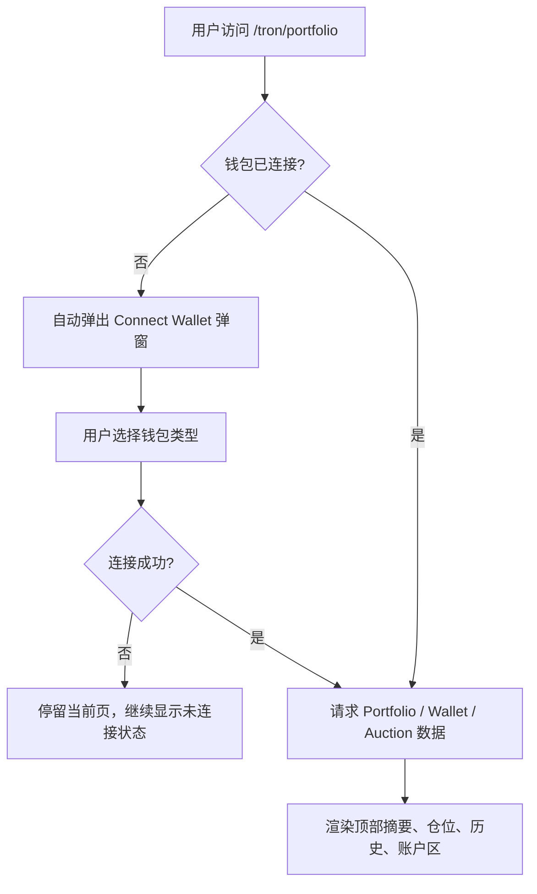
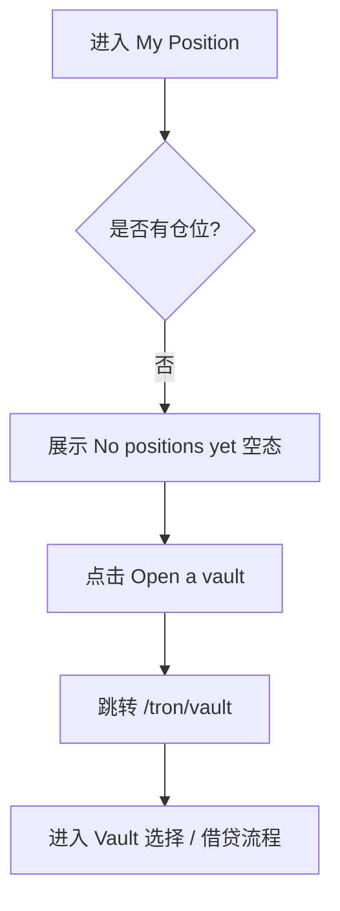
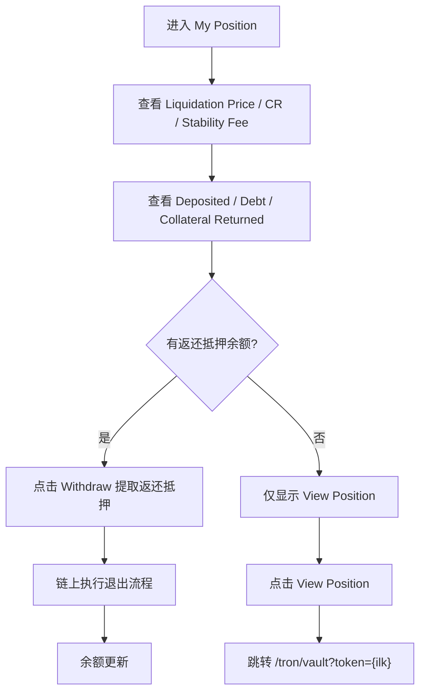
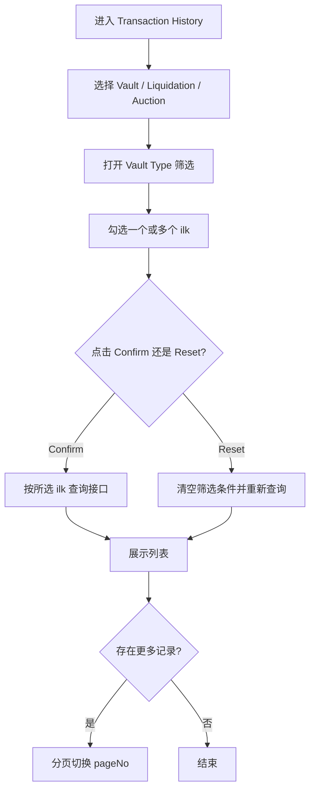
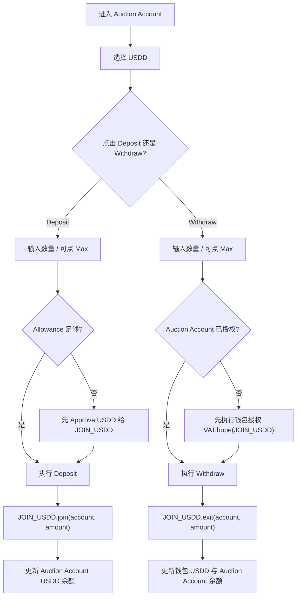

# 逆向还原 PRD | TRON Portfolio 页面（My Position + Transaction History + Wallet Assets + Auction Account）

> 模块名称：TRON Portfolio Page
> 页面入口：`https://app.usdd.io/tron/portfolio`
> 文档类型：逆向还原 PRD
> 还原日期：2026-04-02
> 还原依据：现网页面运行态、浏览器交互验证、DOM 提取、JS Bundle 逆向、路由配置、页面文案、链上动作命名、USDD 2.0 机制约束

---

## 先结论

`/tron/portfolio` 不是单一“资产总览页”，而是 TRON 用户在 USDD 2.0 体系内的个人资产与行为工作台。它把四类原本分散的能力聚合在一个页面内：

- **My Position**：查看个人 Vault 仓位、清算后返还抵押、继续进入仓位管理
- **Transaction History**：回看 Vault / Liquidation / Auction 三类历史行为
- **Wallet Assets**：查看与 USDD 业务直接相关的钱包资产，并为下一步操作提供快捷入口
- **Auction Account**：管理拍卖账户里的 USDD 与清算所得抵押品，用于竞拍资金沉淀与奖励提取

从业务机制上看，这页的核心目标不是“看余额”，而是让用户围绕 USDD 形成持续闭环：

1. 资产持有者从钱包资产进入 Vault 借贷或收益模块
2. 已建仓用户回看仓位状态并继续增减仓
3. 发生清算后，用户在 Portfolio 中看见返还抵押并执行提取
4. 参与拍卖或获得奖励的用户，在 Auction Account 中完成存取与资金回收

因此，Portfolio 页是 USDD 2.0 在 TRON 上连接**增长、收益、清算善后、资金沉淀**的关键中枢页。

---

## 逆向事实层

### 已证实事实

**页面基础**

| 项目 | 已证实内容 |
| --- | --- |
| 路由 | `/tron/portfolio` |
| 页面标题 | `USDD | Portfolio` |
| 链支持 | 路由配置声明该页仅支持 TRON |
| 未连接行为 | 页面加载后若无钱包地址，会自动打开连接钱包弹窗 |
| 顶部摘要 | `Your Total Deposited`、`Your Total Minted (USDD)` |
| 未连接默认值 | 未连接时顶部摘要默认展示 `0` / `0` |
| 顶部数据接口 | `GET /portfolio/detail?address={account}` |
| 顶部刷新机制 | 通过统一轮询逻辑定时刷新，周期约 60 秒 |

**主视图区**

| 区域 | 已证实内容 |
| --- | --- |
| 桌面主 Tab | `My Position`、`Transaction History` |
| 移动端主 Tab | `My Position`、`History`、`My Account` |
| My Position 空态 | `No positions yet`、`Create a position to see it here`、`Open a vault` |
| 空态跳转 | `Open a vault` 跳转 `/tron/vault` |
| Transaction History 子 Tab | `Vault`、`Liquidation`、`Auction` |
| History 筛选 | `Vault Type` 下拉，多选，带 `Confirm` / `Reset` |
| History 空态 | `No transaction yet` |
| History 分页 | `pageSize = 10`，存在分页逻辑 |

**右侧 / 账户区**

| 模块 | 已证实内容 |
| --- | --- |
| 桌面侧栏 Tab | `Wallet Assets`、`Auction Account` |
| 移动端归属 | 归入顶层 `My Account` 页签 |
| Wallet Assets 卡片 | `USDD`、`USDDOLD`、`TRX`、`sTRX`、`USDT` |
| Wallet Assets 快捷动作 | `Earn`、`Migrate`、`Deposit` |
| 快捷路由 | `/tron/earn`、`/tron/migrate`、`/tron/vault?token=TRX-A`、`/tron/vault?token=STRX-A`、`/tron/vault?token=USDT-A` |
| Auction Account 说明 | “Only USDD in this account can be used for auctions.” |
| Auction Account 支持动作 | USDD 可 `Deposit` / `Withdraw`；抵押品仅 `Withdraw` |

**My Position 卡片字段**

| 字段 | 已证实内容 |
| --- | --- |
| 核心风控 | `Liquidation Price`、`Collateral Ratio`、`Stability Fee` |
| 抵押视角 | `{Token} Deposited` |
| 债务视角 | `USDD Debt` |
| 清算善后 | `Collateral Returned` |
| 继续操作 | `View Position` |
| 条件性操作 | 若存在返还抵押余额，则显示 `Withdraw` |
| 排序 | 仓位存在时显示 `Sort by`，选项为 `Vault increase` / `Vault decrease` |

**Transaction History 接口**

| 类型 | 接口 |
| --- | --- |
| Vault 历史 | `GET /portfolio/transactions` |
| Liquidation 历史 | `GET /portfolio/liquidation` |
| Auction 历史 | `GET /portfolio/auctionHistory` |
| Vault 类型选项 | `GET /portfolio/ilks` |

**Transaction History 行语义**

| 类型 | 已证实内容 |
| --- | --- |
| Vault | 行内至少包含 `Ilk`、`Index`、`Description`、`Time` |
| Liquidation | 标题文案会按状态显示 `Liquidated {ink} {ilk}` 或 `Restarted {ink} {ilk}` |
| Auction | 标题文案会显示 `Auctioned {collateralAmount} {ilk}` |

**Auction Account 动作逻辑**

| 动作 | 已证实内容 |
| --- | --- |
| USDD Deposit | 先检查 USDD allowance；不足时先 `Approve`，再 `Deposit` |
| USDD Withdraw | 先检查 Auction Account 授权；未授权时先执行钱包授权，再 `Withdraw` |
| USDD 入账方式 | `JOIN_USDD.join(account, amount)` |
| USDD 出账方式 | `JOIN_USDD.exit(account, amount)` |
| 授权动作 | `VAT.hope(JOIN_USDD)` |
| 抵押品提取 | 来自拍卖账户里的 Vat 余额，仅支持 `Withdraw` |
| TRX 提示 | 提取时会提示实际提取为 `WTRX`，与 `TRX` 1:1 等值 |

### 推断结论

- Portfolio 页的设计目标是把“资产查看”与“下一步行动”合并，尽量减少用户在 Vault、Earn、Migrate、Auction 之间来回找入口的成本。
- Wallet Assets 不是完整钱包扫描器，而是**面向 USDD 业务的白名单资产面板**，只展示与借贷、收益、迁移直接相关的资产。
- My Position 的 `Collateral Returned` 不是普通可提余额，而是**清算结束后可返还给原仓位用户的剩余抵押**，承接清算善后。
- Auction Account 不是普通钱包余额，而是**拍卖参与专用链上账户视图**，服务于竞拍资金准备、清算奖励提取、拍得资产领取。
- 顶部 `Your Total Deposited` 与 `Your Total Minted (USDD)` 更偏向 CDP 活跃度视角，不等同于用户钱包总资产。

### 待确认项

- ⚠️ 待确认：顶部 `Your Total Deposited` 是否只统计当前活跃仓位抵押，不含已清算待返还抵押。
- ⚠️ 待确认：`Vault increase` / `Vault decrease` 的精确定义是按最近仓位变化方向排序，还是按抵押/债务净变化排序。
- ⚠️ 待确认：My Position 卡片连接钱包后的完整视觉样式与多仓位并列展示细节。
- ⚠️ 待确认：Auction Account 在移动端的完整版式、按钮排列和弹窗层级。
- ⚠️ 待确认：USDD 卡片上的“new”小标识是否对应新收益入口或运营提示。
- ⚠️ 待确认：`/portfolio/detail` 返回的 `items` 是否包含已完全关闭但仍可提取返还抵押的历史仓位。

---

## 1. 背景与目标

### 1.1 背景

USDD 2.0 的 TRON 端并非只有“借”这一条主路径，而是由以下连续链路组成：

- 持有 TRX / sTRX / USDT 等资产，进入 Vault 借出 USDD
- 持有 USDD 后进入 Earn 获取收益
- 遇到仓位被清算后，回到 Portfolio 查看返还抵押并提取
- 参与 Auction 前，需要先把 USDD 充值到 Auction Account
- 获得拍卖抵押或清算奖励后，再从 Auction Account 提回钱包

如果这些链路全部分散在不同页面，用户容易出现：

- 不知道自己在哪些模块还有余额
- 不知道清算后是否还有资产可回收
- 不知道拍卖前 USDD 需要放在哪个账户
- 钱包里有资产，但不知道下一步可去 Earn、Migrate 还是 Vault

Portfolio 页的存在，本质上是在 USDD 2.0 里提供一个“用户侧资产驾驶舱”，把资产、仓位、历史与拍卖账户聚合展示。

### 1.2 业务目标

- 让 TRON 用户快速理解自己在 USDD 体系内的资产状态、借贷状态与可执行动作。
- 承接钱包资产到 Vault / Earn / Migrate 的转化，提高 USDD 使用深度与留存。
- 为发生清算或参与拍卖的用户提供善后资金入口，提升资金回收效率。
- 通过统一历史页让用户建立对 Vault、Liquidation、Auction 三类行为的可解释认知。
- 在不增加过多学习成本的前提下，把拍卖专用账户规则明确传达给用户。

### 1.3 非目标

- 不承担完整钱包资产管理职责，不展示所有 TRON 资产。
- 不承担 Vault 参数配置、治理管理或风控后台功能。
- 不承担拍卖市场发现页职责，那是 `/tron/auction` 页面主责。
- 不承担完整的新手教育中心，仅提供最必要的状态说明和动作入口。

---

## 2. 目标用户与场景

### 2.1 目标用户

| 用户类型 | 核心诉求 | 页面价值 |
| --- | --- | --- |
| 已建仓借贷用户 | 查看仓位、继续调仓、处理清算后返还资产 | 通过 `My Position` 聚合管理 |
| 收益型用户 | 查看 USDD 并继续进入 Earn | 通过 Wallet Assets 快速跳转 |
| 迁移用户 | 持有 USDDOLD 并想完成迁移 | 通过 `Migrate` 快捷入口承接 |
| 拍卖参与者 / Keeper | 管理 Auction Account 中的 USDD 与拍卖所得资产 | 完成竞拍前充值与竞拍后提取 |
| 风险敏感用户 | 回看清算、拍卖、仓位历史 | 通过 History 理解资产变化轨迹 |

### 2.2 核心场景

| 场景 | 触发条件 | 期望结果 |
| --- | --- | --- |
| 新用户首次进入 | 从导航进入 `/tron/portfolio`，尚未连接钱包 | 自动弹出钱包连接，引导进入体系 |
| 无仓位用户查看 | 已连接但未开仓 | 看到空态并通过 `Open a vault` 开始建仓 |
| 有仓位用户回看状态 | 已有 Vault | 查看抵押、债务、清算价、可返还抵押，并进入详情页 |
| 用户查看行为记录 | 想确认过去做过哪些 Vault / 清算 / 拍卖操作 | 通过 History 筛选和分页回看 |
| 拍卖前准备资金 | 用户想参与 Auction | 先把钱包中的 USDD 充值进 Auction Account |
| 清算 / 竞拍后回收资金 | 用户在 Auction Account 中有 USDD 或抵押品余额 | 从账户中提回钱包 |

---

## 3. 功能清单（P0/P1/P2）

### P0

- 顶部总览：展示 `Your Total Deposited` 与 `Your Total Minted (USDD)`。
- 自动钱包连接引导：未连接时进入页面自动打开连接钱包弹窗。
- My Position：展示当前用户仓位，支持继续进入 `View Position`。
- My Position 空态：无仓位时展示空态与 `Open a vault`。
- Transaction History：支持 `Vault` / `Liquidation` / `Auction` 三类记录切换。
- Vault Type 筛选：支持选择一个或多个 `ilk`，并通过 `Confirm` / `Reset` 控制查询。
- Wallet Assets：展示与 USDD 业务强相关的白名单资产，并提供快捷入口。
- Auction Account：支持 USDD 充值与提取，以及拍卖所得抵押品提取。

### P1

- My Position 排序：支持 `Vault increase` / `Vault decrease` 排序。
- Collateral Returned 提取：若返还抵押存在余额，在仓位卡片直接提取。
- History 分页：支持多页记录浏览。
- 价格辅助展示：Wallet Assets 卡片显示币种价格和估值。
- 轮询刷新：核心数据定期刷新，降低状态滞后。

### P2

- 更细粒度的状态标签，例如按仓位风险或返还状态进行区分。
- Wallet Assets 卡片支持更多面向业务的说明提示。
- History 支持更丰富筛选，如时间区间、交易结果、链上哈希跳转。

---

## 4. 用户流程

### 4.1 首次进入与钱包连接

### 4.2 无仓位用户开始建仓

### 4.3 有仓位用户查看与继续操作

### 4.4 Transaction History 查询流程

### 4.5 Auction Account 的 USDD 充值 / 提取

---

## 5. 业务规则

### 5.1 页面与链路规则

| 规则 | 说明 |
| --- | --- |
| TRON 专属 | 页面路由仅支持 TRON 网络 |
| 进入即引导连接 | 页面在无钱包地址时会自动打开钱包连接弹窗，而不是仅展示静态占位 |
| 顶部指标偏业务口径 | `Your Total Deposited` / `Your Total Minted` 更偏 CDP 口径，不等于钱包总资产 |
| Wallet Assets 有白名单 | 只展示与 USDD 业务强相关的资产，不做全钱包资产遍历 |
| Auction Account 独立于钱包 | 只有 Auction Account 中的 USDD 才能用于拍卖，不等同于钱包中持有的 USDD |

### 5.2 My Position 规则

| 规则 | 说明 |
| --- | --- |
| 数据来源 | 与顶部总览共享 `/portfolio/detail` 基础数据源，但仓位列表带排序参数 |
| 排序参数 | 默认 `sort=0`，用户选择后切换到 `1` 或 `2` |
| 排序控件展示条件 | 仅在仓位列表非空时显示 |
| View Position 跳转 | 按仓位 `ilk` 跳转到对应 Vault 管理页 |
| Collateral Returned 含义 | 展示清算结束后可返还给用户的剩余抵押 |
| Collateral Returned 按钮展示 | 仅当返还抵押余额 `>= 0.0001` 时展示 `Withdraw` |
| 提取实现 | TRX 走原生退出逻辑；TRC20 抵押品走代币退出逻辑 |

### 5.3 Transaction History 规则

| 规则 | 说明 |
| --- | --- |
| Tab 独立接口 | `Vault`、`Liquidation`、`Auction` 分别请求不同接口 |
| pageSize 固定 | 单页 10 条 |
| 支持多选筛选 | 用户可选择多个 `ilk` 作为过滤条件 |
| 筛选选项来源 | 由 `/portfolio/ilks` 返回；运行态已看到 `sTRX-A`、`TRX-A`、`TRX-B`、`TRX-C`、`USDT-A` |
| Confirm / Reset 分离 | 只有点击 `Confirm` 才提交当前筛选；`Reset` 清空筛选并重查 |
| 异步防串页 | 页面内部用 tab-key 防止旧请求覆盖新 tab 数据 |
| Auction 文案 | 代码枚举中内部命名出现 `Actions`，但实际 UI 文案展示为 `Auction` |

### 5.4 Wallet Assets 规则

| 资产 | 快捷动作 | 规则说明 |
| --- | --- | --- |
| USDD | `Earn` | 引导进入收益页，提升资金沉淀 |
| USDDOLD | `Migrate` | 引导完成旧币迁移 |
| TRX | `Deposit` | 进入 `TRX-A` Vault |
| sTRX | `Deposit` | 进入 `STRX-A` Vault |
| USDT | `Deposit` | 进入 `USDT-A` Vault |

### 5.5 Auction Account 规则

| 规则 | 说明 |
| --- | --- |
| USDD Deposit 前置条件 | 钱包中需有足够 USDD；allowance 不足时先 Approve |
| USDD Withdraw 前置条件 | Auction Account 中需有足够 USDD；若未授权需先 `VAT.hope` |
| 抵押品操作限制 | 抵押品仅允许 Withdraw，不允许从钱包主动存入 |
| TRX 提现形式 | 实际提示为 WTRX 1:1 提取 |
| 输入校验一 | 输入值必须大于 0 |
| 输入校验二 | 输入值不得超过当前可用最大值 |
| Modal 行为 | 动作按钮会根据当前授权状态在 `Approve` / `Deposit` / `Withdraw` 间切换 |

### 5.6 数据刷新规则

| 模块 | 刷新特征 |
| --- | --- |
| 顶部总览 / Portfolio 数据 | 约每 60 秒轮询 |
| Auction Account 数据 | 约每 60 秒轮询 |
| Wallet Assets 估值 | 依赖价格接口与钱包余额，随轮询刷新 |

---

## 6. UI / 交互说明

### 6.1 页面信息架构

**桌面端**

- 顶部：标题 `Portfolio` + 两个核心业务摘要
- 左侧主区：`My Position` / `Transaction History`
- 右侧账户区：`Wallet Assets` / `Auction Account`

**移动端**

- 顶部摘要保持
- 主 Tab 变为：`My Position` / `History` / `My Account`
- `Wallet Assets` 与 `Auction Account` 被合并进 `My Account`

### 6.2 My Position 卡片交互

| 元素 | 交互说明 |
| --- | --- |
| `Sort by` | 点击展开排序下拉，仅非空列表显示 |
| `View Position` | 跳到该 `ilk` 对应的 Vault 管理页 |
| `Withdraw` | 仅在返还抵押存在时出现，点击后执行提取 |
| 指标说明 | `Liquidation Price` 下方显示当前价格参考；`Collateral Ratio` 下方显示最低阈值参考 |

### 6.3 History 交互

| 元素 | 交互说明 |
| --- | --- |
| 子 Tab | 在 `Vault` / `Liquidation` / `Auction` 间切换 |
| Vault Type 筛选 | 多选下拉，底部有 `Confirm` 与 `Reset` |
| Pagination | 点击页码切换数据 |
| 空态 | 统一展示 `No transaction yet` |

### 6.4 Wallet Assets 交互

| 资产卡 | 交互说明 |
| --- | --- |
| USDD | 点击 `Earn` 跳转收益页 |
| USDDOLD | 点击 `Migrate` 跳转迁移页 |
| TRX / sTRX / USDT | 点击 `Deposit` 跳到预选好资产类型的 Vault 页面 |

### 6.5 Auction Account 交互

| 元素 | 交互说明 |
| --- | --- |
| `Deposit` / `Withdraw` | 打开弹窗，输入数量，可点 `Max` |
| 主按钮文案 | 根据是否需要授权动态显示 `Approve` / `Deposit` / `Withdraw` |
| 表单校验 | 即时提示输入值为正且不超过 max |
| 提示文案 | TRX 提取时提示返回 WTRX |

### 6.6 钱包连接弹窗

已确认可见的钱包选项：

- `Tronlink`
- `Binance Wallet`
- `OKX Wallet`
- `TokenPocket`
- `imToken Wallet (App only)`
- `Wallet Connect`

---

## 7. 异常场景与边界

| 场景 | 页面行为 / 预期处理 |
| --- | --- |
| 未连接钱包进入页面 | 自动拉起连接钱包弹窗；若用户关闭，则页面仍可停留但数据为空或默认值 |
| 无仓位 | My Position 显示空态，引导去 `Open a vault` |
| 无交易记录 | History 显示 `No transaction yet` |
| 无 Auction Account 余额 | 对应提取按钮应不可用或不可提交 |
| 输入值为 0 或负数 | 弹窗提示 `Input value must be greater than 0.` |
| 输入值超过 Max | 弹窗提示 `Input value should not be greater than {max}` |
| Allowance 不足 | Deposit 流程需先 Approve |
| Auction Account 未授权 | Withdraw USDD 前需先做 `VAT.hope` |
| 钱包交易失败 | 应展示失败通知，当前代码已存在 success / fail notifier 结构 |
| 价格或余额刷新滞后 | 页面依赖约 60 秒轮询，短时间内可能与链上最新值存在差异 |
| TRX 提取理解偏差 | 需明确告知提取结果是 WTRX 而非原生 TRX |
| 合规拦截 | 页面继承全局 `status_check` 限制逻辑，受限制地区可能无法继续操作 |

---

## 8. 数据埋点需求

以下为基于逆向结果补全的推荐埋点口径。

| 事件名 | 触发时机 | 关键属性 | 目标 |
| --- | --- | --- | --- |
| `tron_portfolio_page_view` | 页面进入 | `wallet_connected`、`device_type` | 评估入口流量 |
| `tron_portfolio_wallet_modal_auto_open` | 未连接时自动弹出钱包连接层 | `from_page=portfolio` | 衡量首访阻力 |
| `tron_portfolio_summary_exposed` | 顶部摘要曝光 | `total_deposited`、`total_minted` | 衡量存量用户结构 |
| `tron_portfolio_position_tab_exposed` | My Position 展示 | `position_count` | 评估活跃仓位用户数 |
| `tron_portfolio_position_sort_change` | 修改排序 | `sort_type` | 了解用户关注方向 |
| `tron_portfolio_position_view_click` | 点击 `View Position` | `ilk`、`vault_id` | 统计 Portfolio 到 Vault 的导流 |
| `tron_portfolio_returned_collateral_withdraw_click` | 点击返还抵押提取 | `ilk`、`returned_amount` | 评估清算善后需求 |
| `tron_portfolio_history_tab_change` | History 子 Tab 切换 | `history_type` | 评估历史关注重心 |
| `tron_portfolio_history_filter_confirm` | 点击筛选确认 | `selected_ilks`、`history_type` | 评估筛选需求 |
| `tron_portfolio_wallet_asset_cta_click` | 点击 Wallet Assets 卡片按钮 | `asset`、`cta_target` | 评估导流效率 |
| `tron_portfolio_auction_account_action_click` | 点击 Deposit / Withdraw | `token`、`action_type` | 统计 Auction Account 使用情况 |
| `tron_portfolio_auction_account_submit` | 完成提交 | `token`、`action_type`、`amount` | 衡量资金沉淀与提取规模 |
| `tron_portfolio_auction_account_submit_fail` | 交易失败 | `token`、`action_type`、`error_type` | 排查失败原因 |

---

## 9. 国际化与文案

### 9.1 已证实核心文案

| 场景 | 文案 |
| --- | --- |
| 页面标题 | `Portfolio` |
| 顶部摘要一 | `Your Total Deposited` |
| 顶部摘要二 | `Your Total Minted (USDD)` |
| 主 Tab | `My Position` / `Transaction History` |
| 移动端 Tab | `History` / `My Account` |
| 空态标题 | `No positions yet` |
| 空态说明 | `Create a position to see it here` |
| 空态 CTA | `Open a vault` |
| History 子 Tab | `Vault` / `Liquidation` / `Auction` |
| 筛选标题 | `Vault Type` |
| 筛选按钮 | `Confirm` / `Reset` |
| History 空态 | `No transaction yet` |
| 侧栏 Tab | `Wallet Assets` / `Auction Account` |
| USDD 按钮 | `Earn` |
| USDDOLD 按钮 | `Migrate` |
| 资产快捷按钮 | `Deposit` |
| 拍卖账户说明 | `This account holds liquidation rewards and collateral tokens from bids. Only USDD in this account can be used for auctions.` |
| 弹窗按钮 | `Approve` / `Deposit` / `Withdraw` |
| 校验文案一 | `Input value must be greater than 0.` |
| 校验文案二 | `Input value should not be greater than {max}` |
| TRX 提示 | `Withdrawals will be in WTRX, which is 1:1 equivalent to TRX.` |

### 9.2 建议补充文案

| 场景 | 建议文案 |
| --- | --- |
| Auction Account 空余额 | `No assets available in your Auction Account.` |
| History 请求失败 | `Failed to load transaction history. Please try again.` |
| Wallet Assets 业务说明 | `Only assets relevant to borrowing, earning, and migration are shown here.` |
| Collateral Returned 说明 | `Remaining collateral from liquidated positions can be withdrawn here after the auction settles.` |

### 9.3 待确认文案

- ⚠️ 待确认：My Position 卡片中 `Liquidation Price`、`Collateral Ratio`、`USDD Debt` 等字段下方辅助说明的完整英文文案。
- ⚠️ 待确认：Auction Account 成功 / 失败 Toast 的最终对外文案。

---

## 10. 兼容性与平台差异

| 维度 | 差异 |
| --- | --- |
| 网络 | 页面仅支持 TRON |
| 桌面 vs 移动 | 桌面端账户区在右侧独立显示；移动端合并到 `My Account` |
| 钱包支持 | 以 TRON 生态钱包为主，同时支持 WalletConnect 路径 |
| TRX 提现表现 | UI 展示 TRX 语义，但底层提取形式为 WTRX |
| 数据新鲜度 | 依赖轮询，不是每一项都实时订阅链上事件 |

---

## 11. 安全与隐私

### 11.1 安全要求

- Portfolio 页必须清楚区分钱包余额与 Auction Account 余额，避免用户误以为钱包 USDD 可直接参与拍卖。
- 涉及链上资金动作的弹窗必须展示可用最大值与明确动作文案，降低误操作风险。
- USDD Withdraw 前的 `VAT.hope` 授权属于额外权限步骤，前端需要明确给出动作反馈。
- TRX 提取为 WTRX 的规则必须充分提示，否则会造成用户对到账资产形态的误解。
- 页面展示的风控字段如 `Collateral Ratio`、`Liquidation Price` 应持续可见，帮助用户理解仓位风险。

### 11.2 隐私与数据边界

- 页面主要依赖公开链上地址与协议账户数据，不涉及传统个人敏感信息。
- 交易历史和仓位数据以用户连接的钱包地址为查询主键。
- 若未连接钱包，不应展示他人数据，只展示默认态或空态。

---

## 12. 成功指标与验收

### 12.1 成功指标

| 指标 | 定义 | 业务意义 |
| --- | --- | --- |
| Portfolio 页面 UV | 访问页面的独立钱包 / 用户数 | 判断资产驾驶舱是否成为稳定入口 |
| Wallet Assets 导流率 | 从 Wallet Assets 点击进入 Vault / Earn / Migrate 的比例 | 衡量资产承接效率 |
| Position 管理转化率 | 从 `View Position` 进入 Vault 管理页的比例 | 衡量存量仓位管理需求 |
| Returned Collateral 提取率 | 有返还抵押用户中完成提取的比例 | 衡量清算善后完成度 |
| Auction Account 使用率 | 有拍卖或奖励相关余额的用户中，发生存取行为的比例 | 衡量拍卖账户可用性 |
| History 使用率 | 使用 History tab 或筛选的用户占比 | 衡量行为回看需求 |

### 12.2 验收标准

| 验收项 | 标准 |
| --- | --- |
| 页面可进入 | 在 TRON 网络下可正常访问 `/tron/portfolio` |
| 未连接引导 | 未连接钱包时自动弹出连接弹窗 |
| 顶部总览正确展示 | 连接钱包后能展示 `Your Total Deposited` 与 `Your Total Minted (USDD)` |
| 空态正确 | 无仓位时展示空态，且 `Open a vault` 能跳转 `/tron/vault` |
| History 可切换 | `Vault` / `Liquidation` / `Auction` 可独立切换并请求数据 |
| 筛选生效 | `Vault Type` 多选后 `Confirm` 能按条件过滤，`Reset` 能恢复 |
| Wallet Assets 快捷跳转正确 | 各资产卡 CTA 能跳到预期页面 |
| Auction Account 流程正确 | USDD `Deposit` / `Withdraw` 分支、授权逻辑、校验逻辑可正常执行 |
| 返还抵押提取正确 | 有 `Collateral Returned` 余额时，`Withdraw` 可执行且刷新成功 |
| 移动端结构正确 | `My Account` 中可看到 `Wallet Assets` 与 `Auction Account` |

---

## 附录 A：接口与动作映射

| 页面模块 | 数据 / 动作 | 接口 / 合约动作 |
| --- | --- | --- |
| 顶部摘要 | 总抵押 / 总铸造 | `GET /portfolio/detail?address={account}` |
| My Position | 仓位列表 | `GET /portfolio/detail?sort={sort}&address={account}` |
| My Position | 返还抵押余额 | `VAT.gem(ilk, account)` 补充查询 |
| History - Vault | 记录列表 | `GET /portfolio/transactions` |
| History - Liquidation | 记录列表 | `GET /portfolio/liquidation` |
| History - Auction | 记录列表 | `GET /portfolio/auctionHistory` |
| History Filter | 支持的 `ilk` 列表 | `GET /portfolio/ilks` |
| Wallet Assets | 价格 | `GET /portfolio/prices` |
| Auction Account | Auction USDD / allowance / Vat 余额 | 拍卖账户相关组合查询 |
| USDD Deposit | Approve | 先授权 `JOIN_USDD` 使用用户钱包中的 USDD |
| USDD Deposit | 入账 | `JOIN_USDD.join(account, amount)` |
| USDD Withdraw | 钱包授权 | `VAT.hope(JOIN_USDD)` |
| USDD Withdraw | 出账 | `JOIN_USDD.exit(account, amount)` |
| Returned Collateral Withdraw | TRX 退出 | `exitTRX(...)` |
| Returned Collateral Withdraw | TRC20 退出 | `exitGem(...)` |

## 附录 B：产品判断

从 USDD 2.0 体系看，Portfolio 页承担的不是“展示层补充页”，而是三类关键业务职责：

- **增长承接**：把钱包中的 USDD / TRX / sTRX / USDT 继续送往 Earn、Migrate、Vault
- **风险善后**：把清算后的返还抵押和拍卖所得资产集中到一个可提取入口
- **行为解释**：把 Vault、Liquidation、Auction 三条链路的个人记录集中沉淀，提升用户对机制的可理解性

这也是它区别于普通 DeFi Dashboard 的关键点。普通 Dashboard 强调“你有多少钱”，Portfolio 则更强调“你在 USDD 体系里下一步还能做什么”。
