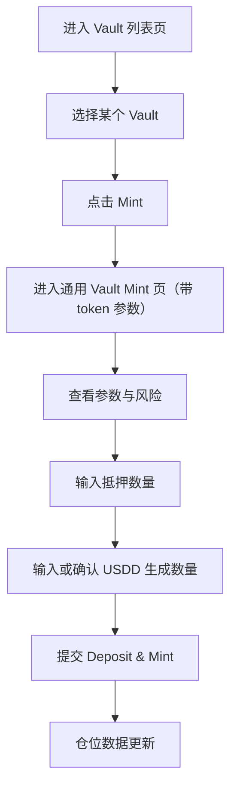
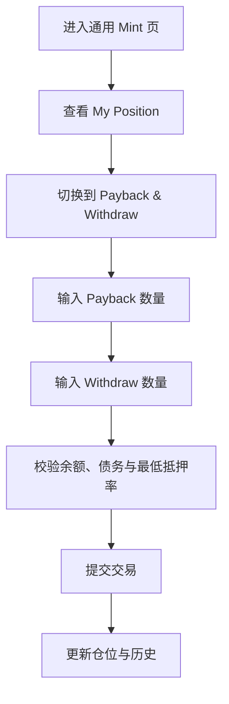
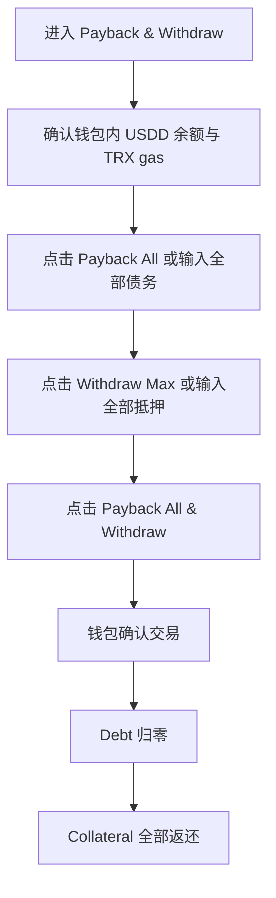

# 逆向还原 PRD | TRON Vault Mint 页面（通用）

> 模块名称：TRON Vault Mint Page
> 页面入口：`https://app.usdd.io/tron/vault?token={vaultToken}`
> 关联上游：[prd-tron-vault-page-v1.md](.//Users/liuyulu/Desktop/USDD2.0/usdd/modules/tron-vault-page/prd-tron-vault-page-v1.md)
> 文档类型：逆向还原 PRD
> 还原日期：2026-04-02
> 还原依据：现网 HTML 壳、动态渲染文本抓取、共享样式、USDD Docs 用户指南（Manage a Vault / Close a Vault / Risk Alert）、配套 i18n / tracking 文件

---

## 先结论

`/tron/vault?token={vaultToken}` 不是某一种抵押品的专属详情页，而是 TRON 链上任意 Vault 的通用 Mint / 仓位管理工作台。用户从上游 Vault 列表页点击 `Mint` 后，会带着某个 `token` 参数进入本页；页面骨架和业务流程保持一致，变化的是抵押品类型、风控参数、价格和额度。

从 USDD 2.0 机制上看，这页是 CDP 借贷引擎的前台执行页，负责把“选择 Vault”转化为“锁定抵押物并生成 USDD”的实际操作，同时承接后续 `Payback & Withdraw` 和仓位状态查看。它服务的核心目标不是内容展示，而是借贷转化、仓位管理和风险可解释。

---

## 逆向事实层

### 已证实事实

**页面基础信息**

| 项目 | 已证实内容 |
| --- | --- |
| 路由形态 | `https://app.usdd.io/tron/vault?token={vaultToken}` |
| 页面类型 | React SPA |
| HTML 壳已加载 | `TronWeb`、`ethers`、`antd`、`main.js`、`main.css` |
| 埋点基础 | HTML 壳中已埋 `gtag("event","page_view")` |
| 页面定位 | 通用 Vault Mint / 仓位管理页 |

**顶部与导航文案**

| 文案 | 来源 | 说明 |
| --- | --- | --- |
| `All Assets` | 运行态抓取 | 返回 Vault 总览入口 |
| `Welcome to USDD` | 运行态抓取 | 欢迎区标题 |
| `Open a vault` | 运行态抓取 | 引导文案 |
| `Manage a vault` | 运行态抓取 | 引导文案 |
| `Learn more` | 运行态抓取 | 文档跳转入口 |

**参数卡字段**

| 字段 | 已证实内容 |
| --- | --- |
| Stability Fee | 存在 |
| Liquidation Fee | 存在 |
| Min. Collateral Ratio | 存在 |
| Dust Limit | 存在 |
| Current Price | 存在 |
| Next Price | 存在 |

**主工作区结构**

| 模块 | 已证实内容 |
| --- | --- |
| 主工作区标题 | `Manage vault` |
| 主模式一 | `Deposit & Mint` |
| 主模式二 | `Payback & Withdraw` |
| 输入区一 | `Deposit {Collateral}` |
| 输入区二 | `Mint USDD` |
| 仓位区 | `My Position` |
| 历史区 | `History` |
| 风险提示 | `Values are estimates and may change.` |

**My Position 字段**

| 分组 | 字段 |
| --- | --- |
| 总体状态 | `Status`、`Liquidation Price`、`Collateral Ratio` |
| Collateral | `Collateral Locked`、`Available to Withdraw` |
| Debt | `Vault USDD Debt`、`Available to Generate` |

**Payback & Withdraw 子流程（文档补证）**

| 项目 | 已证实内容 |
| --- | --- |
| 子流程位置 | 官方文档确认发生在 `Payback & Withdraw` 标签下 |
| 还款输入 | `Payback` |
| 还清快捷动作 | `Payback All` |
| 提取输入 | `Withdraw` |
| 提取快捷动作 | `Max` |
| 关闭仓位复合 CTA | `Payback All & Withdraw` |
| 前置条件一 | 钱包中需有足够 USDD 偿还全部债务 |
| 前置条件二 | 钱包中需有足够 TRX 支付 gas |

**风险提醒（文档补证）**

| 风险级别 | 触发条件 |
| --- | --- |
| Moderate Risk Alert | Collateral Ratio 距离清算线不足 10% |
| High Risk Alert | Collateral Ratio 距离清算线不足 5% |

**截至 2026-04-02 抓取到的参数示例**

| Vault | Stability Fee | Liquidation Fee | Min. Collateral Ratio | Dust Limit | Current Price | Next Price |
| --- | --- | --- | --- | --- | --- | --- |
| TRX-A | 0.5% | 13% | 120% | 1,000 | $0.3156 | $0.3156 in 40 min |
| TRX-B | 0.5% | 13% | 117% | 2,000 | $0.3156 | $0.3156 in 39 min |
| USDT-A | 1% | 13% | 105% | 2,000 | $0.9998 | $0.9998 in 39 min |

**示例页面文案与资产上下文**

| Vault | 抵押输入标题 | 借款输入标题 | Balance / Max 示例 |
| --- | --- | --- | --- |
| TRX-A | `Deposit TRX` | `Mint USDD` | `Balance: 0 TRX` / `MAX: 0 USDD` |
| TRX-B | `Deposit TRX` | `Mint USDD` | `Balance: 0 TRX` / `MAX: 0 USDD` |
| USDT-A | `Deposit USDT` | `Mint USDD` | `Balance: 0 USDT` / `MAX: 0 USDD` |

**接口 / 数据来源表**

| 数据项 | 接口 / 来源 | 代码 / 证据 | 证据等级 | 说明 |
| --- | --- | --- | --- | --- |
| 页面上下文参数 | 路由 `/vault` + 查询参数 `token={vaultToken}` | TRON 路由表存在 `/vault`；当前页通过 query token 识别具体 Vault | 已证实前端数据来源 | 页面骨架固定，`token` 只切换 Vault 上下文 |
| 后端 Host | `REACT_APP_BACKEND_HOST=https://app-api.usdd.io` | 主 bundle 暴露统一后端 Host | 已证实前端环境配置 | 说明参数卡、仓位和历史大概率都经由同一 API Host 获取 |
| 参数卡 + My Position + Proxy | `GET /vault/info?ilk={token}&address={account}` | `fetchData(e)` 调用 `LG({ method:"GET", url:"/vault/info", params:{ ilk:e, address:this.account } })`，并将返回值写入 `vaultInfo` | 已证实接口 | 这是当前页最核心的数据源，覆盖 Vault 参数、仓位信息和代理地址上下文 |
| `/vault/info` 返回数据域 | `ilk`、`parameters`、`position`、`proxy` | 初始状态定义含 `ilk.curPrice`、`ilk.nextPrice`、`parameters.dust`、`position.collateralRatio`、`position.withdrawable` 等 | 已证实接口字段 | 对应参数卡、`My Position`、可借额度、可提取额度等前台展示 |
| 历史记录 | `GET /portfolio/transactions?ilks={token}&address={account}&pageNo=1&pageSize=10&sortAsc=false` | `fetchHistoryListData(e)` 中直接请求该接口并写入 `historyList=t.data.items` | 已证实接口 | 当前页 `History` 区至少依赖该接口返回的最近 10 条交易记录 |
| 当前价 / 下一价 | `GET /liquid/price?ilk={token}` | 同 bundle 中存在 `FG(e)=>Vx.get("/liquid/price",{ params:{ ilk:e } })`，并返回 `currentPrice`、`nextPrice`、`nextPriceTimestamp` | 已证实接口，页面复用为高可信推断 | 当前页参数卡展示 `Current Price` / `Next Price`，高度吻合同一价格源与 OSM 延迟生效机制 |
| 抵押资产余额 / USDD 余额 | 钱包适配器 + `userStore` 链上余额查询 | 输入区展示 `Balance`、`MAX`，并结合钱包连接状态实时变化 | 已证实前端数据来源 | 表单可提交性依赖用户钱包实际余额，而不是单独后端缓存 |
| 代币精度与符号 | `erc20Config` + `queryStore.getErc20Decimals()` | 前端根据不同 Vault 抵押品读取 decimals 与 token metadata | 已证实前端数据来源 | 影响输入精度、金额格式化和 `MAX` 计算 |
| Allowance / Approve 状态 | 钱包授权状态 + 前端表单状态机 | 运行态按钮在部分资产场景可能显示 `Approve`；代码中存在 allowance 驱动提交态的通用模式 | 已证实数据类型，当前页接入待补证 | 偿还或抵押 ERC20 资产时很可能需要授权，但 TRX 原生资产不需要 |
| 风险提醒阈值 | 官方文档 + 前端实时计算 | Docs 明确 `Moderate` / `High Risk Alert` 阈值；页面存在 `Collateral Ratio` 与估算值提示 | 文档补证 + 推断来源 | 风险级别依赖仓位计算结果，不一定来自单独后端接口 |
| Learn more 文档 | `docs.usdd.io` 用户指南 | 页面存在 `Learn more` 入口；文档中覆盖 Open / Manage / Close Vault | 已证实外部资料来源 | 用于补足机制教育，不参与交易结果计算 |
| 合规地域检查 | `GET /status_check` | App Shell 全局请求 `/status_check`，403 时弹出 Restricted Access 模态 | 已证实接口 | 当前页继承全局合规拦截，可能在进入交易前阻断访问 |

**文案与国际化摘要（来自配套 i18n）**

| Key | EN | 说明 | 状态 |
| --- | --- | --- | --- |
| `tron_vault_mint.nav.all_assets` | `All Assets` | 返回总览入口 | observed |
| `tron_vault_mint.tab.deposit_mint` | `Deposit & Mint` | 开仓 / 增仓主模式 | observed |
| `tron_vault_mint.tab.payback_withdraw` | `Payback & Withdraw` | 调仓 / 关仓模式 | observed |
| `tron_vault_mint.input.payback_all` | `Payback All` | 一键还清 | doc_supported |
| `tron_vault_mint.cta.payback_all_withdraw` | `Payback All & Withdraw` | 关仓复合按钮 | doc_supported |
| `tron_vault_mint.risk.high` | `High Risk Alert` | 高风险提醒 | doc_supported |
| `tron_vault_mint.error.insufficient_usdd` | `Not enough USDD to repay your Vault debt.` | 还款失败错误 | suggested |
| `tron_vault_mint.error.insufficient_gas` | `Not enough TRX to cover gas fees.` | gas 不足错误 | suggested |

**埋点摘要（来自配套 tracking）**

| 事件 | 触发时机 | 核心属性 | 目标 |
| --- | --- | --- | --- |
| `tron_vault_mint_page_view` | 进入 Mint 页 | `vault_type`、`wallet_connected` | 承接导流 |
| `tron_vault_mint_param_exposed` | 参数卡曝光 | `stability_fee`、`min_collateral_ratio` | 风险参数曝光 |
| `tron_vault_mint_mode_switch` | 切换模式 | `from_mode`、`to_mode` | 开仓 / 调仓需求结构 |
| `tron_vault_mint_collateral_input` | 输入抵押数量 | `collateral_symbol`、`input_amount` | 建仓意图 |
| `tron_vault_mint_debt_input` | 输入生成 / 偿还数量 | `mode`、`usdd_amount` | 借贷规模意图 |
| `tron_vault_mint_payback_all_click` | 点击 `Payback All` | `current_debt`、`wallet_usdd_balance` | 快速降杠杆 / 关仓 |
| `tron_vault_mint_withdraw_max_click` | 点击 `Max` | `available_withdraw` | 资金回收意图 |
| `tron_vault_mint_close_vault_click` | 点击 `Payback All & Withdraw` | `current_debt`、`collateral_locked` | 完整关仓需求 |
| `tron_vault_mint_risk_alert_exposed` | 风险提醒曝光 | `risk_level`、`distance_to_liquidation` | 高风险仓位识别 |
| `tron_vault_mint_submit_fail` | 交易失败 | `error_type`、`error_stage` | 签名 / 链上损耗定位 |

### 推断结论

- `token` 参数决定的是 Vault 上下文，不改变页面主流程。
- 本页是“建仓 / 调整仓位”的执行页，不是只读详情页。
- `Deposit & Mint` 是开仓或增仓主路径，`Payback & Withdraw` 是减仓或平仓主路径。
- `Payback & Withdraw` 不只是“关闭 Vault”按钮，而是通用仓位管理子流程：
  - 可做部分还款
  - 可做部分提取
  - 也可在还清全部债务后提走全部抵押，完成关仓
- `Current Price` / `Next Price` 说明页面前台已消费预言机相关价格数据，`Next Price` 很可能对应 OSM 延迟生效机制。
- `Status` 很可能与文档中的风险等级体系关联，但当前运行态抓取尚未直接看到真实状态值。

### 待确认项

| 项目 | 当前状态 |
| --- | --- |
| `#2`、`#3`、`#4` 这类编号的真实含义 | 仍待确认 |
| `History` 字段、分页方式、时间精度 | 仍待确认 |
| 偿还 USDD 是否必须先 `Approve` | 仍待确认 |
| 成功提交后是否停留本页更新仓位 | 仍待确认 |
| `Payback` 与 `Withdraw` 是否允许完全独立提交 | 仍待确认 |
| `Payback All & Withdraw` 是否只在关仓条件下出现 | 仍待确认 |
| `STRX-A` 路由回退原因 | 仍待确认 |
| 组合操作是单笔合约调用还是多步前端拆分 | 仍待确认 |

---

## 1. 背景与目标

### 1.1 背景

上游 [prd-tron-vault-page-v1.md](.//Users/liuyulu/Desktop/USDD2.0/usdd/modules/tron-vault-page/prd-tron-vault-page-v1.md) 解决的是“选哪个 Vault”的问题，而本页解决的是“如何实际使用选中的 Vault 铸造 USDD”。

对 USDD 2.0 而言，这页是 CDP 借贷的转化核心页。用户在这里输入抵押数量和目标借款量，前端实时展示风控参数和仓位状态，把超额抵押、稳定费、清算阈值这些复杂机制翻译成可执行动作。

### 1.2 业务目标

- 承接 Vault 列表页导流，把点击 `Mint` 的用户转化为真实建仓用户
- 为任意 TRON Vault 提供统一的开仓、增仓、还款、提取操作界面
- 在交易前显式展示 Vault 风险参数，降低误操作和清算风险
- 通过仓位信息和历史信息提升用户对 USDD 借贷机制的可解释性
- 在保证风控前提下，提高 TRON 主链 USDD 的借贷使用率和流通量

### 1.3 非目标

- 不承担 Vault 发现与比价功能，那是上游列表页职责
- 不承担治理参数修改、风控后台配置和清算后台监控
- 不替代完整的协议文档中心或新手教育中心
- 不负责跨链桥或 PSM 的兑换流程

---

## 2. 目标用户与场景

### 2.1 目标用户

| 用户类型 | 核心诉求 | 本页价值 |
| --- | --- | --- |
| TRON 生态资产持有者 | 用 TRX / USDT / sTRX 等释放流动性 | 快速建仓并借出 USDD |
| 套利者与做市商 | 低摩擦铸造稳定币 | 根据实时参数选择借贷规模 |
| 风险敏感用户 | 明确清算线、稳定费和可借额度 | 在操作前理解仓位风险 |
| 已有仓位用户 | 调整抵押、还款、提取 | 在同一页完成仓位管理 |

### 2.2 核心场景

- 用户从 Vault 列表页点击 `Mint`，进入对应 Vault 的建仓页
- 用户输入抵押数量，评估可生成的 USDD 数量后发起 Mint
- 用户进入已有仓位页面，切换到 `Payback & Withdraw` 做减债或提取
- 用户持有足够 USDD 时，在 `Payback & Withdraw` 中偿还部分或全部债务
- 用户在仓位安全前提下，通过 `Withdraw` 提取部分抵押
- 用户通过“全额还债 + 全额提取”完成关仓
- 用户查看当前清算价格、抵押率、债务和可继续生成额度，判断是否需要调仓

---

## 3. 功能清单（P0/P1/P2）

### 3.1 P0（核心功能）

| 功能 | 说明 |
| --- | --- |
| 参数化路由 | 通过 `token` 参数载入指定 Vault 上下文 |
| 参数卡展示 | Stability Fee、Liquidation Fee、Min CR、Dust Limit、Current / Next Price |
| `Deposit & Mint` | 开仓 / 增仓主路径 |
| `Payback & Withdraw` | 调仓 / 关仓主路径 |
| 抵押与借款输入 | 输入抵押数量与生成数量 |
| 偿还与提取输入 | 输入偿还数量与提取数量 |
| 仓位核心指标 | 清算价、抵押率、债务、可提取、可继续生成 |
| 估算值提示 | 明确“数值为估算值，可能变化” |

### 3.2 P1（重要功能）

| 功能 | 说明 |
| --- | --- |
| `History` 信息区 | 展示用户历史操作 |
| `Learn more` | 文档跳转入口 |
| `All Assets` | 返回列表页 |
| 钱包与余额辅助 | 结合钱包状态提供表单上下文 |
| `MAX` / `Payback All` | 快捷填充与一键还清 |
| 关仓复合动作 | `Payback All & Withdraw` |
| 风险提醒 | Moderate / High Risk Alert |

### 3.3 P2（增量优化）

| 功能 | 说明 |
| --- | --- |
| 更明确策略提示 | 不同 Vault 的风险 / 适用场景说明 |
| 更细粒度成功反馈 | 建仓成功、调仓成功、关仓成功 |
| 更丰富错误引导 | USDD 不足、gas 不足、风险超限等分流处理 |

---

## 4. 用户流程

### 4.1 从列表到建仓

### 4.2 已有仓位调整

### 4.3 关闭 Vault 流程

### 4.4 子流程对照

| 维度 | Deposit & Mint | Payback & Withdraw |
| --- | --- | --- |
| 主目标 | 新开仓 / 增仓 / 增发 USDD | 降杠杆 / 提取抵押 / 关仓 |
| 主要输入 | Deposit、Mint USDD | Payback、Withdraw |
| 快捷动作 | `MAX` | `Payback All`、`Max` |
| 主要风险方向 | 增发过多导致 CR 降低 | 提取过多导致 CR 降低 |
| 完整结束态 | 仓位债务上升、可用资金增加 | 债务下降、抵押释放或关仓 |

---

## 5. 业务规则

### 5.1 页面定位规则

- 本页属于 TRON 链 Vault 的执行页。
- 上游列表页负责“选择哪种 Vault”，本页负责“如何对该 Vault 执行借贷”。
- `token` 只决定具体 Vault 类型，不改变页面主流程。

### 5.2 参数展示规则

- 进入页面后，必须先展示该 Vault 的关键风控参数。
- 用户不应在不理解 `Min. Collateral Ratio` 和 `Stability Fee` 的前提下直接进入 Mint。
- `Current Price` 与 `Next Price` 同时展示，帮助用户理解价格更新与风险变化。

### 5.3 开仓 / 增仓规则

- 用户在 `Deposit & Mint` 中输入抵押资产数量。
- 用户输入或调整 USDD 生成数量。
- 可生成量受以下因素共同约束：
  - 当前抵押品价格
  - 最低抵押率
  - 当前仓位状态
  - Vault 上限与 Dust Limit
- 低于 `Dust Limit` 的债务规模不应被允许提交。

### 5.4 还款 / 提取规则

- `Payback & Withdraw` 承接已有仓位的减债或提取动作。
- 子流程至少包含两类输入：
  - `Payback`
  - `Withdraw`
- 子流程至少包含两类快捷动作：
  - `Payback All`
  - `Max`
- 在满足条件时，页面支持组合动作 `Payback All & Withdraw`。
- 用户可只还款、不提取；也可在安全范围内提取，不必同时发生。
- 用户提取抵押物后仍需满足最低抵押率。
- 用户还款后可释放更多可提取抵押或降低清算风险。
- 若用户想完全关闭 Vault，必须先将债务归零，再提走全部抵押。

### 5.5 关闭仓位规则

- 关闭 Vault 前必须确保：
  - 钱包内有足够 USDD 偿还全部债务
  - 钱包内有足够 TRX 支付 gas
- 部分还款会提升 Collateral Ratio。
- 部分提取会降低 Collateral Ratio。
- 页面应在用户输入时实时展示这些变化对风险的影响。

### 5.6 风险提醒规则

- `Status` 字段应服务于风险理解，而不是纯展示标签。
- 页面存在基于抵押率的页内风险提醒。
- 至少存在两档自动提醒阈值：
  - Moderate Risk Alert：距离清算线不足 10%
  - High Risk Alert：距离清算线不足 5%
- 当用户在 `Payback & Withdraw` 中输入提取数量导致风险上升时，应同步触发更高等级的警示。
- 当用户通过还款降低风险后，页面状态与提醒应同步更新。

### 5.7 仓位显示规则

- `My Position` 需要围绕“风险与可操作性”展示，而不是只展示资产余额。
- 核心字段至少应包括：
  - Liquidation Price
  - Collateral Ratio
  - Collateral Locked
  - Available to Withdraw
  - Vault USDD Debt
  - Available to Generate
- 前端需明确这些数值为估算值，避免和链上最终状态混淆。

### 5.8 路由与参数规则

- 合法 `token` 应进入对应 Vault 执行页。
- 不合法或不可解析 `token` 应进入明确的兜底状态。
- 当前抓取显示某些 `token` 情况下可能回落到 `All Vaults` 列表，这一行为需产品和研发确认是否为设计预期。

---

## 6. UI / 交互说明

### 6.1 页面结构

| 区块 | 说明 |
| --- | --- |
| 返回 / 总览入口 | `All Assets` |
| 欢迎与引导区 | `Welcome to USDD`、`Open a vault`、`Manage a vault` |
| 参数概览区 | 关键费率和风险阈值 |
| 操作区 | `Deposit & Mint` / `Payback & Withdraw` |
| 仓位区 | `My Position` |
| 历史区 | `History` |
| 辅助入口 | `Learn more` |

### 6.2 输入交互

| 输入区 | 已证实能力 |
| --- | --- |
| 抵押输入 | 左侧展示抵押资产图标与名称 |
| 借款输入 | 左侧展示 USDD 图标 |
| 借款快捷动作 | `MAX` |
| 偿还输入 | `Payback` |
| 偿还快捷动作 | `Payback All` |
| 提取输入 | `Withdraw` |
| 提取快捷动作 | `Max` |

### 6.3 状态反馈

- 未连接钱包或无仓位时，`My Position` 默认显示 `--` 或 `0`。
- 风险值或余额变化后，页面应实时刷新相关估算指标。
- 错误输入应通过 `ant-input-msg-info.error` 这类组件就地提示。
- 当用户进入 `Payback & Withdraw` 时，提交按钮应根据“部分操作 / 全部关闭”显示不同动作语义。
- 若用户输入构成全额还债与全额提取，页面可升格为 `Payback All & Withdraw` 这类复合 CTA。

### 6.4 可解释性设计

- 关键风险参数被前置在输入区上方，而不是藏在说明文档里。
- 页面用 `Values are estimates and may change.` 提醒用户关注链上最终结果。
- `Learn more` 用于把高复杂度机制导向文档层，不把全部教育内容堆在交易表单内。

---

## 7. 异常场景与边界

### 7.1 钱包未连接

- 用户可以看到页面骨架和 Vault 参数。
- 余额默认为 0 或不可用。
- 仓位指标为占位值。
- 提交动作应被拦截并引导连接钱包。

### 7.2 输入金额不合法

- 抵押数量为空、负值、超余额或格式错误时，不应允许提交。
- 借款数量低于 Dust Limit 或超出可生成额度时，不应允许提交。
- 提取后若抵押率低于最小阈值，应直接阻断。
- 偿还数量超过钱包 USDD 余额时，应直接阻断。
- 偿还数量超过当前债务时，应自动纠正或阻断。
- 提取数量超过可提取数量时，应直接阻断。
- 关仓时若未还清全部债务，不应允许“全部提取抵押”。

### 7.3 价格与估算值波动

- 由于存在当前价、下一价和估算值提示，用户提交前后看到的可借额度可能变化。
- 前端需提示价格变动风险，避免用户对提交结果预期错误。

### 7.4 关闭仓位前置条件不足

- 用户钱包 USDD 不足以覆盖全部债务时，不能完成 `Payback All`。
- 用户钱包 TRX 不足以覆盖 gas 时，不能顺利完成提交。
- 官方文档已建议用户在 USDD 不足时通过 PSM 或交易所获取 USDD。
- 页面应把“缺 USDD”和“缺 gas”区分成两类不同错误，而不是笼统报错。

### 7.5 非法 token / 路由异常

- 对无效 `token` 参数应进入明确兜底。
- 当前抓取结果显示部分参数可能回到 `All Vaults` 列表，产品需确认是否接受该行为。

### 7.6 网络 / 链错误

- 当前页面属于 TRON 上下文。
- 若钱包网络不匹配，应阻断交易并给出链切换提示。
- 多链入口存在于共享 App 头部，但本页不应误导用户在错误链上发起交易。

---

## 8. 数据埋点需求

### 8.1 核心目标

- 衡量列表页到 Mint 页的转化效率
- 衡量建仓与调仓的漏斗损耗
- 识别高频错误类型和高风险操作点

### 8.2 重点埋点

| 事件 | 说明 | 核心属性 |
| --- | --- | --- |
| `tron_vault_mint_page_view` | 页面浏览 | `vault_type`、`wallet_connected` |
| `tron_vault_mint_param_exposed` | 参数卡曝光 | `stability_fee`、`min_collateral_ratio` |
| `tron_vault_mint_learn_more_click` | 点击 Learn more | `vault_type` |
| `tron_vault_mint_mode_switch` | 模式切换 | `from_mode`、`to_mode` |
| `tron_vault_mint_collateral_input` | 抵押输入 | `collateral_symbol`、`input_amount` |
| `tron_vault_mint_max_click` | 点击 MAX | `target_field` |
| `tron_vault_mint_debt_input` | 生成 / 偿还数量输入 | `mode`、`usdd_amount` |
| `tron_vault_mint_payback_all_click` | 点击 Payback All | `current_debt`、`wallet_usdd_balance` |
| `tron_vault_mint_withdraw_max_click` | 点击提取 Max | `available_withdraw` |
| `tron_vault_mint_submit_click` | 点击提交 | `mode`、`collateral_amount`、`usdd_amount` |
| `tron_vault_mint_close_vault_click` | 点击关仓组合按钮 | `current_debt`、`collateral_locked` |
| `tron_vault_mint_submit_success` | 交易成功 | `tx_hash`、`mode` |
| `tron_vault_mint_submit_fail` | 交易失败 | `error_type`、`error_stage` |
| `tron_vault_mint_position_view` | 仓位区曝光 | `has_position` |
| `tron_vault_mint_history_view` | 历史区查看 | `has_position` |
| `tron_vault_mint_risk_error_exposed` | 风控 / 输入错误曝光 | `error_type` |
| `tron_vault_mint_risk_alert_exposed` | 风险提醒曝光 | `risk_level`、`distance_to_liquidation` |
| `tron_vault_mint_invalid_token_fallback` | 非法参数兜底 | `token_param`、`fallback_type` |

### 8.3 指标关注

- Mint 页访问量
- 钱包连接率
- Deposit & Mint 提交率
- Mint 成功率
- Payback / Withdraw 使用率
- 关仓完成率
- 表单错误率
- 不同 Vault 的借贷转化率

---

## 9. 国际化与文案

### 9.1 已纳入 PRD 的关键文案

| 场景 | EN | 说明 |
| --- | --- | --- |
| 返回总览 | `All Assets` | 返回列表页 |
| 欢迎区 | `Welcome to USDD` | 欢迎文案 |
| 模式一 | `Deposit & Mint` | 建仓 / 增仓 |
| 模式二 | `Payback & Withdraw` | 调仓 / 关仓 |
| 还清 | `Payback All` | 一键还债 |
| 关仓 | `Payback All & Withdraw` | 组合动作 |
| 风险提醒 | `High Risk Alert` / `Moderate Risk Alert` | 风险分级 |
| 风险提示 | `Values are estimates and may change.` | 估算值提示 |

### 9.2 文案要求

- 参数名、状态名、错误提示需跨页面统一。
- “USDD 不足”“TRX 不足 gas”“低于最低抵押率”必须分开定义。
- 关闭仓位相关文案不能模糊描述为“完成操作”，要明确“还债 / 提取 / 关仓”。

### 9.3 建议标准化的错误文案

| Key | EN | 说明 |
| --- | --- | --- |
| `tron_vault_mint.error.connect_wallet` | `Please connect your wallet first.` | 未连接钱包 |
| `tron_vault_mint.error.invalid_amount` | `Please enter a valid amount.` | 输入错误 |
| `tron_vault_mint.error.insufficient_balance` | `Insufficient balance.` | 余额不足 |
| `tron_vault_mint.error.insufficient_usdd` | `Not enough USDD to repay your Vault debt.` | 还款失败 |
| `tron_vault_mint.error.insufficient_gas` | `Not enough TRX to cover gas fees.` | gas 不足 |
| `tron_vault_mint.error.risk_limit` | `Operation would breach the minimum collateral ratio.` | 风控阻断 |
| `tron_vault_mint.error.below_dust` | `Debt amount is below the dust limit.` | Dust Limit 错误 |
| `tron_vault_mint.error.wrong_network` | `Please switch to the TRON network.` | 链错误 |

---

## 10. 兼容性与平台差异

### 10.1 链与钱包

- 页面核心场景是 TRON。
- HTML 壳同时加载 `TronWeb` 与 `ethers`，说明 App 具备多链钱包能力。
- 本页要明确区分“页面链上下文”和“钱包当前网络”。

### 10.2 桌面与移动

- 当前抓取未完整覆盖移动版布局。
- 参考上游列表页，App 使用统一响应式体系，Mint 页应同样支持移动端输入与仓位查看。
- `MAX`、错误提示和参数面板在移动端需避免信息拥挤。

---

## 11. 安全与隐私

### 11.1 安全要求

- 所有借贷结果都必须以超额抵押规则为前提。
- 前端应突出最低抵押率、清算费用和估算值风险。
- 用户在提取抵押或增发 USDD 前，必须被阻断到不会跌破风险阈值。
- 用户在 `Payback & Withdraw` 中的每一步输入，都应重新计算清算价格与抵押率。
- 若价格源延迟或波动，前端应优先保证风险提示而不是只追求转化。

### 11.2 隐私与账户

- 页面主要依赖钱包地址与链上公开数据。
- 不应要求用户提供托管型账户资料。
- 与钱包交互时只暴露必要的连接、余额和签名上下文。

---

## 12. 成功指标与验收

### 12.1 成功指标

- 从 Vault 列表页进入本页的 CTR
- 本页钱包连接率
- `Deposit & Mint` 提交率与成功率
- 各 Vault 的借贷转化率
- 风险拦截率与错误分布
- 已有仓位用户的 `Payback & Withdraw` 使用率
- 关仓成功率与失败原因分布

### 12.2 验收标准

- 输入合法 `token` 时，可进入对应 Vault 的通用 Mint 页面
- 至少展示以下参数：Stability Fee、Liquidation Fee、Min. Collateral Ratio、Dust Limit、Current Price、Next Price
- 页面至少支持两个核心操作模式：`Deposit & Mint`、`Payback & Withdraw`
- `Payback & Withdraw` 至少支持：
  - Payback 输入
  - Withdraw 输入
  - Payback All
  - Max
- 页面至少展示以下仓位字段：Liquidation Price、Collateral Ratio、Collateral Locked、Available to Withdraw、Vault USDD Debt、Available to Generate
- 未连接钱包时，页面可浏览但不可发起有效交易
- 不合法金额、超限金额、破坏最低抵押率的操作必须被阻断并给出错误提示
- 用户在钱包 USDD 足够、gas 足够的前提下，能够完成“全部还债 + 全部提取”的关仓动作
- 页面需明确提示估算值可能变化
- 与不同 Vault 关联时，页面骨架与流程保持一致，只切换参数与资产上下文

---

## 后续最值得补证的项

- `History` 的真实字段与接口返回结构
- 实际连接钱包后的按钮文案、授权流程和提交成功态
- 非法 `token` 的正式产品兜底规则
- `STRX-A` 等特殊 Vault 的参数解析与路由兼容性
- `Payback` / `Withdraw` 是否支持单笔合约调用组合执行，还是前端拆为多步交易
