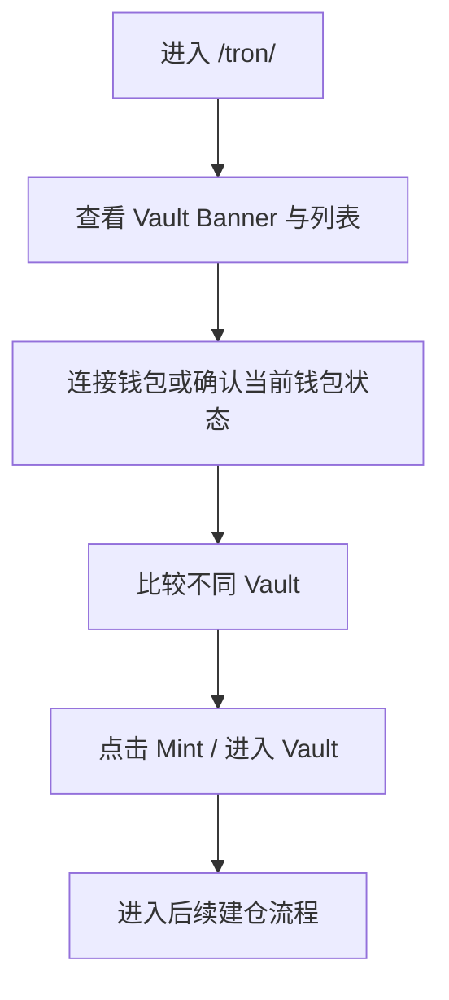
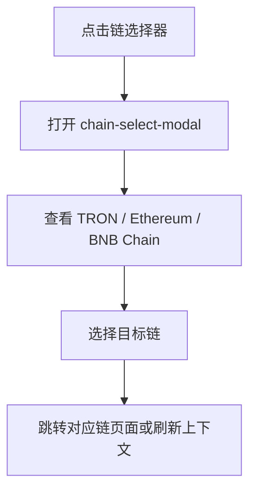
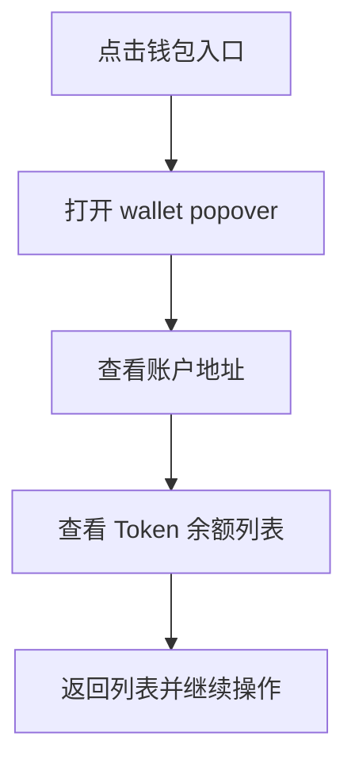

# 逆向还原 PRD | TRON Vault 页面

> 模块名称：TRON Vault Page
> 页面入口：`https://app.usdd.io/tron/`
> 文档类型：逆向还原 PRD
> 还原日期：2026-04-02
> 还原依据：现网 HTML 壳、动态渲染抓取、共享 CSS 结构、关联 Mint 页验证、i18n / tracking 配套文件、浏览器自动化验证

---

## 先结论

`https://app.usdd.io/tron/` 是 USDD App 在 TRON 网络上的 Vault 入口页，不是普通品牌落地页。它承担“多 Vault 市场列表 / Vault 选择页”的职责，用来展示可用抵押借贷仓位类型、关键参数和活动状态，并把用户导向后续 [prd-tron-vault-mint-page-v1.md](.//Users/liuyulu/Desktop/USDD2.0/usdd/modules/tron-vault-mint-page/prd-tron-vault-mint-page-v1.md) 的 Mint / 仓位管理页。

从 USDD 2.0 机制上看，这页直接服务于 CDP 借贷引擎，是 TRON 主链上的借贷流量入口。它连接的是“抵押品选择 -> Vault 参数理解 -> 发起 Mint / 建仓”的链路，核心目标是把 Vault 差异、风险门槛和活动激励前置展示，提高真实借贷转化，同时降低用户误选和误操作。

---

## 逆向事实层

### 已证实事实

**页面基础信息**

| 项目 | 已证实内容 |
| --- | --- |
| 页面标题 | `USDD | Vault` |
| 页面路径 | `https://app.usdd.io/tron/` |
| 所属链上下文 | TRON |
| 页面职责 | Vault 列表入口 / 借贷方案选择页 |
| 前端技术栈 | React 18、Ant Design 5.21.6、TronWeb 6.0.3、ethers 6.14.4 |
| 视图形态 | 桌面端表格 + 移动端卡片 |

**已观测到的页面结构**

| 结构 / 组件 | 证据 | 说明 |
| --- | --- | --- |
| `vault-root` | CSS 类名 | Vault 页主容器 |
| `custom-table` | CSS 类名 | 桌面端表格主体 |
| `card-container` | CSS 类名 | 移动端卡片容器 |
| `collateral-info` | CSS 类名 | 抵押品信息区 |
| `mint-button` | CSS 类名 | 每个 Vault 的主 CTA |
| `header-chain-select` | CSS 类名 | 头部链切换入口 |
| `chain-select-modal` | CSS 类名 | 链切换弹层 |
| `wallet-popover` | CSS 类名 | 钱包详情浮层 |
| `token-balance-list` | CSS 类名 | 钱包资产列表 |
| `global-notification` | CSS 类名 | 全局通知条 |
| `not-found-root` | CSS 类名 | 异常路由兜底页 |

**支持的链与链切换状态**

| 项目 | 已证实内容 |
| --- | --- |
| 可见链类型 | `TRON` / `Ethereum` / `BNB Chain` |
| 已连接状态 | 弹层中存在 `connected-item-true` 状态 |
| 切换形式 | 头部链选择器 + 弹层 |
| 风险点 | 页面链上下文与钱包真实网络可能不一致 |

**钱包相关能力**

| 能力 | 已证实内容 |
| --- | --- |
| 钱包入口 | 存在 |
| 钱包弹层 | 存在 |
| 账户信息 | 存在账户区 |
| 复制地址 | 存在复制能力 |
| Token 余额 | 存在 `token-balance-list` |

**Vault 列表字段定义**

| 字段 | 含义 |
| --- | --- |
| Collateral | Collateral refers to the crypto assets or other acceptable assets deposited by users as collateral for borrowing. |
| Collateral Value | The current market value of the collateral, used to compare with the debt to ensure that the borrowing risk is within acceptable limits. |
| Overcollateralization | The ratio of the current value of the collateral deposited to the amount of debt. |
| Debt | Total USDD borrowed from this vault compared to its maximum debt ceiling. |
| Debt Ceiling | The maximum allowed loan amount for this collateral vault. |
| Stability Fee | Stability Fee is the interest charged for borrowing USDD. It accrues over time and is paid upon repayment. The rate is annual. |
| Min. Collateral Ratio | This is referred to as the Liquidation Ratio. If the Vault's collateralization level drops below this threshold, it will be considered undercollateralized and may trigger liquidation. A portion of your collateral will be sold through auction to repay the outstanding debt and cover liquidation penalties. |

**截至 2026-04-02 抓取到的现网 Vault 示例**

| Vault | Total Collateral | USDD Limit | Min. Collateral Ratio | Stability Fee | Dust Limit | 入口 |
| --- | --- | --- | --- | --- | --- | --- |
| TRX-A | $395.11M | 170.25M / 200.00M | 120% | 0.5%（抓取中伴随活动降费展示） | 1,000 | `/tron/vault?token=TRX-A` |
| TRX-B | $228.71M | 96.13M / 100.00M | 117% | 0.5%（抓取中伴随活动降费展示） | 2,000 | `/tron/vault?token=TRX-B` |
| TRX-C | $473.86M | 190.13M / 200.00M | 130% | 0.5%（抓取中伴随活动降费展示） | 500 | `/tron/vault?token=TRX-C` |
| USDT-A | $673.02K | 559.36K / 200.00M | 105% | 1% | 2,000 | `/tron/vault?token=USDT-A` |
| sTRX-A | $19.40M | 8.86M / 50.00M | 130% | 1%（抓取中伴随活动降费展示） | 2,000 | `/tron/vault?token=STRX-A` |

**页面状态与视觉样式**

| 状态 / 样式 | 证据 | 含义 |
| --- | --- | --- |
| `activity-true` | CSS 类名 | 活动态 CTA 或高亮态 |
| `row-value-activity` | CSS 类名 | 某行参数存在活动值 / 强调态 |
| `ant-input-msg-info.error` | CSS 类名 | 存在输入错误提示容器 |
| `global-notification` | CSS 类名 | 存在顶部 / 全局提示条 |

**接口 / 数据来源表**

| 数据项 | 接口 / 来源 | 代码 / 证据 | 证据等级 | 说明 |
| --- | --- | --- | --- | --- |
| 页面链上下文 | 前端路由表 `aue` + `supportedChains:[Ks.Tron]` | `/` 路由映射到 Vault 首页；同时存在 `/vault`、`/liquidation` 等 TRON 路由 | 已证实前端数据来源 | 说明 `https://app.usdd.io/tron/` 属于 TRON Vault 首页，而不是通用内容页 |
| 后端 Host | `REACT_APP_BACKEND_HOST=https://app-api.usdd.io` | 前端环境变量被编译进主 bundle | 已证实前端环境配置 | 说明本页数据默认经由 `app-api.usdd.io` 聚合层提供 |
| Vault 列表核心数据 | `GET /vault/collaterals` | `fetchVaultListData()` 中调用 `LG({ method:"GET", url:"/vault/collaterals" })`，成功后写入 `vaultList=e.data.items` | 已证实接口 | 当前页表格 / 卡片中的 Vault 集合、核心参数和排序基础均来自该接口 |
| Vault 列表字段域 | `e.data.items[]` | 行渲染直接消费 `ilk`、`totalCollateral`、`curMinted`、`maxMinted`、`minCollateralRatio`、`stabilityFee`、`dust` | 已证实接口字段 | 对应页面的 `Total Collateral`、`USDD Limit`、`Min. Collateral Ratio`、`Stability Fee`、`Dust Limit` |
| Mint 跳转上下文 | 站内路由 `/vault?token={ilk}` | CTA 使用 `gc("/vault?token=".concat(n.ilk))` 生成跳转地址 | 已证实前端数据来源 | 当前页不直接建仓，只把 `ilk` 作为参数传递给下游 Mint 页 |
| 活动态 / 降费展示 | 前端活动配置 `FQ(ilk)` | 行渲染会额外读取活动字段 `isActivity`、`oldFee` | 已证实前端数据来源 | 活动态并非全部来自 `/vault/collaterals` 原始字段，前端存在一层活动配置叠加 |
| sTRX 说明文案 | 前端静态文案 + Learn More 链接 | 移动卡片中存在 sTRX tooltip 说明与文档跳转 | 已证实前端数据来源 | 属于教育 / 风险解释层，不是后端动态字段 |
| 钱包浮层地址与余额 | 钱包适配器 + `userStore / walletStore` + 代币配置 | `token-balance-list` 组合 TRX、USDD、sUSDD 余额与地址复制能力 | 已证实前端数据来源 | 该部分主要来自钱包连接态和链上余额读取，不依赖单一后端列表接口 |
| 合规地域检查 | `GET /status_check` | App Shell 在路由切换时请求 `/status_check`，403 时弹出 Restricted Access 模态 | 已证实接口 | 本页会继承全局合规拦截，不是 Vault 业务接口但会影响可访问性 |
| 全局通知条内容 | 全局 `notices` 容器，运行态配置待定 | `global-notification` 样式存在，但当前 bundle 中 `iue([])` 初始传入空数组 | 推断来源 | 已证实容器存在；具体通知数据源仍待补证，可能来自运行态配置或运营下发 |

**文案与国际化摘要（来自配套 i18n）**

| Key | EN | 说明 | 状态 |
| --- | --- | --- | --- |
| `tron_vault.meta.title` | `USDD | Vault` | 页面标题 | observed |
| `tron_vault.chain_modal.title` | `Select Chain` | 链切换弹层标题 | suggested |
| `tron_vault.wallet.connect` | `Connect Wallet` | 钱包入口文案 | suggested |
| `tron_vault.vault.cta.mint` | `Mint` | 每个 Vault 的主 CTA | inferred |
| `tron_vault.notification.default` | `Important notice` | 全局通知默认标题 | suggested |
| `tron_vault.empty.no_data` | `No vaults available` | 空列表态 | suggested |
| `tron_vault.not_found.title` | `Page not found` | 路由异常态 | suggested |

**埋点摘要（来自配套 tracking）**

| 事件 | 触发时机 | 关键属性 | 目标 |
| --- | --- | --- | --- |
| `tron_vault_page_view` | 进入 `/tron/` | `chain_context`、`wallet_connected` | 入口流量 |
| `tron_vault_chain_selector_open` | 点击链选择器 | `current_chain` | 多链导航使用率 |
| `tron_vault_chain_switch` | 选择目标链 | `from_chain`、`to_chain` | 链切换成功与流失 |
| `tron_vault_wallet_entry_click` | 点击钱包入口 | `wallet_connected` | 钱包连接意图 |
| `tron_vault_wallet_popover_view` | 钱包浮层曝光 | `address_present`、`balance_count` | 账户查看需求 |
| `tron_vault_card_click` | 点击 Vault 行 / 卡片 | `vault_type`、`list_position` | 方案关注度 |
| `tron_vault_mint_click` | 点击 Mint | `vault_type`、`wallet_connected` | 建仓导流效率 |
| `tron_vault_notification_view` | 通知曝光 | `notification_type` | 提示覆盖率 |
| `tron_vault_error_exposed` | 错误提示曝光 | `error_type` | 阻塞点定位 |
| `tron_vault_empty_state_view` | 空态展示 | `chain_context` | 数据 / 配置异常识别 |

### 推断结论

- 本页是 Vault 列表入口，不是单个仓位详情页。
- 每行 / 每卡片对应一种 Vault 类型或抵押品类型。
- 主 CTA 是 `Mint`，点击后进入站内详情页，而不是在列表页内直接完成建仓。
- 页面支持链切换和钱包连接后查看账户与资产余额。
- 活动态样式说明部分 Vault 会挂运营激励、限时降费或主推标识。
- 页面本身承担“方案比较 + 风险前置 + 导流”的职责，不承担完整交易执行。

### 待确认项

| 项目 | 当前状态 |
| --- | --- |
| Banner 真实标题 / 描述 / 活动文案 | 已确认由运营宣发活动承接，无固定内容 |
| 钱包未连接时主按钮的完整交互链路 | 已知默认按钮文案为 `mint`，点击可跳转 Mint 页 |
| 全局通知展示条件与文案来源 | 运营确认，触发条件仍待固化 |
| 活动态具体字段 | 仍需接口或运行态补证 |
| 空列表态是否现网可触发 | 配套 i18n / tracking 已设计，运行态未观察到 |

---

## 1. 背景与目标

### 1.1 背景

USDD 2.0 在 TRON 上具备完整的超额抵押借贷能力，用户可通过 Vault 锁定 TRX、sTRX、USDT 等资产并借出 USDD。由于不同 Vault 在抵押率、费用、债务上限、Dust Limit 和活动激励上存在差异，前台需要一个统一入口完成以下任务：

- 呈现可用 Vault 列表
- 帮助用户理解方案差异
- 将用户导向后续 Mint / 建仓流程

因此，本页承担的是 TRON 端 Vault 发现与决策入口，而不是完整的交易执行终点。

### 1.2 业务目标

- 为用户提供 TRON 链 Vault 的统一入口页
- 展示可用抵押品类型和 Vault 方案
- 缩短“认知 Vault 差异 -> 选择 Vault -> 发起 Mint”路径
- 承接活动激励，提高 TRON 端借贷转化
- 在入口层前置风险、连接状态和链选择，降低错误操作

### 1.3 非目标

- 不在本页完成全部建仓交易步骤
- 不承担后台参数治理与风险配置能力
- 不作为清算监控页、历史仓位详情页或系统总览页
- 不承担完整新手教程中心能力

---

## 2. 目标用户与场景

### 2.1 目标用户

| 用户类型 | 核心关注 | 页面价值 |
| --- | --- | --- |
| TRON 生态巨鲸 / 资产持有者 | 资产流动性释放、借贷效率 | 快速比较可用 Vault 并进入借贷 |
| DeFi 收益用户 | 活动奖励、借出成本、借贷收益协同 | 识别活动态 Vault 和 Mint 机会 |
| 套利 / 做市用户 | 链上铸造效率、成本透明度 | 快速进入建仓路径 |
| 风险敏感用户 | 抵押要求、清算风险、链选择 | 在入口页完成方案初筛 |

### 2.2 核心场景

- 用户进入 TRON App，想用 TRX / sTRX 等抵押物借出 USDD
- 用户切换链后，比较不同链的 Vault 入口
- 用户连接钱包后，查看账户与资产余额，再选择 Vault
- 用户被活动 Banner 或活动态按钮吸引，点击某个 Vault 发起 Mint

---

## 3. 功能清单（P0/P1/P2）

### 3.1 P0（核心功能）

| 功能 | 说明 |
| --- | --- |
| Vault 列表展示 | 展示可用 Vault 及其关键参数 |
| 桌面 / 移动双布局 | 桌面表格、移动卡片 |
| 链选择 | 至少覆盖 TRON / Ethereum / BNB Chain |
| 钱包入口与浮层 | 查看地址、复制地址、查看余额 |
| 主 CTA | 每个 Vault 行提供 `Mint` 操作 |
| 活动态展示 | 支持活动态 / 主推态高亮 |
| 输入 / 错误容器 | 承接后续交易表单或输入相关状态 |

### 3.2 P1（重要功能）

| 功能 | 说明 |
| --- | --- |
| Vault 差异化参数展示 | Collateral Value、Debt Ceiling、Stability Fee 等 |
| 已连接链标识 | 在链切换弹层中标识当前链 |
| 用户资产摘要 | 钱包浮层展示余额列表 |
| 全局通知条 | 风险、公告或活动提示 |
| i18n 基础词条 | 链名、按钮、空态、错误态统一枚举 |

### 3.3 P2（增量优化）

| 功能 | 说明 |
| --- | --- |
| 更清晰的 Vault 说明 | 强化风险解释和教育内容 |
| 活动态信息差异化 | 不只做颜色高亮，还要明确利益点 |
| 更细粒度异常引导 | 空态、错误态、无权限态更明确 |

---

## 4. 用户流程

### 4.1 标准借贷入口流程

### 4.2 链切换流程

### 4.3 钱包状态流程

---

## 5. 业务规则

### 5.1 页面定位规则

- 当前页面面向 TRON 链 Vault。
- 页面应展示与 TRON 网络相关的可操作 Vault 类型。
- 页面不是单纯内容页，而是交易入口页。

### 5.2 链选择规则

- 头部链选择器支持多链切换。
- 当前样式证实支持 TRON、Ethereum、BNB Chain。
- 链选择弹层支持“已连接状态”标识。
- 切换链时应同步切换页面上下文、钱包连接与可用 Vault 集合。

### 5.3 Vault 列表规则

- 桌面端使用表格型布局。
- 移动端使用卡片型布局。
- 页面至少针对前 3 个条目提供独立背景样式，说明这些 Vault 可能是主推方案。
- 每个 Vault 至少包含：
  - 抵押品信息
  - 若干参数值
  - 主操作按钮

### 5.4 主操作规则

- CSS 中存在 `mint-button`，说明用户主动作与 `Mint` 高度相关。
- 活动态按钮会套用 `activity-true` 样式。
- 主操作进入具体 Vault 操作流，而不是在列表页内完成全部交易。

### 5.5 钱包规则

- 页面支持钱包信息弹层。
- 弹层包含账户展示、复制能力和 Token 余额列表。
- 钱包状态会影响可执行动作与链切换结果。

### 5.6 活动规则

- 页面支持活动态 / 新品态视觉表现。
- 某些 Vault 行可能展示活动值或活动标签。
- 活动态会影响用户点击优先级，但不应遮蔽风险差异。

### 5.7 文案与埋点规则

- `Mint`、`Connect Wallet`、`Select Chain`、`No vaults available` 等基础文案应进入统一 i18n 枚举。
- 页面至少应覆盖浏览、链切换、钱包浮层、Vault 点击、Mint 点击、通知曝光、错误曝光、空态曝光这几类核心埋点。

---

## 6. UI / 交互说明

### 6.1 页面结构

| 区块 | 说明 |
| --- | --- |
| 顶部导航与链选择入口 | 选择链、保持链上下文一致 |
| Vault Banner 区 | 运营 / 宣发活动承接区 |
| 列表主体区 | 桌面表格 / 移动卡片 |
| 钱包相关交互入口 | 钱包状态查看与复制 |
| 全局通知区 | 风险、活动、公告提示 |

### 6.2 Banner 设计

- 使用独立背景图。
- 包含主标题、副标题和说明文案区域。
- 当前已确认 Banner 文案并不固定，由运营活动承接。

### 6.3 列表设计

- 桌面表格强调横向参数对比。
- 移动卡片强调逐项浏览。
- 卡片内存在 `collateral-info`、`row-header`、`row-value` 和 `mint-button`。

### 6.4 状态设计

| 状态 | 当前依据 | 说明 |
| --- | --- | --- |
| 活动态 | `activity-true` | 活动或高亮态 |
| 输入错误 | `ant-input-msg-info.error` | 输入校验失败反馈 |
| 链连接中 | 样式层证据 | 可能将链选择置为不可点击 |
| 通知曝光 | `global-notification` | 风险 / 公告 / 活动提示 |
| 路由异常 | `not-found-root` | 非法页面兜底 |

### 6.5 钱包交互

- 钱包浮层包含地址展示与复制。
- Token 余额列表按条目展示。
- 余额项包含币种图标与数值。

---

## 7. 异常场景与边界

### 7.1 钱包未连接

- 用户进入页面但未连接钱包时，主操作应降级为连接引导或不可执行状态。
- 当前已知默认按钮文案为 `mint`，点击可跳转 Mint 页。

### 7.2 链不匹配

- 用户当前钱包网络与页面链上下文不一致时，应给出明确提示。
- 链切换入口应避免用户误以为已经完成网络切换。

### 7.3 数据加载失败

- Vault 列表、账户余额或活动信息加载失败时，需要有可见反馈。
- 当前从样式上已观察到通知条与错误提示容器，但未确认具体触发文案。

### 7.4 路由异常

- App 存在独立 `not-found-root`。
- 非法路径或不可用链路由应进入 Not Found 态，而不是空白页。

### 7.5 活动风险

- 活动高亮可能放大用户对收益和成本的关注，弱化风险认知。
- 需要在视觉上保持“增长激励”和“风险提醒”的平衡。

---

## 8. 数据埋点需求

### 8.1 核心埋点目标

- 衡量 Vault 列表页对 Mint 流程的导流效率
- 判断不同 Vault 类型的点击和转化差异
- 判断链切换和钱包连接是否构成主要流失点
- 判断活动态是否真正提升入口点击

### 8.2 建议埋点

| 事件 | 说明 | 核心属性 |
| --- | --- | --- |
| `tron_vault_page_view` | 进入 TRON Vault 页面 | `page_path`、`chain_context`、`wallet_connected` |
| `tron_vault_chain_selector_open` | 打开链选择弹层 | `current_chain` |
| `tron_vault_chain_switch` | 选择目标链 | `from_chain`、`to_chain` |
| `tron_vault_wallet_entry_click` | 点击钱包入口 | `wallet_connected` |
| `tron_vault_wallet_popover_view` | 查看钱包弹层 | `address_present`、`balance_count` |
| `tron_vault_card_click` | 点击某个 Vault 卡片 / 行 | `vault_type`、`list_position` |
| `tron_vault_mint_click` | 点击 Mint CTA | `vault_type`、`wallet_connected` |
| `tron_vault_notification_view` | 查看全局通知条 | `notification_type` |
| `tron_vault_error_exposed` | 暴露错误提示 | `error_type` |
| `tron_vault_empty_state_view` | 页面展示空列表 | `chain_context` |

### 8.3 指标关注

- 页面到 Mint 点击转化率
- 各 Vault 类型点击率
- 钱包连接完成率
- 链切换成功率
- 活动态 Vault 相比普通 Vault 的 CTR 提升
- 入口页跳出率

---

## 9. 国际化与文案

### 9.1 已纳入 PRD 的关键文案

| 场景 | EN | 说明 |
| --- | --- | --- |
| 页面标题 | `USDD | Vault` | 已观测 |
| 链切换弹层 | `Select Chain` | 建议标准化 |
| 已连接状态 | `Connected` | 建议标准化 |
| 钱包入口 | `Connect Wallet` | 建议标准化 |
| 主 CTA | `Mint` | 入口动作 |
| 通知标题 | `Important notice` | 全局通知默认文案 |
| 空列表 | `No vaults available` | 建议标准化 |
| 路由异常 | `Page not found` | 建议标准化 |

### 9.2 文案要求

- 借贷类文案必须明确“抵押”“铸造 / 借出”“风险”含义。
- 不使用容易让用户误解为保本承诺的收益措辞。
- 活动文案不能遮蔽清算与抵押风险。

### 9.3 国际化建议

- 将链名称、按钮、通知、错误态、活动态全部抽成 i18n key。
- 为 Vault 参数标签提供统一枚举。
- 为 TRON / ETH / BSC 共用同一套基础词条，仅替换链名和参数差异。

---

## 10. 兼容性与平台差异

### 10.1 终端差异

- 桌面端使用表格布局。
- 移动端使用卡片布局。
- 中间尺寸区间存在统一缩放逻辑。

### 10.2 链差异

- 页面结构支持 TRON、Ethereum、BNB Chain。
- 链切换后，Vault 集合、连接逻辑和资产展示很可能不同。

### 10.3 钱包差异

- 页面同时加载 TronWeb 与 Ethers，说明 TRON 和 EVM 钱包支持方式不同。
- 链切换能力必须兼容不同钱包适配层。

---

## 11. 安全与隐私

### 11.1 风险披露

- 这是 Vault 入口页，必须前置抵押借贷风险认知。
- 对清算、抵押率、费用和极端波动的风险披露不能只放在深层页面。

### 11.2 钱包安全

- 钱包浮层涉及账户地址和余额展示。
- 复制地址、链切换和连接状态需要防止误操作。

### 11.3 合规

- App 整体沿用站点的合规限制样式体系。
- 在受限地区场景下，入口页可能被统一合规模态拦截。

---

## 12. 成功指标与验收

### 12.1 成功指标

- 页面到 Mint 点击转化率
- 各 Vault 类型点击率
- 钱包连接完成率
- 链切换成功率
- 活动态 Vault 相比普通 Vault 的 CTR 提升
- 入口页跳出率

### 12.2 验收标准

- 页面标题正确显示为 `USDD | Vault`
- 页面至少支持 TRON / Ethereum / BNB Chain 三条链上下文展示
- 页面同时支持桌面表格和移动卡片两种布局
- 每个 Vault 至少展示抵押品信息、关键参数和 `Mint` 主 CTA
- 钱包浮层至少支持账户展示、地址复制和余额列表
- 页面需具备通知区、错误态容器和异常路由兜底
- 页面需覆盖浏览、链切换、钱包、Mint、错误、空态等核心埋点

---

## 后续最值得补证的项

- Banner 运行态截图与活动文案版本
- Vault 列表真实接口与字段来源
- 活动态数据来源与触发条件
- 未连接钱包与空列表态的现网真实文案
