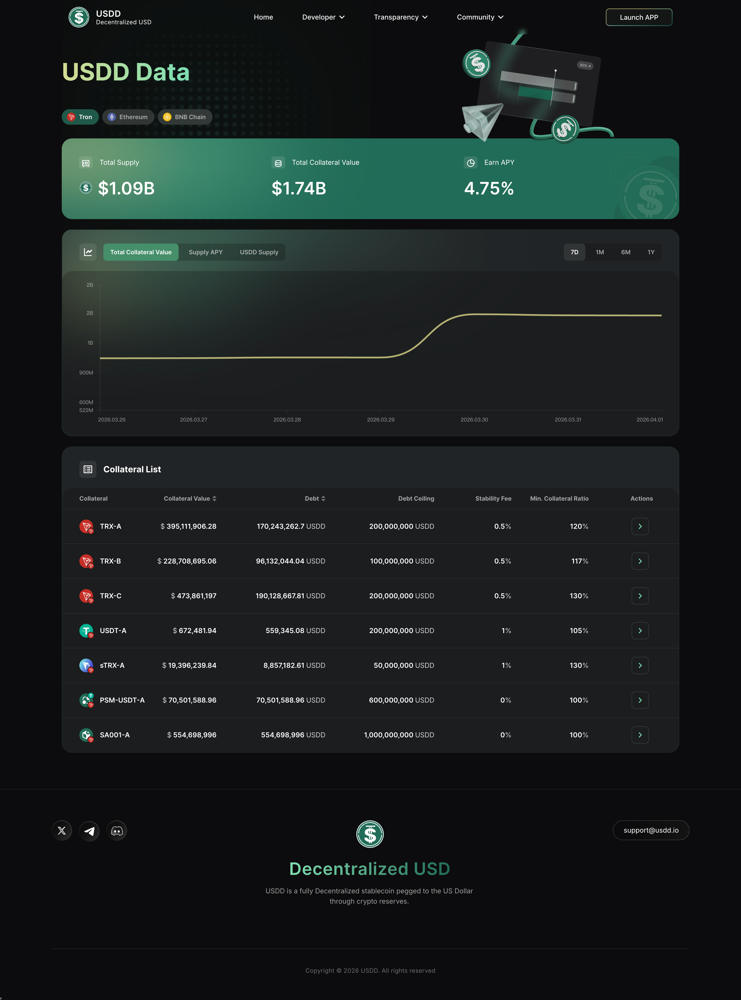
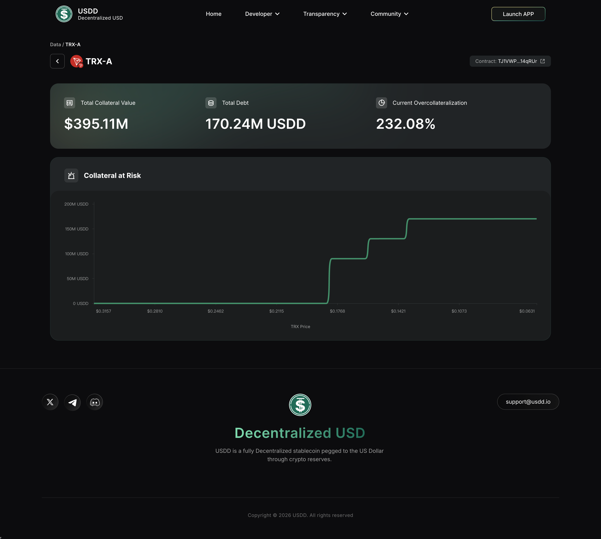

# 数据透明页 — Data Transparency

---

## 一、文档元数据

| 字段 | 说明 |
| --- | --- |
| **项目名称** | USDD 2.0 官网 |
| **模块名称** | 数据透明 — Data Transparency |
| **页面 URL** | `/data` |
| **关联模块** | website-global（全局导航/页脚）、website-homepage（首页指标卡片引用同源数据） |
| **外部依赖** | 链上数据 API（实时获取各链 Collateral Value、Debt、Supply、APY 等指标） |

### 截图/原型参考

| 页面 | 截图 | 说明 |
| --- | --- | --- |
| Data 列表页（TRON） |  | 默认展示 TRON 链的指标卡片、图表、Collateral List |
| Vault 详情二级页 |  | TRX-A Vault 详情，含指标卡片和图表 |
| Data 页面（Ethereum） | ⚠️ 待补充 | 切换至 Ethereum 链后的数据视图 |
| Data 页面（BNB Chain） | ⚠️ 待补充 | 切换至 BNB Chain 后的数据视图 |

### 设计稿

> ⚠️ 待补充。设计稿索引文件建立后，在此补充链接。
>
> 开发实现时以设计稿为**视觉标准**，本文档为**功能与逻辑标准**。如二者不一致，以设计稿最新版为准并同步更新本文档。

### 源码索引（供 Dev 参考）

点击展开关键文件清单

| 类别 | 文件路径 | 说明 |
|------|---------|------|
| 页面 | ⚠️ 待补充 | Data 页面主入口 |
| 业务逻辑 | ⚠️ 待补充 | 链上数据聚合与格式化 |
| 服务层 | ⚠️ 待补充 | 链上数据 API 调用封装 |
| 状态管理 | ⚠️ 待补充 | 当前链选择、图表时间范围等状态 |

---

## 二、功能清单（Feature Inventory）

| # | 功能名称 | 功能描述 | 入口/触发方式 | 用户角色 | 优先级 | 状态 |
| --- | --- | --- | --- | --- | --- | --- |
| F01 | 多链 Tab 切换 | 在 TRON / Ethereum / BNB Chain 间切换，刷新页面所有数据 | 页面顶部 Tab 栏点击 | 所有访客 | P0 | 已实现 |
| F02 | 顶部指标卡片 | 展示当前链的 Total Supply、Total Collateral Value、Earn APY 三项核心指标 | 页面加载自动展示 | 所有访客 | P0 | 已实现 |
| F03 | 时间序列图表 | 展示 Total Collateral Value、Supply APY、USDD Supply 三条走势曲线 | 页面加载自动展示，支持切换时间范围 | 所有访客 | P1 | 已实现 |
| F04 | 图表时间范围切换 | 支持 7D / 1M / 6M / 1Y 四种时间粒度 | 图表区域内的时间范围选择器 | 所有访客 | P1 | 已实现 |
| F05 | Collateral List 表格 | 展示当前链所有 Collateral Vault 的详细参数 | 页面下方自动展示 | 所有访客 | P0 | 已实现 |
| F06 | Collateral 操作入口 | 表格 Actions 列按钮，跳转到站内 Vault 详情二级页 `/data/{vaultId}/{vaultName}?chainType={chain}` | 表格每行 Actions 列按钮 | 所有访客 | P1 | 已实现 |
| F07 | Vault 详情页（二级页面） | 展示单个 Vault 的完整数据：抵押品价值、Debt、超额抵押率、风险分布图、代币价格走势 | 从 F06 跳转或直接 URL 访问 | 所有访客 | P1 | 已实现 |

---

## 三、功能详细 Spec

### F01: 多链 Tab 切换

#### 用户故事
> 作为**USDD 用户或潜在投资者**，我希望在不同链之间切换查看数据，以便了解 USDD 在各链上的储备和运营状况。

#### 前置条件
- 用户已访问 usdd.io/data 页面
- 链上数据 API 可用

#### 主流程（Happy Path）
1. 用户进入 `/data` 页面，系统默认展示 **TRON** 链数据（⚠️ 需确认：默认链是否始终为 TRON）
2. 页面顶部展示 3 个 Tab：**Tron** / **Ethereum** / **BNB Chain**，当前链高亮
3. 用户点击其他 Tab（如 Ethereum）
4. 页面所有数据区域更新为 Ethereum 链的数据，包括：
  - 顶部三个指标卡片
  - 三个时间序列图表
  - Collateral List 表格
5. 被点击的 Tab 变为高亮状态，原 Tab 恢复默认样式

#### 分支流程与异常处理

| 场景编号 | 触发条件 | 系统行为 | UI 表现 |
| --- | --- | --- | --- |
| E01-01 | 切换链时数据加载中 | 发起对应链的数据请求 | ⚠️ 需确认：是否有 Loading 状态（骨架屏/spinner） |
| E01-02 | 目标链数据接口超时或失败 | ⚠️ 需确认：是否有错误提示或重试机制 | ⚠️ 需确认 |
| E01-03 | 某条链暂无 Collateral 数据 | 表格展示空状态 | ⚠️ 需确认：空状态文案 |

#### 业务规则

| 规则编号 | 规则描述 | 校验时机 | 失败处理 |
| --- | --- | --- | --- |
| BR-F01-01 | 切换 Tab 后，页面内所有数据区域必须同步更新为目标链数据 | Tab 点击时 | 不允许出现混合展示不同链数据的情况 |
| BR-F01-02 | 默认展示 TRON 链数据 | 页面首次加载 | ⚠️ 需确认 |

#### 数据依赖与接口清单

| 接口名称 | 请求方式 | 端点 | 主要参数 | 返回内容 | 调用时机 | 缓存策略 |
| --- | --- | --- | --- | --- | --- | --- |
| 获取指定链数据 | GET | `/data-platform/latest-collateral` | chain（TRON / Ethereum / BNB Chain） | 指标卡片数据 + 图表数据 + Collateral List | Tab 切换时 | 无本地缓存，每次请求实时数据 |

---

### F02: 顶部指标卡片

#### 用户故事
> 作为**USDD 用户或潜在投资者**，我希望一眼看到当前链的核心指标，以便快速评估 USDD 的规模和收益水平。

#### 前置条件
- 已选定链（默认 TRON）
- 链上数据 API 返回成功

#### 主流程（Happy Path）
1. 页面加载后，在 Tab 栏下方展示 **3 个指标卡片**，横向排列：
  - **Total Supply**：展示当前链 USDD 总供应量，带美元符号和数值缩写（如 $1.09B），含 icon
  - **Total Collateral Value**：展示当前链全部抵押品总价值（如 $1.73B）
  - **Earn APY**：展示当前链的存款年化收益率（如 4.75%）
2. 数值实时反映链上最新状态

#### 分支流程与异常处理

| 场景编号 | 触发条件 | 系统行为 | UI 表现 |
| --- | --- | --- | --- |
| E02-01 | 数据加载中 | 等待 API 响应 | ⚠️ 需确认：是否有占位加载态 |
| E02-02 | 接口返回异常或为空 | ⚠️ 需确认 | ⚠️ 需确认：是否展示 "--" 或 "N/A" |

#### 业务规则

| 规则编号 | 规则描述 | 校验时机 | 失败处理 |
| --- | --- | --- | --- |
| BR-F02-01 | Total Supply 展示为美元计价，使用缩写格式（B = 十亿，M = 百万） | 数据渲染时 | 格式异常时展示完整数值 |
| BR-F02-02 | Earn APY 以百分比展示，保留两位小数 | 数据渲染时 | ⚠️ 需确认精度规则 |
| BR-F02-03 | 三个指标卡片数据与下方图表、表格的数据源一致 | 页面加载时 | 不允许出现指标卡片与表格数据矛盾 |

---

### F03 + F04: 时间序列图表与时间范围切换

#### 用户故事
> 作为**USDD 用户或分析师**，我希望查看关键指标的历史趋势，以便评估协议的健康度和增长轨迹。

#### 前置条件
- 已选定链
- 历史数据 API 可用

#### 主流程（Happy Path）
1. 在指标卡片下方，展示 **3 个时间序列图表**，纵向排列：
  - **图表 1 — Total Collateral Value**：抵押品总价值走势曲线
  - **图表 2 — Supply APY**：存款年化收益率走势曲线
  - **图表 3 — USDD Supply**：USDD 供应量走势曲线
2. 每个图表右上方展示时间范围选择器，提供 4 个选项：**7D** / **1M** / **6M** / **1Y**
3. 默认选中的时间范围为7D 需确认
4. 用户点击不同时间范围，图表数据重新加载并展示对应周期内的走势
5. 图表支持悬停查看具体日期和数值

#### 分支流程与异常处理

| 场景编号 | 触发条件 | 系统行为 | UI 表现 |
| --- | --- | --- | --- |
| E03-01 | 图表数据加载中 | 请求对应时间段数据 | ⚠️ 需确认：图表区域是否有 Loading 态 |
| E03-02 | 某个时间段无历史数据 | ⚠️ 需确认 | ⚠️ 需确认：图表是否展示空状态或部分数据 |
| E03-03 | 切换链后图表时间范围状态 | ⚠️ 需确认：是否重置为默认时间范围 | ⚠️ 需确认 |

#### 业务规则

| 规则编号 | 规则描述 | 校验时机 | 失败处理 |
| --- | --- | --- | --- |
| BR-F03-01 | 三个图表的时间范围选择器联动 | 用户切换时间范围时 | — |
| BR-F03-02 | 图表 Y 轴数值单位与卡片一致（美元 / 百分比） | 数据渲染时 | — |
| BR-F03-03 | 图表 X 轴标签根据时间范围自适应（7D 按日、1Y 按月等） | 数据渲染时 | ⚠️ 需确认具体粒度 |

#### 数据依赖与接口清单

| 接口名称 | 请求方式 | 端点 | 主要参数 | 返回内容 | 调用时机 | 缓存策略 |
| --- | --- | --- | --- | --- | --- | --- |
| 获取图表历史数据 | GET | `/data-platform/collateral-history` | chain、interval（WEEKLY 等）、metric（collateral_value / supply_apy / usdd_supply）、timeRange（7d / 1m / 6m / 1y） | 时间序列数据点数组 | 页面加载 + 切换时间范围 | 无本地缓存，每次请求实时数据 |

---

### F05: Collateral List 表格

#### 用户故事
> 作为**USDD 用户或审计者**，我希望看到每种抵押品的详细参数，以便评估各 Vault 的风险水平和利用率。

#### 前置条件
- 已选定链
- Collateral 数据 API 可用

#### 主流程（Happy Path）
1. 在图表区域下方，展示 **Collateral List** 表格
2. 表格包含以下列：

   | 列名 | 说明 | 数据格式 |
   |------|------|---------|
   | Collateral | 抵押品名称（如 TRX-A、PSM-USDT-A） | 文本，含抵押品类型标识 |
   | Collateral Value | 该 Vault 抵押品总价值 | 美元计价，带 $ 前缀和千分位分隔符 |
   | Debt | 该 Vault 已借出的 USDD 数量 | 数值 + "USDD" 后缀 |
   | Debt Ceiling | 该 Vault 的借贷上限 | 数值 + "USDD" 后缀 |
   | Stability Fee | 稳定费率 | 百分比 |
   | Min. Collateral Ratio | 最低抵押率要求 | 百分比 |
   | Actions | 操作按钮 | ⚠️ 需确认：按钮文案和跳转目标 |

3. TRON 链当前展示以下 Collateral Vault（2026-04-01 采集）：
  - **TRX-A**：Collateral Value $391M，Debt 170M USDD，Debt Ceiling 200M USDD，Stability Fee 0.5%，Min CR 120%
  - **TRX-B**：Collateral Value $226M，Debt 96M USDD，Debt Ceiling 100M USDD，Stability Fee 0.5%，Min CR 117%
  - **TRX-C**：Collateral Value $469M，Debt 190M USDD，Debt Ceiling 200M USDD，Stability Fee 0.5%，Min CR 130%
  - **USDT-A**：Collateral Value $672K，Debt 559K USDD，Debt Ceiling 200M USDD，Stability Fee 1%，Min CR 105%
  - **sTRX-A**：Collateral Value $19.2M，Debt 8.9M USDD，Debt Ceiling 50M USDD，Stability Fee 1%，Min CR 130%
  - **PSM-USDT-A**：Collateral Value $71.4M，Debt 71.4M USDD，Debt Ceiling 600M USDD，Stability Fee 0%，Min CR 100%
  - **SA001-A**：Collateral Value $554.7M，Debt 554.7M USDD，Debt Ceiling 1B USDD，Stability Fee 0%，Min CR 100%

4. 表格数据实时从链上获取

#### 分支流程与异常处理

| 场景编号 | 触发条件 | 系统行为 | UI 表现 |
| --- | --- | --- | --- |
| E05-01 | 数据加载中 | 请求 Collateral List 数据 | ⚠️ 需确认：表格是否有骨架屏 |
| E05-02 | 当前链无 Collateral Vault | 返回空列表 | ⚠️ 需确认：空状态展示方式 |
| E05-03 | 某行数据字段缺失 | ⚠️ 需确认 | ⚠️ 需确认：缺失字段展示 "--" 还是隐藏该行 |

#### 业务规则

| 规则编号 | 规则描述 | 校验时机 | 失败处理 |
| --- | --- | --- | --- |
| BR-F05-01 | Collateral Value 使用美元计价，保留两位小数 | 数据渲染时 | — |
| BR-F05-02 | Debt 和 Debt Ceiling 以 USDD 为单位展示 | 数据渲染时 | — |
| BR-F05-03 | PSM 类型 Vault 的 Min CR 固定为 100%（1:1 锚定机制） | 数据渲染时 | — |
| BR-F05-04 | SA001-A 类型 Vault 的 Min CR 固定为 100%（特殊抵押品） | 数据渲染时 | ⚠️ 需确认 SA001-A 的具体含义和业务逻辑 |
| BR-F05-05 | 表格默认排序规则 | 页面加载时 | 固定顺序 |

#### 数据依赖与接口清单

| 接口名称 | 请求方式 | 端点 | 主要参数 | 返回内容 | 调用时机 | 缓存策略 |
| --- | --- | --- | --- | --- | --- | --- |
| 获取 Collateral 列表 | GET | `/data-platform/latest-collateral` | chain | 各 Vault 的 Collateral Value、Debt、Debt Ceiling、Stability Fee、Min CR | 页面加载 + 切换链 | 无本地缓存，每次请求实时数据 |

---

### F06: Collateral 操作入口（跳转 Vault 详情二级页）

#### 用户故事
> 作为**USDD 用户或分析师**，我希望从 Collateral 列表点击某个 Vault 查看其详细数据，以便深入了解该 Vault 的抵押状况和风险分布。

#### 前置条件
- Collateral List 表格已加载

#### 主流程（Happy Path）
1. 在 Collateral List 表格每行的 Actions 列，展示操作按钮
2. 用户点击某行（如 TRX-A）的 Actions 按钮
3. 系统跳转到**站内二级页面**，URL 格式为 `/data/{vaultId}/{vaultName}?chainType={chain}`
  - 示例：`/data/1/TRX-A?chainType=tron`
4. 进入 **Vault 详情页**（详见 F07）

#### 分支流程与异常处理

| 场景编号 | 触发条件 | 系统行为 | UI 表现 |
| --- | --- | --- | --- |
| E06-01 | 目标 Vault 详情页数据加载失败 | 页面已跳转但数据请求失败 | ⚠️ 需确认：是否有错误态或自动返回列表 |

#### 业务规则

| 规则编号 | 规则描述 | 校验时机 | 失败处理 |
| --- | --- | --- | --- |
| BR-F06-01 | Actions 按钮跳转到站内 `/data/{vaultId}/{vaultName}?chainType={chain}` 二级页面，非外部链接 | 用户点击时 | — |
| BR-F06-02 | URL 参数需携带当前链类型（chainType）和 Vault 标识（vaultId + vaultName） | 路由构建时 | 参数缺失则⚠️ 需确认降级行为 |

---

### F07: Vault 详情页（二级页面）

#### 用户故事
> 作为**USDD 用户或分析师**，我希望查看单个 Vault 的完整数据（抵押品价值、Debt、超额抵押率、风险分布、价格走势），以便评估该 Vault 的健康度和潜在风险。

#### 前置条件
- 用户从 Data 页 Collateral List 点击 Actions 按钮进入
- 或直接通过 URL 访问（如 `/data/1/TRX-A?chainType=tron`）
- 链上数据 API 可用

#### 主流程（Happy Path）
1. 页面顶部展示面包屑导航：**Data /** {Vault 名称}（如 "Data / TRX-A"），点击 "Data" 可返回列表页
2. 展示 Vault 基本信息：
  - **Vault 名称**：如 "TRX-A"
  - **合约地址**：截断展示（如 "TJ1VWP...14qRUr"），可点击跳转到区块链浏览器（TRON 对应 tronscan.org）
3. 展示 **3 个核心指标卡片**，横向排列：
  - **Total Collateral Value**：该 Vault 抵押品总价值（如 $395.11M）
  - **Total Debt**：该 Vault 已借出的 USDD 总量（如 170.24M USDD）
  - **Current Overcollateralization**：当前超额抵押率（如 232.08%）
4. 展示 **2 个图表**：
  - **Collateral at Risk**：抵押品风险分布图表（⚠️ 需确认具体图表类型和维度）
  - **TRX Price**：抵押品代币价格走势图（⚠️ 需确认时间范围选项）

#### 分支流程与异常处理

| 场景编号 | 触发条件 | 系统行为 | UI 表现 |
| --- | --- | --- | --- |
| E07-01 | URL 中 vaultId 或 vaultName 无效 | ⚠️ 需确认：是否展示 404 或重定向到列表页 | ⚠️ 需确认 |
| E07-02 | Vault 数据加载中 | 请求链上数据 | ⚠️ 需确认：是否有骨架屏或 Loading 态 |
| E07-03 | Vault 数据接口失败 | ⚠️ 需确认 | ⚠️ 需确认：错误态展示方式 |
| E07-04 | 不同链的 Vault 合约地址跳转到不同区块链浏览器 | 根据 chainType 决定浏览器 URL（TRON→tronscan、ETH→etherscan、BSC→bscscan） | 新窗口打开区块链浏览器 |
| E07-05 | PSM / SA001 等特殊 Vault 无 Price 图表 | ⚠️ 需确认：是否隐藏 Price 图表或展示替代内容 | ⚠️ 需确认 |

#### 业务规则

| 规则编号 | 规则描述 | 校验时机 | 失败处理 |
| --- | --- | --- | --- |
| BR-F07-01 | 超额抵押率 = Total Collateral Value / Total Debt * 100% | 数据渲染时 | Debt 为 0 时⚠️ 需确认展示逻辑 |
| BR-F07-02 | 合约地址截断展示，点击在新窗口打开对应链的区块链浏览器 | 用户点击时 | — |
| BR-F07-03 | 面包屑导航 "Data" 链接回到 `/data` 列表页，并保持之前选中的链 Tab 状态 | 用户点击时 | ⚠️ 需确认是否保持链 Tab 状态 |
| BR-F07-04 | Price 图表标题动态适配抵押品代币名称（TRX Price / USDT Price / sTRX Price） | 数据渲染时 | — |

#### 数据依赖与接口清单

| 接口名称 | 请求方式 | 端点 | 主要参数 | 返回内容 | 调用时机 | 缓存策略 |
| --- | --- | --- | --- | --- | --- | --- |
| 获取 Vault 详情 | GET | `/data-platform/latest-collateral` | ilk（如 TRX-A）、chain | Collateral Value、Debt、Overcollateralization、合约地址 | 页面加载时 | 无本地缓存，每次请求实时数据 |
| 获取抵押品风险分布 | GET | `/data-platform/collateral-normal/collateral-at-risk` | ilk（如 TRX-A）、chain | Collateral at Risk 分布数据 | 页面加载时 | 无本地缓存，每次请求实时数据 |
| 获取抵押品代币价格走势 | GET | `/liquid/highestprice` | chainType、tokenSymbol | 价格时间序列 | 页面加载时 | 无本地缓存，每次请求实时数据 |

---

## 四、模块级总览

### 4.1 页面流程

**入口：**
- 用户通过导航栏或直接访问 `usdd.io/data` → 进入 **Data 页面**

**页面内交互：**
- 默认展示 TRON 链数据（指标卡片 + 图表 + 表格）
- 点击 Tab 切换链 → 页面所有数据区域刷新为目标链数据
- 在图表区域切换时间范围（7D / 1M / 6M / 1Y）→ 对应图表更新
- 点击 Collateral List 表格 Actions 按钮 → 跳转到站内 Vault 详情二级页（如 `/data/1/TRX-A?chainType=tron`）

**页面结构（自上而下）：**

**一级页面 \****`/data`**\*\*：**
1. 全局导航栏（来自 website-global 模块）
2. 页面标题 "USDD Data"
3. 多链 Tab 栏（Tron / Ethereum / BNB Chain）
4. 指标卡片区（Total Supply / Total Collateral Value / Earn APY）
5. 图表区（3 个时间序列图表，各带时间范围选择器）
6. Collateral List 表格（Actions 列跳转二级页）
7. 全局页脚（来自 website-global 模块）

**二级页面 \****`/data/{vaultId}/{vaultName}?chainType={chain}`**\*\*：**
1. 全局导航栏
2. 面包屑导航（Data / {Vault 名称}）
3. Vault 名称 + 合约地址（可点击跳转区块链浏览器）
4. 指标卡片区（Total Collateral Value / Total Debt / Current Overcollateralization）
5. 图表区（Collateral at Risk + 代币 Price 走势）
6. 全局页脚

### 4.2 模块依赖关系

**本模块包含 1 个页面：**

1. **Data 页面**（`/data`）：集中展示指标卡片、历史图表、Collateral 明细 — 向用户传达协议透明度和健康状况

**与其他模块的关系：**
- **website-global**：复用全局导航栏和页脚组件
- **website-homepage**：首页指标卡片可能引用同一数据源（Total Supply、Collateral Ratio 等）
- **Vault 详情二级页**（站内 `/data/{vaultId}/{vaultName}?chainType={chain}`）：Collateral List Actions 按钮跳转目标
- **区块链浏览器（外部）**：Vault 详情页合约地址链接，跳转到 tronscan / etherscan / bscscan

### 4.3 已知待优化项

| # | 描述 | 影响 | 建议优先级 |
| --- | --- | --- | --- |
| 1 | 加载态和错误态表现不明确 | 网络慢时用户可能看到空白区域，不知道是加载中还是无数据 | P1 |
| 2 | Vault 详情页信息密度较低 | 仅展示 3 个指标 + 2 个图表，缺失 Debt Ceiling、Stability Fee、Min CR 等列表页已有字段 | P2 |
| 3 | 移动端适配情况未知 | 表格列较多，小屏设备可能需要横向滚动，体验受损 | P2 |
| 4 | 图表无数据导出能力 | 分析师或机构用户无法直接获取原始数据进行二次分析 | P3 |
| 5 | 各链之间的数据缺乏汇总视图 | 用户需要逐链查看才能了解 USDD 全貌，无法一眼看到跨链总量 | P2 |

### 4.4 迭代建议

| 优先级 | 建议 | 原因 |
| --- | --- | --- |
| P1 | 明确并统一各区域的加载态和错误态设计 | 直接影响用户对页面可靠性的感知，当前行为不确定 |
| P1 | 确认 Actions 列交互细节（按钮文案、跳转目标、是否新窗口打开） | 属于核心操作链路的闭环，当前信息不完整 |
| P2 | 增加跨链汇总视图（All Chains Tab 或顶部汇总） | 用户关心 USDD 全局健康度，不应只能逐链查看 |
| P2 | 优化移动端表格展示方案 | Data 页面承担透明度展示职责，应对各端友好 |
| P3 | 支持图表数据导出（CSV / API） | 满足机构用户和分析师的进阶需求，提升协议可信度 |

---

## 质量自检清单

- [x] 主流程步骤描述以用户视角和页面内容为主，无代码级实现描述
- [x] 异常流程覆盖了至少 5 种以上场景
- [x] 业务规则有明确的校验时机和失败处理方式
- [x] 截图/设计稿有引用或标记为待补充
- [x] 标注了所有不确定的点（⚠️ 需确认）
- [x] 待优化项从产品和用户体验角度提出
- [x] 源码索引折叠展示，不干扰产品阅读
