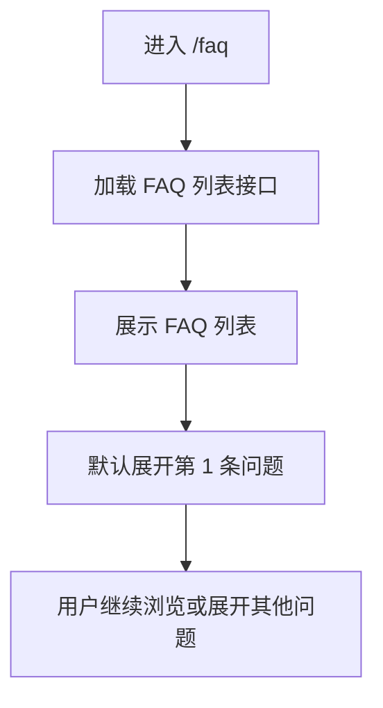
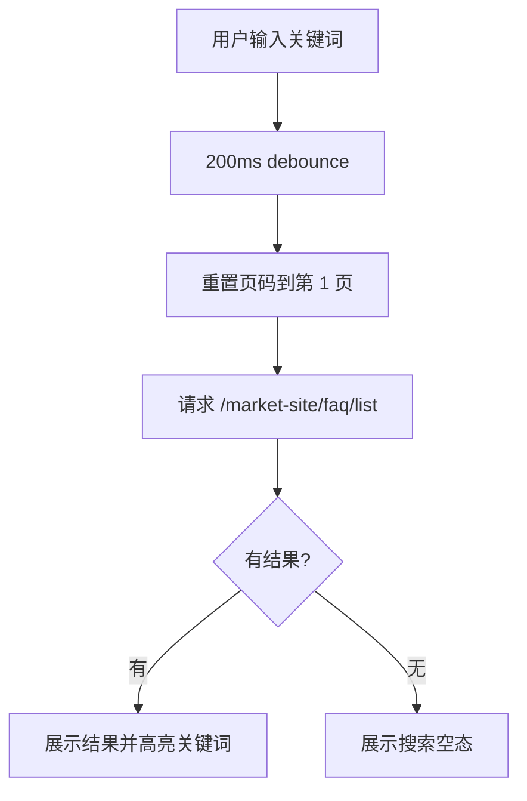
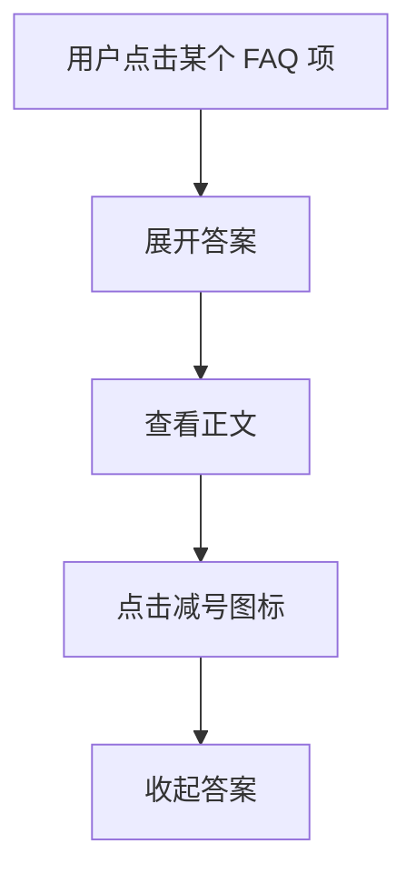

# 逆向还原 PRD | FAQ 页面

> 模块名称：FAQ Page
> 页面入口：`https://usdd.io/faq`
> 文档类型：逆向还原 PRD
> 还原日期：2026-04-02
> 还原依据：现网页面内容抓取、`main.3eddeebb.js` 路由与组件逆向、FAQ API 响应样例、搜索与分页代码、用户补充信息（FAQ 问题可由公司内部系统配置）

---

## 先结论

`https://usdd.io/faq` 是 USDD 官网的自助答疑页，不是静态写死的纯展示页。它承担“统一解释 USDD 核心概念、借贷操作、收益入口、PSM 兑换和 Smart Allocator 新机制”的内容承接职责，用于降低新用户理解门槛、减少重复客服沟通，并通过可配置内容持续维护 USDD 2.0 的品牌叙事与机制解释。

从实现上看，这个页面复用了官网的通用 `列表 + 搜索 + 分页` 容器，但 FAQ 没有启用分类过滤，而是使用折叠式问答项渲染。FAQ 内容通过 `https://app-api.usdd.io/market-site/faq/list` 动态拉取，当前现网已返回 16 条问题；接口字段同时包含 `id`、`sortOrder`、`status`、`createTime`、`updateTime`，结合你的补充信息，可以高可信判断 FAQ 内容来自公司内部配置系统或 CMS，而不是每次前端发版才更新。

从业务价值上看，这页更偏“信任建设 + 用户教育 + 自助支持”，不是直接做交易转化，但它会显著影响用户对 USDD 2.0 的理解质量，尤其影响对 Vault、Earn、PSM、Smart Allocator 这些模块的认知效率。由于页面内容可配置，它同时也是一个运营内容位，因此需要特别关注叙事一致性和错误内容发布风险。

---

## 逆向事实层

### 已证实事实

**页面基础信息**

| 项目 | 已证实内容 |
| --- | --- |
| 页面路径 | `https://usdd.io/faq` |
| 路由组件 | React Router `path:"/faq"` -> `qQ` |
| 页面 HTML 标题 | `USDD` |
| 页面主标题 | `Frequently Asked Questions` |
| 搜索占位文案 | `Search FAQs` |
| 页面技术栈 | React 18、Ant Design 5.21.6、自定义列表容器 `XQ` |
| 页面定位 | 官网 FAQ / 自助答疑页 |

**页面主结构**

| 区块 | 已证实内容 | 说明 |
| --- | --- | --- |
| 搜索 Banner | 存在 | 顶部承载标题和搜索框 |
| FAQ 列表区 | 存在 | 问题项逐条渲染 |
| 问答折叠项 | 存在 | 每条 FAQ 可展开 / 收起 |
| 分页区 | 存在 | 固定每页 8 条 |
| 空状态区 | 存在 | 搜索无结果时展示图片和双行文案 |
| 分类筛选区 | FAQ 当前未启用 | 通用容器支持分类，但 FAQ 页 `showCateFilter` 为 `false` |

**核心交互事实**

| 交互 | 已证实内容 |
| --- | --- |
| 默认展开规则 | 当前页第 1 条 FAQ 默认展开 |
| 展开行为 | 点击整条 FAQ 项会展开答案 |
| 收起行为 | 点击减号图标会收起当前项 |
| 搜索触发方式 | 输入变更后 200ms debounce 触发 |
| 搜索后页码处理 | 搜索关键词变化时会重置到第 1 页 |
| 翻页能力 | 存在分页器，支持页码切换 |
| 每页条数 | 固定 `8` |
| 页大小切换 | 关闭 `showSizeChanger` |
| 清空搜索 | 输入非空时显示清空图标，可一键清空 |
| 路由滚动 | 路由切换后全局触发 `window.scrollTo(0,0)` |

**FAQ 问答项渲染规则**

| 字段 / 能力 | 已证实内容 |
| --- | --- |
| 问题字段 | `question` |
| 答案字段 | `answer` |
| 展开状态字段 | 本地 `useState(defaultStatus)` 控制 |
| 展开图标 | `icon-add` / `icon-minus` |
| 搜索高亮 | 前端会对问题和答案执行关键词高亮 |
| 多行答案 | 通过按 `\n` 分行后逐行渲染 |
| 骨架屏 | 当 `item` 为空时渲染 Skeleton Input 占位 |

**接口 / 数据来源表**

| 数据项 | 接口 / 来源 | 代码 / 证据 | 证据等级 | 说明 |
| --- | --- | --- | --- | --- |
| 页面路由 | 前端路由 `/faq` | `path:"/faq", element:(0,ui.jsx)(qQ,{})` | 已证实前端数据来源 | FAQ 是官网一级路由，不是弹层或嵌入模块 |
| FAQ 主组件 | `qQ -> XQ -> MQ` | `qQ` 使用通用列表容器 `XQ`，FAQ 单项渲染组件为 `MQ` | 已证实前端数据来源 | 页面复用通用列表框架，但 FAQ 使用问答折叠渲染 |
| API Host | `https://app-api.usdd.io` | 通用请求 helper `is()` 内部 `baseURL:"https://app-api.usdd.io"` | 已证实接口环境 | FAQ 内容并非直接从 `usdd.io` 静态包读取，而是走 API |
| FAQ 列表接口 | `GET /market-site/faq/list` | `is("/market-site/faq/list", e, {})` | 已证实接口 | 页面核心内容由该接口驱动 |
| 请求参数 | `pageNo`、`pageSize`、`keyword` | `({ keyword:i, pageNo:t, pageSize:n })` | 已证实接口参数 | FAQ 当前未使用 `category` 参数 |
| 查询串拼装规则 | 仅追加非空参数 | helper 用 `URLSearchParams` 过滤 `undefined` / `null` | 已证实前端规则 | 空关键词不会被拼进 query string |
| 成功判定 | HTTP 200 且 `code===0` | helper `is()` 对 `status` 和 `data.code` 做双重校验 | 已证实接口规则 | 成功时返回 `data` 节点，失败进入 reject |
| 响应数据结构 | `totalPage`、`totalCount`、`items[]` | 页面直接解构 `{ totalCount=0, items=[], categories=[] }` | 已证实接口字段 | FAQ 不展示 categories，但容器兼容该字段 |
| FAQ 内容字段 | `id`、`question`、`answer`、`sortOrder`、`status`、`createTime`、`updateTime` | 现网接口直接返回这些字段 | 已证实接口字段 | 字段形态非常接近 CMS / 配置中心内容模型 |
| 内容配置来源 | 公司内部系统 / CMS 配置层 | 用户明确补充“问题可以在公司内部系统配置”；接口字段含 `status`、`sortOrder`、时间戳 | 用户补证 + 高可信推断 | 当前代码证明是动态接口，业务侧补证说明来源是内部系统 |
| 搜索高亮来源 | 前端本地处理 | `question` / `answer` 在渲染前执行 split + startsWith 高亮 | 已证实前端数据来源 | 高亮不依赖后端返回富文本标记 |
| 空状态文案 | 前端静态文案 | `No results found for your search.` / `Please try different keywords.` | 已证实前端数据来源 | 空态由前端本地固定文案渲染 |
| 合规拦截 | `GET /status_check` | 全站 Shell 会请求 `/status_check` 并在 403 时弹受限地区提示 | 已证实接口 | FAQ 页同样继承站点级合规模态，不是 FAQ 自身业务接口 |

**FAQ 内容模型（现网接口返回）**

| 字段 | 类型 | 已证实含义 | 说明 |
| --- | --- | --- | --- |
| `id` | number | FAQ 唯一标识 | 可用于埋点和后台编辑映射 |
| `question` | string | FAQ 问题标题 | 列表主展示字段 |
| `answer` | string | FAQ 答案正文 | 展开后显示 |
| `sortOrder` | number | 排序权重 | 用于后台配置排序，现网前台最终顺序可能还叠加搜索相关性 |
| `status` | number | 发布状态 | 现网样例均为 `1` |
| `createTime` | string | 创建时间 | 后台内容元信息 |
| `updateTime` | string | 更新时间 | 后台内容元信息 |

**截至 2026-04-02 抓取到的现网 FAQ 清单**

| ID | Question | Sort Order | Update Time |
| --- | --- | --- | --- |
| 1 | `What is USDD?` | 30 | 2025-06-30 07:02:23 |
| 2 | `How is USDD different from USDDOLD?` | 15 | 2025-01-26 06:20:50 |
| 3 | `How can I migrate USDDOLD for USDD?` | 14 | 2025-01-26 03:59:12 |
| 4 | `Can I borrow USDD using my crypto assets?` | 29 | 2025-06-30 09:11:26 |
| 5 | `How can I earn rewards with USDD?` | 12 | 2025-01-21 07:31:19 |
| 6 | `Is USDD fully decentralized?` | 11 | 2025-01-21 07:31:19 |
| 7 | `Is USDD backed by collateral?` | 10 | 2025-01-21 07:31:19 |
| 8 | `What makes USDD secure?` | 9 | 2025-01-21 07:31:19 |
| 9 | `Where can I learn more about USDD?` | 8 | 2025-01-21 07:31:19 |
| 10 | `How do I deposit collateral?` | 7 | 2025-01-21 07:31:19 |
| 11 | `How can I mint USDD?` | 6 | 2025-01-21 07:31:19 |
| 12 | `How do I repay my USDD debt?` | 5 | 2025-01-21 07:31:20 |
| 15 | `Are there any fees involved?` | 2 | 2025-01-21 07:31:20 |
| 16 | `How does swapping USDD work?` | 1 | 2025-01-21 07:31:21 |
| 17 | `What is Smart Allocator?` | 16 | 2025-06-30 09:14:20 |
| 18 | `Why Smart Allocator?` | 17 | 2025-06-30 09:14:11 |

**文案与国际化摘要（来自现网与配套 i18n）**

| Key | EN | 说明 | 状态 |
| --- | --- | --- | --- |
| `faq_page.header.title` | `Frequently Asked Questions` | 页面主标题 | observed |
| `faq_page.search.placeholder` | `Search FAQs` | 搜索框占位文案 | observed |
| `faq_page.empty.title` | `No results found for your search.` | 搜索空态主文案 | observed |
| `faq_page.empty.desc` | `Please try different keywords.` | 搜索空态辅助文案 | observed |
| `faq_page.icon.expand` | `expand` | 展开 icon 的语义占位 | inferred |
| `faq_page.icon.collapse` | `collapse` | 收起 icon 的语义占位 | inferred |

**埋点摘要（来自配套 tracking）**

| 事件 | 触发时机 | 核心属性 | 目标 |
| --- | --- | --- | --- |
| `faq_page_view` | 进入 `/faq` | `page_path,referrer,device_type,locale` | 统计 FAQ 使用量 |
| `faq_search` | 用户输入搜索词 | `keyword,result_count,current_page` | 衡量自助检索效率 |
| `faq_search_no_result` | 搜索结果为空 | `keyword` | 识别内容缺口 |
| `faq_question_expand` | 用户展开问题 | `faq_id,question_title,list_position,keyword,current_page` | 识别高关注问题 |
| `faq_question_collapse` | 用户收起问题 | `faq_id,question_title,current_page` | 衡量阅读完成度 |
| `faq_pagination_click` | 用户翻页 | `from_page,to_page,keyword` | 判断内容消费深度 |
| `faq_search_clear` | 用户清空搜索框 | `previous_keyword,current_page` | 判断搜索回退行为 |
| `faq_api_error_exposed` | FAQ 接口失败且页面无结果 / 停留旧状态 | `error_type,page_no,keyword` | 识别内容加载问题 |

### 推断结论

- FAQ 内容排序并不单纯等于 `sortOrder` 降序，当前现网结果更像“后台排序 + 搜索相关性”的组合结果。
- FAQ 页面明显复用了 `News` 页的通用搜索 / 分页容器，说明后续如果业务需要，也可以较低成本扩展 FAQ 分类或标签体系。
- 结合接口字段和你的补充信息，高可信判断 FAQ 内容由内部运营系统或 CMS 维护，再通过 `app-api.usdd.io` 发布给官网消费。
- 当前 FAQ 内容包含部分值得复核的叙事，例如首条回答中的 `advanced algorithms`、`fully decentralized`，与 USDD 2.0 在本项目里的“超额抵押 + 储备支撑 + 机制透明”标准叙事存在偏差风险。
- FAQ 页是品牌信任与机制教育页面，不直接发起链上交易，但它会实质影响用户是否继续进入 Vault、Earn、PSM 等高价值模块。

### 待确认项

| 项目 | 当前状态 |
| --- | --- |
| 内部配置系统的真实入口、发布流和权限模型 | 用户口径已确认存在，代码中未包含后台实现 |
| `status` 字段的完整枚举值 | 现网样例仅见 `1` |
| 搜索后端的匹配范围 | 高可信是 question + answer，但接口未提供正式文档 |
| FAQ 的最终排序规则 | 已看到 `sortOrder`，但现网前端顺序可能混合搜索相关性 |
| 答案正文是否支持富文本 / 链接 / HTML | 当前前端按纯文本和换行渲染，未看到富文本解析逻辑 |
| API 失败时的最终用户体验 | 当前 `onSearch` reject 后，容器未显式 catch，可能停留旧数据 |
| 页面 SEO 是否另有动态 title / structured data | 当前 HTML title 仅见 `USDD`，未见 FAQ 专属 SEO 证据 |

---

## 1. 背景与目标

### 1.1 背景

USDD 2.0 的用户教育不只依赖开发文档，还需要一个面向普通用户的轻量答疑入口，快速解释以下高频问题：

- USDD 是什么
- 与 USDDOLD 的关系
- 如何迁移、借贷、还款、兑换、赚取收益
- Smart Allocator 这类新机制的定位

FAQ 页承担的是“公开、自助、可持续更新”的内容中台前台出口。由于问题可以通过内部系统配置，业务团队可以在不发版的情况下调整问题表述、补充新机制问答、修正叙事偏差或响应热点问题。

### 1.2 业务目标

- 为用户提供一个低门槛、快速可检索的自助问答入口
- 统一解释 USDD 2.0 的核心机制、操作路径和信任叙事
- 降低重复客服咨询和社群答疑成本
- 用后台配置能力提升 FAQ 更新效率，不依赖前端发版
- 为 Vault、Earn、PSM、Smart Allocator 等模块提供教育承接

### 1.3 非目标

- 不替代完整开发者文档中心
- 不承担工单提交、人工客服会话或反馈收集
- 不直接发起 Vault / PSM / Earn 交易
- 不作为论坛、公告页或新闻流

---

## 2. 目标用户与场景

### 2.1 目标用户

| 用户类型 | 核心关注 | 页面价值 |
| --- | --- | --- |
| 新用户 / 认知型用户 | USDD 是什么、是否安全、和旧版有什么区别 | 快速建立基础认知和信任 |
| 已有用户 / 操作型用户 | 如何抵押、铸造、还款、兑换、赚收益 | 快速找到操作型答案 |
| 机制关注用户 | Collateral、PSM、Smart Allocator 的机制解释 | 形成更完整的协议理解 |
| 内容运营 / PM（间接角色） | 快速调整 FAQ 内容、补充热点问题 | 通过配置系统维护对外叙事一致性 |

### 2.2 核心场景

- 用户进入官网后，想快速理解 USDD 的基本定义和安全性
- 用户想知道如何从 USDDOLD 迁移到 USDD
- 用户对 Vault、Mint、Payback、PSM、Earn 等流程产生操作疑问
- 用户想通过搜索直接定位某个问题，而不是逐条浏览
- 运营团队需要新增 Smart Allocator 等新机制问答，无需等待前端发版

---

## 3. 功能清单（P0/P1/P2）

### 3.1 P0（核心功能）

| 功能 | 说明 |
| --- | --- |
| FAQ 列表展示 | 渲染后台返回的问题与答案 |
| 问题展开 / 收起 | 默认首条展开，其余按点击展开 |
| 搜索 FAQ | 基于关键词检索 FAQ |
| 分页 | 每页 8 条，支持页码切换 |
| API 驱动内容 | FAQ 内容由接口动态获取 |
| 搜索空态 | 无匹配结果时展示空状态 |

### 3.2 P1（重要功能）

| 功能 | 说明 |
| --- | --- |
| 前端关键词高亮 | 对搜索词做问题 / 答案高亮 |
| 内容配置能力 | 通过内部系统配置 question / answer / status / sort |
| 更新时间管理 | 通过接口时间戳追踪内容变更 |
| 统一叙事校正 | 支持热点问答和错误文案快速修正 |

### 3.3 P2（增量优化）

| 功能 | 说明 |
| --- | --- |
| 分类或标签过滤 | 通用容器已兼容，FAQ 可未来扩展 |
| 富文本答案 | 支持链接、列表、文档跳转 |
| FAQ 相关推荐 | 某条问题展开后推荐相关问题 |
| SEO 增强 | FAQ schema、动态 title、Open Graph 优化 |

---

## 4. 用户流程

### 4.1 默认浏览流程

### 4.2 搜索流程

### 4.3 问答展开流程

---

## 5. 业务规则

### 5.1 内容获取规则

- FAQ 页面打开后会立即请求 FAQ 列表接口。
- 当前前端固定使用 `pageSize=8`。
- 请求参数只包含：
  - `pageNo`
  - `pageSize`
  - `keyword`
- FAQ 当前不传 `category`，说明现阶段业务模型是“单列表问答”，不是多分组知识库。

### 5.2 搜索规则

- 搜索通过输入变更自动触发，不依赖单独提交按钮。
- 搜索行为带有约 200ms debounce。
- 搜索词变化后页码重置到第 1 页。
- 当前前端高亮逻辑更接近“前缀匹配高亮”，不是完整全文搜索体验。
- 搜索空结果时显示专门空态文案，而不是简单空白页。

### 5.3 分页规则

- FAQ 固定每页展示 8 条。
- 用户只能切换页码，不能切换 page size。
- 当前接口在 `pageSize=20` 时可一次性返回 16 条，说明分页受前端产品策略控制，而不是接口硬限制。

### 5.4 展开 / 收起规则

- 每页加载完成后，第 1 条 FAQ 默认展开。
- 点击 FAQ 项本体会将其设为展开态。
- 点击减号图标会阻止冒泡并收起该项。
- 现有实现更偏“单项自持状态”，并没有证据表明同页只能同时展开 1 项。

### 5.5 内容渲染规则

- `question` 作为列表标题字段展示。
- `answer` 作为正文展示，按换行拆分后逐行渲染。
- 当前未看到富文本解析逻辑，说明答案内容应尽量按纯文本 + 换行组织。
- 如果后台未来直接下发 HTML，当前前端大概率不会按预期渲染。

### 5.6 配置发布规则

- 结合用户补充信息和接口字段，高可信判断 FAQ 内容来自内部系统配置。
- 后台应至少支持：
  - 新增 / 编辑问题
  - 更新答案
  - 调整排序
  - 控制发布状态
- 当前前台已消费 `sortOrder`、`status`、时间戳类元信息，但最终排序细则仍需和后台确认。

### 5.7 内容风险规则

- FAQ 属于面向大众的品牌叙事面，必须优先遵循 USDD 2.0 的“超额抵押、储备支撑、透明与风控”表达框架。
- 当前现网部分 FAQ 文案仍带有 `advanced algorithms` 等表述，存在与项目标准叙事不完全一致的风险。
- 内容运营更新 FAQ 时，需要有明确的 PM / 品牌 / 合规校验机制。

---

## 6. UI / 交互说明

### 6.1 页面结构

| 区块 | 说明 |
| --- | --- |
| 搜索 Banner | 标题 + 搜索框 |
| FAQ 列表区 | 问题项按卡片 / 行展示 |
| 单条 FAQ 项 | 标题、展开图标、答案正文 |
| 分页区 | 页码切换 |
| 空状态区 | 搜索无结果时展示图 + 文案 |

### 6.2 搜索交互

| 项目 | 已证实内容 |
| --- | --- |
| 占位文案 | `Search FAQs` |
| 搜索触发 | 输入时自动触发 |
| 清空能力 | 有 close icon |
| 搜索结果高亮 | 问题和答案均支持 |

### 6.3 FAQ 项交互

| 项目 | 已证实内容 |
| --- | --- |
| 默认展开 | 当前页第 1 项 |
| 展开 icon | `icon-add` |
| 收起 icon | `icon-minus` |
| 点击区域 | 整个 FAQ 项可触发展开 |
| 正文呈现 | 展开后显示 answer 文本 |

### 6.4 状态反馈

| 状态 | 当前依据 | 说明 |
| --- | --- | --- |
| 默认首项展开 | `defaultStatus: !!t && 0===n` | 提升首屏信息密度 |
| 搜索结果为空 | 空态图片 + 双行文案 | 引导用户换词重试 |
| 列表加载占位 | Skeleton Input | `item` 为空时占位 |
| 接口错误 | 未见明确错误 UI | 当前更像缺少显式错误态 |

---

## 7. 异常场景与边界

### 7.1 搜索无结果

- 页面会展示空态图片。
- 主文案为 `No results found for your search.`。
- 辅助文案为 `Please try different keywords.`。

### 7.2 接口失败

- `is()` 请求失败时，FAQ 的 `onSearch` Promise 会 reject。
- 通用容器 `XQ` 当前未看到显式 `.catch()` 处理。
- 因此页面在接口失败时可能表现为：
  - 停留旧数据
  - 或无显式错误提示
- 这是当前现网体验中的一个风险点。

### 7.3 内容过长

- 答案目前按纯文本换行渲染。
- 若后台录入超长段落、复杂列表或多链接内容，当前阅读体验可能变差。

### 7.4 叙事偏差

- FAQ 回答属于高曝光内容。
- 如果后台配置使用了偏离 USDD 2.0 当前机制定位的措辞，会直接影响用户理解和品牌信任。

### 7.5 SEO 边界

- 当前 HTML title 仅观测到通用值 `USDD`。
- 若未做更细的 FAQ SEO 配置，搜索引擎可见性和问答结构化展示能力会受限。

---

## 8. 数据埋点需求

### 8.1 核心目标

- 衡量 FAQ 是否真正被用户使用
- 识别用户最关注的问题主题
- 判断搜索能否有效命中答案
- 识别 FAQ 内容缺口和接口稳定性问题

### 8.2 重点埋点

| 事件 | 说明 | 核心属性 |
| --- | --- | --- |
| `faq_page_view` | FAQ 页面浏览 | `page_path,referrer,device_type,locale` |
| `faq_search` | 输入或变更搜索关键词 | `keyword,result_count,current_page` |
| `faq_search_no_result` | 搜索结果为空 | `keyword,current_page` |
| `faq_search_clear` | 点击清空搜索 | `previous_keyword,current_page` |
| `faq_question_expand` | 展开某个问题 | `faq_id,question_title,list_position,keyword,current_page` |
| `faq_question_collapse` | 收起某个问题 | `faq_id,question_title,current_page` |
| `faq_pagination_click` | 切换页码 | `from_page,to_page,keyword` |
| `faq_api_error_exposed` | 接口失败或前端异常状态曝光 | `error_type,page_no,keyword` |

### 8.3 指标关注

- FAQ 页面 UV / PV
- FAQ 搜索使用率
- 搜索命中率
- 搜索无结果率
- Top 展开问题排行
- FAQ 翻页率
- 接口错误率

---

## 9. 国际化与文案

### 9.1 已纳入 PRD 的关键文案

| 场景 | EN | 说明 |
| --- | --- | --- |
| 页面标题 | `Frequently Asked Questions` | FAQ 主标题 |
| 搜索占位 | `Search FAQs` | 搜索框占位 |
| 空态标题 | `No results found for your search.` | 搜索空结果文案 |
| 空态说明 | `Please try different keywords.` | 空结果辅助说明 |

### 9.2 内容文案风险

- `What is USDD?` 当前答案中出现 `advanced algorithms`，建议与 USDD 2.0 当前主叙事重新对齐。
- `Is USDD fully decentralized?` 这类回答需要与当前真实治理和机制边界保持一致，避免泛化表述。
- `How can I earn rewards with USDD?` 等答案应尽量和真实入口（JustLend、Smart Allocator、官方支持渠道）保持同步。

### 9.3 国际化建议

- 页面 chrome 文案应前端 i18n 管理。
- 具体 FAQ 内容若由后台配置，可在 CMS 侧支持多语言字段，而不是继续把问答内容写死在前端词条中。
- 若未来支持多语言 FAQ，应至少扩展：
  - `question_en_us`
  - `question_zh_cn`
  - `answer_en_us`
  - `answer_zh_cn`

---

## 10. 兼容性与平台差异

### 10.1 响应式

- 站点存在统一 `scale-root / scale-wrapper` 缩放逻辑。
- FAQ 页复用站点级响应式框架，理论上兼容桌面和移动端。
- 当前已证实的交互元素主要是搜索框、问题项和分页器，移动端需关注点按区域和长答案阅读体验。

### 10.2 与其他内容页的差异

- FAQ 与 News 复用通用列表容器 `XQ`。
- 但 News 启用分类筛选并跳外链，FAQ 使用折叠问答且不启用分类。
- 这说明 FAQ 在内容架构上更接近“知识点检索”，不是资讯流。

---

## 11. 安全与隐私

### 11.1 安全要求

- FAQ 本身不涉及钱包、签名或链上资产操作。
- 主要风险来自内容正确性，而不是资金安全。
- 对外回答必须避免误导性承诺、模糊收益宣传和过时机制叙事。

### 11.2 隐私

- FAQ 页面不要求用户登录或连接钱包。
- 页面核心数据是公共内容配置，不涉及敏感账户信息。

### 11.3 合规

- FAQ 页继承全站 `status_check` 地域合规模态。
- 如果某些问题涉及收益、稳定性或兑换能力，内容措辞需要额外注意合规边界。

---

## 12. 成功指标与验收

### 12.1 成功指标

- FAQ 页面访问量
- FAQ 搜索使用率
- 搜索命中率
- 空搜索率
- Top FAQ 展开率
- FAQ 到相关模块的引导效果（若未来增加入口）
- 内容更新时间与问题修正响应速度

### 12.2 验收标准

- 页面可通过 `/faq` 正常访问
- 页面顶部展示 `Frequently Asked Questions`
- 页面展示搜索框，且占位文案为 `Search FAQs`
- 页面默认每页展示 8 条 FAQ
- 当前页第 1 条 FAQ 默认展开
- 用户可展开 / 收起 FAQ 项
- 搜索关键词变更后会重置到第 1 页
- 搜索无结果时展示专门空态文案
- 页面从 `https://app-api.usdd.io/market-site/faq/list` 获取 FAQ 数据
- FAQ 内容模型至少包含 `id / question / answer / sortOrder / status / createTime / updateTime`

---

## 后续最值得补证的项

- 内部 FAQ 配置系统的字段定义、权限与发布流程
- FAQ 搜索接口的正式匹配规则与排序逻辑
- FAQ 是否已有 SEO / schema.org 结构化数据
- API 失败时页面的真实前端表现和错误监控接入情况
- FAQ 内容与 USDD 2.0 当前标准叙事的系统性校对机制
