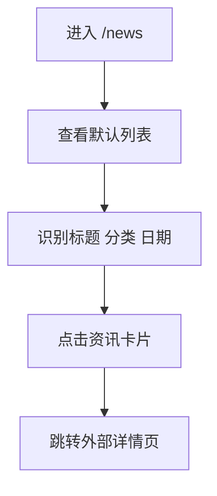
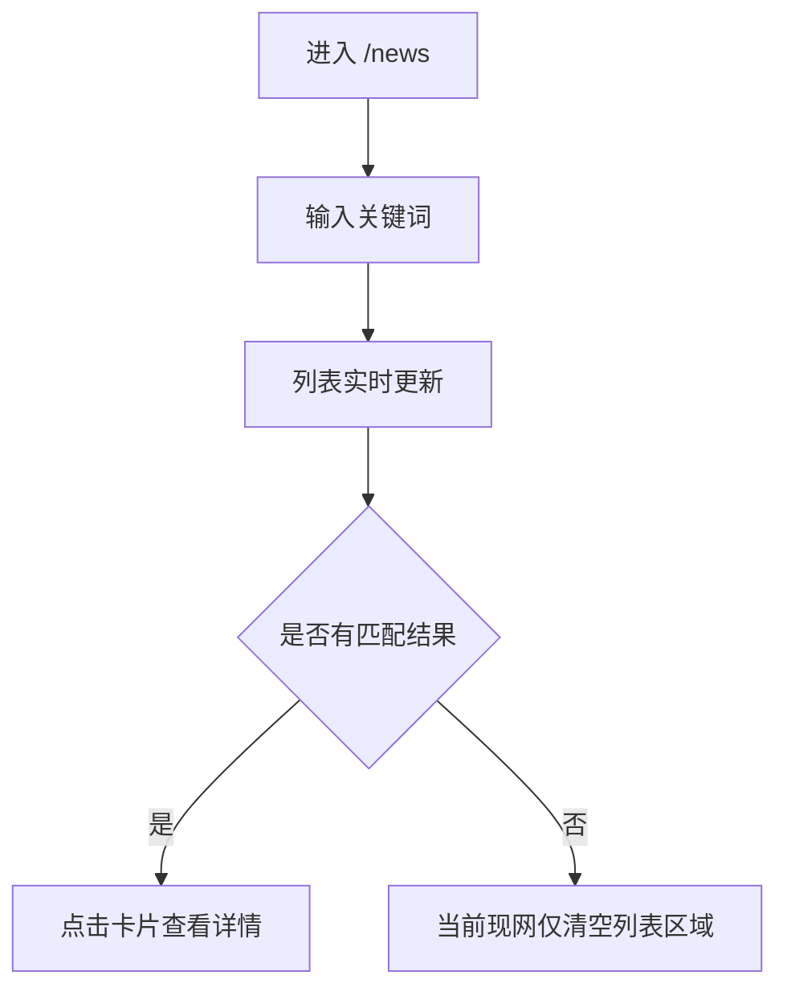
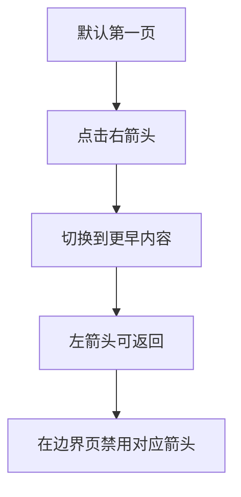

# 逆向还原 PRD | USDD News 页面

> 模块名称：News Page
> 页面入口：`https://usdd.io/news`
> 文档类型：逆向还原 PRD
> 还原日期：2026-04-01
> 还原依据：现网页面渲染结果、前端静态产物、实际交互验证

## 先结论

`/news` 是 USDD 官网的信息分发与品牌信任增强页面，主要承接官方公告、活动更新和生态叙事传播，不直接承载链上机制交互。该页的核心业务目标不是“留在站内深读”，而是让用户快速检索更新，并把点击流量导向外部内容承载平台（当前实测为 Medium）。

从 USDD 2.0 体系看，这个页面主要服务于增长、信任和市场沟通，次级服务于收益与活动运营。它通过统一的官方入口，把 APY 调整、Vault 活动、KOL 激励和品牌叙事集中呈现，降低用户获取官方信息的摩擦，并减少信息分散带来的声誉风险。

## 1. 背景与目标

### 1.1 背景

USDD 需要一个统一的官方资讯入口，集中承载：

- 官方公告
- 活动更新
- APY 与收益相关变更
- 与 Vault、Smart Allocator、生态合作有关的市场传播内容

当前现网 `/news` 已承担该职责，但详情并不在站内沉淀，而是跳转到外部文章页。页面本身更像“官方内容索引与分发层”，而不是“完整内容消费层”。

### 1.2 业务目标

- 为用户提供可信、集中、低摩擦的官方资讯入口
- 快速分发与 USDD 收益、活动、品牌叙事相关的最新内容
- 通过搜索和翻页降低内容检索成本
- 把流量导向外部文章承载页，完成深度阅读转化
- 通过官方站点统一出口降低信息真假混杂带来的品牌风险

### 1.3 非目标

- 不在当前页面完成长文阅读
- 不在当前页面承载评论、收藏、分享、登录等社区能力
- 不在当前页面完成链上操作
- 不承担资讯编辑后台能力展示

## 2. 目标用户与场景

### 2.1 目标用户

| 用户类型 | 关注点 | 页面价值 |
| --- | --- | --- |
| USDD 持有者 | APY 调整、收益活动、官方公告 | 快速确认官方信息，降低收益预期偏差 |
| DeFi 收益用户 | Vault 活动、奖励计划、收益更新 | 获取参与机会与规则变化 |
| KOL / 社区传播者 | 官方活动、品牌叙事、传播素材 | 获取权威内容源，便于二次传播 |
| 合作方 / 观察者 | 官方动态、品牌可信度、更新频率 | 观察项目活跃度和官方治理节奏 |

### 2.2 核心场景

- 用户想查看最近是否有 APY 或收益机制相关更新
- 用户想查找某个关键词对应的历史公告
- 用户浏览近期活动，寻找可参与的激励内容
- 用户通过官方入口跳转到外部长文查看详情

## 3. 功能清单（P0/P1/P2）

### 3.1 P0

- 展示 News 页面入口与品牌导航
- 提供 `Search News` 搜索框
- 按时间倒序展示资讯卡片列表
- 每张卡片展示标题、内容分类、发布日期
- 支持点击卡片跳转外部文章详情
- 支持通过左右箭头翻页浏览历史内容
- 在翻页边界禁用不可用按钮
- 提供站内基础导航入口，如 `Home`、`Launch APP`

### 3.2 P1

- 搜索结果页复用同一列表样式
- 搜索结果覆盖跨页历史内容，而非仅筛当前页可见项
- 提供响应式适配，支持桌面与移动端浏览
- 保留站点统一的地域合规拦截逻辑

### 3.3 P2

- 明确的空结果文案与引导
- 站内详情页承载而非完全依赖外部平台
- 分类筛选器（如 Announcement / Activities）
- 排序与时间范围筛选

## 4. 用户流程

### 4.1 浏览最新资讯

### 4.2 搜索资讯

### 4.3 翻页浏览历史内容

## 5. 业务规则

### 5.1 内容对象规则

每条资讯至少包含以下字段：

- 标题
- 分类标签
- 发布日期
- 详情跳转链接

### 5.2 列表规则

- 默认按发布时间倒序展示最新内容
- 默认首屏展示最新一页内容
- 观察到首屏可见 8 条卡片，分页规模推断为 8 条/页
- 非满页历史页可能少于 8 条

### 5.3 搜索规则

- 搜索入口为单一文本框，placeholder 为 `Search News`
- 搜索结果会命中历史内容，而不是只在当前页内过滤
- 搜索结果仍以资讯卡片形式呈现
- 当前现网未观察到明确“无结果”文案；无匹配时卡片列表区域被清空

### 5.4 跳转规则

- 点击资讯卡片后，跳转到外部文章页
- 已验证样例详情页落在 Medium
- 当前未观察到站内详情页

### 5.5 分类规则

当前页面已观察到的内容标签包括但不限于：

- `Latest News`
- `Latest Activities`

分类用于帮助用户快速识别内容性质，但当前未观察到独立分类筛选能力。

## 6. UI / 交互说明

### 6.1 页面结构

- 顶部品牌入口
- 站内导航
- `Launch APP` 行动按钮
- 搜索框
- 资讯列表区
- 左右翻页按钮
- 页脚区域

### 6.2 卡片交互

- 卡片整体可点击
- 卡片文案由“标题 + 分类 + 日期”组成
- 标题较长时会做截断展示

### 6.3 翻页交互

- 首页左箭头禁用
- 翻到后续页后左箭头可用
- 到最后一页时右箭头应禁用
- 翻页保持同一页面上下文，不跳新路由

### 6.4 搜索交互

- 文本输入后触发结果刷新
- 搜索结果与默认列表共用同一展现区
- 当前未看到独立“清空搜索”按钮

### 6.5 视觉风格

页面延续 USDD 品牌深色体系：

- 深色背景
- 绿色品牌高亮
- Inter 字体
- 官网统一页头/页脚风格

## 7. 异常场景与边界

### 7.1 空结果

- 当搜索无匹配时，当前现网仅剩基础框架和页脚，未看到明确空状态文案
- 这会增加用户对“系统错误”和“确实无结果”的判断成本

### 7.2 外链异常

- 外部文章平台不可用时，用户无法在站内继续阅读
- 如果 Medium 访问受限，会直接影响内容消费完成率

### 7.3 内容缺失 / 数据接口异常

- 如果资讯源失败，页面应至少保留基础壳和搜索框
- 当前未在现网观察到明确错误提示文案，属于待确认项

### 7.4 分页边界

- 首页禁用左箭头
- 末页应禁用右箭头
- 翻页后列表条目数可小于首屏页

### 7.5 合规边界

- 站点存在统一地域限制逻辑
- 在受限地区场景下，页面可能被全站级合规模态中断

## 8. 数据埋点需求

### 8.1 核心埋点目标

- 判断资讯页是否有效承接官方内容访问
- 判断哪些内容类型最能驱动点击和外链跳转
- 识别搜索是否帮助用户更快定位内容
- 识别空结果、翻页深度和内容消费损耗点

### 8.2 建议埋点

| 事件 | 说明 |
| --- | --- |
| `news_page_view` | 进入资讯页 |
| `news_search` | 输入或提交搜索关键词 |
| `news_search_no_result` | 搜索无结果 |
| `news_card_click` | 点击资讯卡片 |
| `news_pagination_click` | 点击左右翻页 |
| `news_launch_app_click` | 点击 Launch APP |
| `news_home_click` | 点击 Home |
| `news_support_click` | 点击 support 邮箱 |

## 9. 国际化与文案

### 9.1 当前状态

当前页面实测为英文文案主导，包含：

- `Search News`
- `Latest News`
- `Latest Activities`
- `Home`
- `Launch APP`

### 9.2 文案问题

- 翻页按钮无业务含义文案，当前可访问标签仅表现为 `left` / `right`
- 空结果缺少显式反馈
- 分类命名可继续标准化，减少 `Latest` 与业务分类混用

### 9.3 国际化建议

- 为搜索、空结果、翻页按钮补充完整文案 key
- 预留多语言扩展，至少支持英文与中文
- 分类标签应统一为可配置枚举，不写死在展示层

## 10. 兼容性与平台差异

### 10.1 终端适配

- 已观察到页面支持桌面与移动端布局适配
- 页面使用统一缩放包装层处理部分中间尺寸区间

### 10.2 路由与渲染

- 当前为 SPA 路由页面
- 首屏 HTML 不包含正文内容，依赖前端渲染

### 10.3 外部平台差异

- 详情承载在外部平台，实际阅读体验受 Medium 打开方式、浏览器限制和地区网络环境影响

## 11. 安全与隐私

### 11.1 数据安全

- 页面本身不涉及登录、钱包连接或用户资产输入
- 搜索行为当前未观察到敏感信息采集场景

### 11.2 合规

- 页面受站点统一地域访问限制逻辑影响
- 需要确保地区判断、提示文案和拦截路径一致

### 11.3 品牌与声誉风险

- 资讯页是官方信息出口，错误内容、过期活动或失效外链会直接影响品牌可信度
- 与 APY、收益活动相关的内容若未及时更新，容易放大预期管理风险

## 12. 成功指标与验收

### 12.1 成功指标

- 资讯卡片点击率
- 搜索使用率
- 搜索无结果率
- 翻页深度
- 外链详情打开成功率
- APY / 活动类内容点击占比

### 12.2 验收标准

- 用户进入 `/news` 后可看到默认资讯列表
- 每条卡片至少展示标题、分类、日期
- 点击卡片可成功打开详情页
- 搜索关键词后列表发生正确变化
- 无搜索结果时页面不崩溃
- 首尾翻页按钮状态正确
- 桌面与移动端均可正常浏览

## 待确认项

1. 搜索是纯前端本地过滤，还是通过接口请求服务端查询：已确认通过接口过滤
2. 资讯列表的数据源接口地址、缓存策略与刷新机制：已确认没有缓存，每次都想服务端请求新数据
3. 分类字段的正式枚举值与后台配置方式
4. 分页是否固定每页 8 条，或会随设备与数据量动态变化：已确认固定8条不会变
5. 页面是否存在加载态、错误态和空态文案，只是当前未触发：已确认有错误状态和空状态，没有加载态

## 逆向依据

### 已证实事实

- `/news` 为实际线上可访问页面
- 页面含 `Search News` 输入框
- 默认页可见多条资讯卡片，包含标题、分类、日期
- 已观察到 `Latest News` 与 `Latest Activities` 标签
- 点击卡片后会跳转外部 Medium 链接
- 页面支持左右翻页
- 搜索 `APY` 后命中跨历史内容结果
- 搜索无命中时当前无显式结果文案

### 推断结论

- 页面主要承担官方内容索引与外链分发职责
- 搜索结果覆盖全量资讯源而非仅当前页
- 分页规模推断为每页约 8 条

